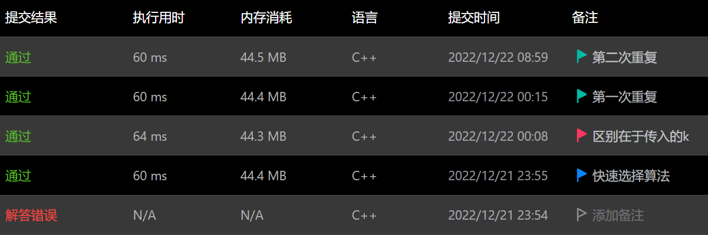

# 一级标题

> - **主要参考来源：[AcWing 算法基础课](https://www.acwing.com/activity/content/introduction/11/)、[AcWing LeetCode究极班](https://www.acwing.com/activity/content/31/)、[代码随想录](https://programmercarl.com/other/say_feel.html)、[阿秀的学习笔记](https://interviewguide.cn/notes/03-hunting_job/03-algorithm/03-leetcode/01-introduce.html)、[labuladong](https://labuladong.github.io/algo/2/)**
> - **主要包含内容：xxx**

**注：**
1. 以算法基础课中的章节为总线，先复习其中的模板题，**模板题要写明解题思路与参考代码**；针对每类题目，从carl、阿秀、东哥(或力扣网站内标签)中补充力扣题目作为联系，不明白的题目看他们各自的题解或者力扣究极班，**练习题只写该题需要特殊注意的点与连接**；打卡记录同步力扣、本地md文件与AcWing LeetCode究极班
2. 有时候只放y总的图片可能不是很清楚，最好在图片下面也写上分点理解或者推导，这部分中的单一字母与符号使用公式形式表达，如$x$、$n$，代码中出现的数组、语句、变量才使用代码形式，时间复杂度什么也不用，直接写就行
3. 分点罗列要点时结尾不使用标点符号，不同部分内容间以空白行分割
4. **LeetCode中题目中有不懂的地方首选去LeetCode究极班中打卡题目下面看讨论，因为这是和模板题/思路最统一对应的地方**

:date:      日期
:pushpin:   基本原理
:watch:     时间复杂度分析
:rocket:    原题连接
:memo:      解题思路
:dart:      参考代码
:telescope: 拓展知识

## 二级标题(第X次课)

:date: 20xx-xx-xx

### 三级标题(算法名称)

:pushpin: **基本原理**

> xxx


> xxx


:rocket:  **[AcWing 785. 快速排序](https://www.acwing.com/problem/content/description/787/)**

:memo:  **解题思路**

> xxxx


> 时间复杂度分析


:dart:  **参考代码**

> 做法名称(若有多种做法)

```C++

```

> 做法名称

```C++

```

:rocket:  **[LeetCode 704. 二分查找](https://leetcode.cn/problems/binary-search/)**
- 解题思路与注意点

:rocket:  **[剑指Offer 704. 二分查找](https://leetcode.cn/problems/binary-search/)**
- 解题思路与注意点

### LeetCode刷题

以 **[215. 数组中的第K个最大元素](https://leetcode.cn/problems/kth-largest-element-in-an-array/)** 为例进行说明：

- LC中最先给出的代码模板如下所示，这是因为LC的编程思路是服务器端进行数据的输入输出，通过调用所写方法（在代码模板中是一个函数）进行相关处理，返回输出值。所以要做的工作就是写一个复合题目要求的方法/函数，至于输入输出则不需要管
```C++
class Solution {
public:
    int findKthLargest(vector<int>& nums, int k) {
        
    }
};
```

- LC对程序检查较为严格，因此在所规定的方法/函数之内必须有一个return语句，即使这个语句永远不会执行
- 有时候LC给出的函数与y总课上讲的代码模板传入参数不一样，这时候最好的做法是从所给的代码模板中调用自己记得的模板，以此传入记忆模板所需要的参数，而不是费劲去修改模板以适应传入参数，如下所示
```C++
class Solution {
public:
    int qucik_sort(vector<int>& nums, int l, int r, int k){
        if (l >= r) return nums[l];
        int x = nums[(l + r) / 2], i = l - 1, j = r + 1;
        while (i < j)
        {
            do i ++; while(nums[i] > x);
            do j --; while(nums[j] < x);
            if (i < j) swap(nums[i], nums[j]);
        }
        if ((j + 1 - l) >= k) return qucik_sort(nums, l, j, k);
        else return qucik_sort(nums, j + 1, r, k - (j + 1 - l));
    }

    int findKthLargest(vector<int>& nums, int k) {
        return qucik_sort(nums, 0, nums.size() - 1, k);
    }
};
```
- 在LC的提交记录中，蓝旗备注解法，红旗备注区别，绿旗备注重复


- LC的代码是行尾风格，最好和所给空白模板统一起来


「距离」


