# 第一讲 基础算法

> - **主要参考来源：[AcWing 算法基础课](https://www.acwing.com/activity/content/introduction/11/)、[AcWing LeetCode究极班](https://www.acwing.com/activity/content/31/)、[代码随想录](https://programmercarl.com/other/say_feel.html)、[阿秀的学习笔记](https://interviewguide.cn/notes/03-hunting_job/03-algorithm/03-leetcode/01-introduce.html)、[labuladong](https://labuladong.github.io/algo/)**
> - **主要包含内容：排序、二分、高精度、前缀和与差分、双指针算法、位运算、离散化、区间合并**

## 第一次课
:date:  2022-08-03

### 快速排序

:pushpin: **基本原理**


- **经过做题实战检验，统一选择中点作为分界点**
- 注意第二步中只要满足图示(含等号)要求即可，值为$x$的元素(也就是选择的分解点的值)不一定正好在分界点位置，在左右均可(因为可能有多个值为$x$的元素)

> 新开两个数组分别存放思路(调整范围暴力方法)：


- 缺点是需要开辟额外的空间，但时间复杂度仍然是线性的

> 双指针移动排序思路(调整范围优美方法)：


- 这里的指针实际是元素在数组中的下标，而不是存储地址的指针
- 核心思想是同时在左右两边找到不符合当前位置条件的元素，然后交换位置，直到左右指针相遇

> 时间复杂度：O(nlogn)

:watch:  **时间复杂度分析** **[参考链接](https://zhuanlan.zhihu.com/p/341225128)**

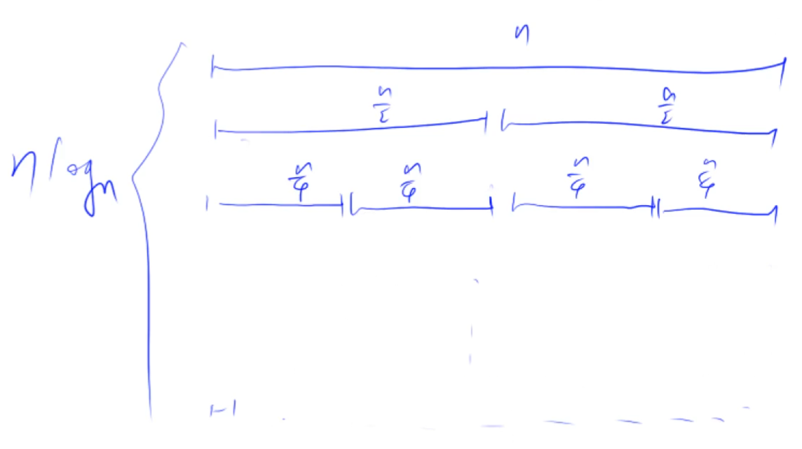

:rocket:  **[AcWing 785. 快速排序](https://www.acwing.com/problem/content/description/787/)**

:memo:  **解题思路**

- 快速排序模板题
- **在取分界点时直接取中点**，避免部分因为取左右边界点而使得快排时间复杂度退化为 O(n^2) 而超时的情况

:dart:  **参考代码**

```C++
#include <cstdio>
#include <algorithm>

using namespace std;

int n;
const int N = 1e5+10;
int q[N];

// 现在只推荐使用这一种模板
void quick_sort1(int q[], int l, int r)
{
    if(l >= r) return;//判定边界，作为递归结束条件
    
    //对于一般的题目而言分界点最好还是选择中点，这样不管怎么分段都不会错
    //这道题由于数据偏多而只能取中点。但对于一般快排题目而言：
    //以左指针分段不能取左边界点，以右指针分段不能取右边界点
    int x = q[(l + r)/2], i = l - 1, j = r + 1;
    //这里让两个指针分别指的超出所给范围是要配合下面的do while操作(先移动后判断)
    
    while(i < j)
    {
        
        do i++; while(q[i] < x); //左指针右移
        do j--; while(q[j] > x); //右指针左移
        //使用do while循环是为了防止遇到q[i]=q[j]=x时进入死循环
		//当执行到判断语句时，说明上面的两个循环均结束，即左右指针各自找到了不满足位置条件的元素
        if(i < j) swap(q[i], q[j]);
    }

    //递归处理左右两边，左右两边的分界方法会影响分界点的选择
    quick_sort1(q, l, j);
    quick_sort1(q, j + 1, r);

}

void quick_sort2(int q[], int l, int r)
{
    if(l >= r) return;//判定边界
    
    int x = q[(l + r + 1) / 2], i = l - 1, j = r + 1;
    
    while(i < j)
    {
        
        do i++; while(q[i] < x);
        do j--; while(q[j] > x); 
        if(i < j) swap(q[i], q[j]);
    }

    quick_sort2(q, l, i - 1);
    quick_sort2(q, i, r);

}

int main(void)
{
    scanf("%d", &n);
    for(int i = 0; i < n; i++) scanf("%d", &q[i]);
	//对于大量数据的读入推荐使用scanf
    
    quick_sort1(q, 0, n-1); //注意这里右端点的下标是n-1，而不是n
    //quick_sort2(q, 0, n-1);
    for(int i = 0; i < n; i++) printf("%d ", q[i]);

    return 0;
}
```

:rocket:  **[AcWing 786. 第k个数](https://www.acwing.com/problem/content/788/)**

:memo:  **解题思路**

- 使用快速排序对数组整体进行排序后选择第 (k-1) 个元素进行输出
- 快速选择算法：时间复杂度O(n)

> 快速选择缩小范围

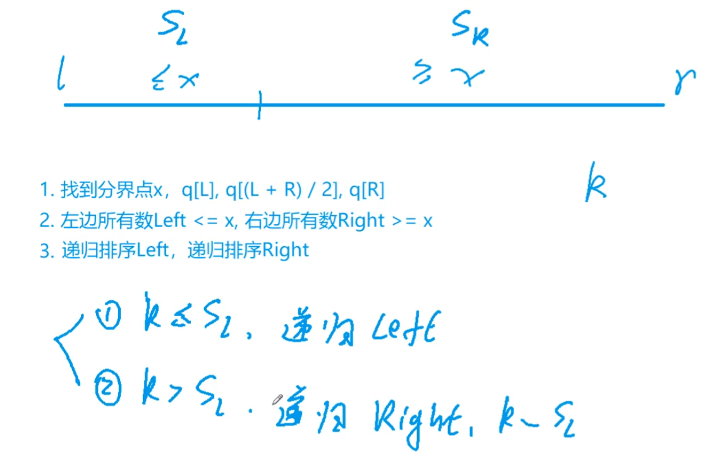

> 快速选择时间复杂度分析

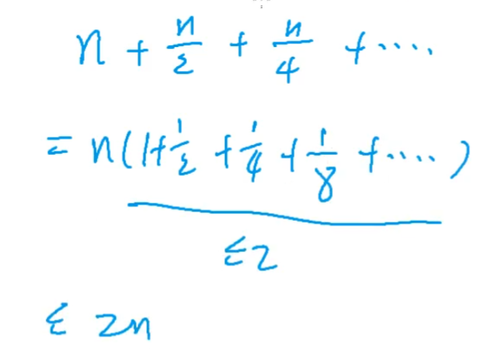

:dart:  **参考代码**

```C++
#include <cstdio>
#include <algorithm>
using namespace std;

const int N = 1e5 + 10;
int q[N];

int quick_sort(int q[], int l, int r, int k)
{
    if(l == r) return q[l];	
    //第k大的数所在的区间只有一个数，那么这个数就是整个区间第k大的数

    int x = q[(l+r) / 2], i = l - 1, j = r + 1;

    while(i < j)
    {
        do i++; while(q[i] < x);
        do j--; while(q[j] > x);
        if(i < j) swap(q[i], q[j]);
    }
    //主要思想：瞄准区间，精准排序。
    //如果在左半区间，由于子区间已经有序，那么整个区间第k大的数就在这个区间的前k个元素中
    //反之，在右半区间的位次就是整个区间第k大的数的位置减去左半区间的元素个数
    if(j-l+1 >= k) quick_sort(q, l, j, k); //左半边
    else quick_sort(q, j+1, r, k - (j-l+1)); //右半边
}

int main(void)
{
    int n, k;
    scanf("%d %d", &n, &k);

    for(int i = 0; i < n; i++) scanf("%d", &q[i]);

    printf("%d\n", quick_sort(q, 0, n-1, k));

    return 0;
}
```

:rocket: **[LeetCode 215. 数组中的第k个最大元素](https://leetcode.cn/problems/kth-largest-element-in-an-array/)** 
- 做法一：套用模板，最后返回排序后的数组倒数第k个元素
- 做法二：将双指针指向的元素与分界点元素比较判断时改为左大右小，实现降序排序，然后每次分治时判断分界点与k的大小关系，缩小范围，进而只在符合要求的范围内继续处理，这样做可以加快速度

:rocket: **[LeetCode 912. 排序数组](https://leetcode.cn/problems/sort-an-array/)** 
- 题目要求是升序排序，所以可以直接套用快排模板
- 这道题快速排序与归并排序都能做，因此在归并排序部分就不再重复出现

:rocket: **[剑指Offer 076. 数组中的第k大的数字](https://leetcode.cn/problems/xx4gT2/)** 

### 归并排序

:pushpin: **基本原理**

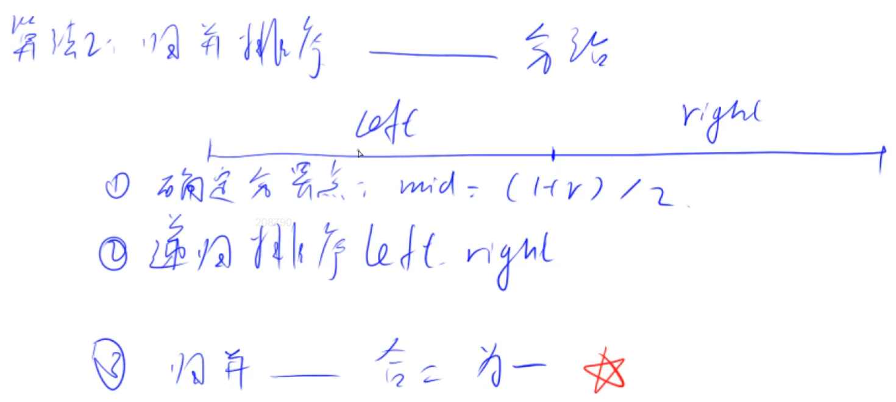

- 注意第一步中的分界点$x$一定在中间位置
- 归并排序：先递归后处理(后序遍历)，快速排序：先处理后递归(前序遍历)

> 双指针移动排序思路：


> 举例说明（双路归并，合二为一）：

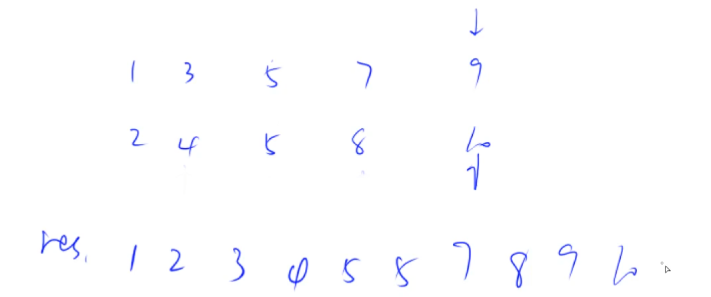

:watch:  **时间复杂度分析**   **[参考链接](https://zhuanlan.zhihu.com/p/341225128)**


- 时间复杂度为O(nlogn)

> 注意归并排序与快速排序的区别：

- 快排分界点大部分情况下可以任意选择，归并分界点唯一
- 快排是自顶向下，因此先操作再递归，递归在第三步；归并是自底向上，因此先递归再操作，递归在第二步(递归可以看做是往下深入的操作)
- 归并需要一个临时数组存放排序结果，快排直接在原数组上操作
- **终极理解：快速排序是二叉树的前序遍历，归并排序是二叉树的后序遍历**

:rocket:  **[AcWing 787. 归并排序](https://www.acwing.com/problem/content/789/)**

:memo:  **解题思路**

- 归并排序模板题
- 如果要用vector容器存储数据，那么归并的过程要使用push_back()函数，否则在LC中会报错

:dart:  **参考代码**

```C++
#include <cstdio>

const int N = 1e5 + 10;
int m[N], tmp[N];

void merge_sort(int m[], int l, int r)
{
    if(l >= r) return;

    int mid = (l + r) / 2;

    merge_sort(m, l, mid);
    merge_sort(m, mid + 1, r);

    //归并
    int k = 0, i = l, j = mid + 1;
    while(i <= mid && j <= r)//每次把较小的元素放到临时数组中去
    {
        if(m[i] < m[j]) tmp[k++] = m[i++];
        else tmp[k++] = m[j++];
    }
    //扫尾
    while(i <= mid) tmp[k++] = m[i++];//如果前半段有剩余直接搬过来
    while(j <= r) tmp[k++] = m[j++];//如果后半段有剩余直接搬过来
    //上面两步操作的大小关系是绝对可以保证的

    //物归原主
    for(i = l, j = 0; i <= r; i++, j++) m[i] = tmp[j];
    //从临时数组返回到原数组中去，一边排序一边还原
    //本轮循环的左右两边都处理完了，因此终止循环的条件是i <= r
    //这一步的还原是已经把当前节点的左右子树都处理完毕了，所以是i=l i<=r

}
int main(void)
{
    int n;
    scanf("%d", &n);

    for(int i = 0; i < n; i++) scanf("%d", &m[i]);

    merge_sort(m, 0, n - 1);//调用函数时边界的确定是闭区间
    for(int i = 0; i < n; i++) printf("%d ", m[i]);

    return 0;
}
```

:rocket:  **[AcWing 788. 逆序对的数量](https://www.acwing.com/problem/content/790/)**  

:memo:  **解题思路**


利用归并排序中的比较过程来统计逆序对。代码中 `res += mid - i + 1；` 是计算第三种情况下的逆序对数量的，由于归并排序是合并两有序的子区间，这里是升序排列，所以一旦左子区间下标为`i`的数大于了右子区间下标为`j`的数，那么左子区间下标`i`到`mid`的数都大于右子区间坐标为`j`的数，即有`mid-i+1`个数都能与右子区间下标为`j`的数构成逆序对。

> 本题中可能出现的最多逆序对数量？


- int 类型的最大值约在20亿数量级，因此本题需要用long long存储

:dart:  **参考代码**

```C++
#include <cstdio>

const int N = 100010;
int a[N], tmp[N];
long long res;

void merge_sort(int m[], int l, int r)
{
    if(l >= r) return ;

    int mid = (l + r) / 2;
    merge_sort(m, l, mid);
    merge_sort(m, mid + 1, r);

    int k = 0, i = l, j = mid + 1;
    while(i <= mid && j <= r)
    {
        if(m[i] <= m[j]) tmp[k++] = m[i++];
        else
        {
            tmp[k++] = m[j++];
            res += mid - i + 1;
	    //多次递归之后前两种情况总会演化成第三种情况，因此只需要计数一次
        //这是与归并排序唯一不同的一条语句，因此还是推荐使用这个模板
        }
    }
    while(i <= mid) tmp[k++] = m[i++];
    while(j <= r) tmp[k++] = m[j++];

    for(i = l, j = 0; i <= r; i++, j++)
        m[i] = tmp[j];

}
int main(void)
{
    int n;
    scanf("%d", &n);
    for(int i = 0; i < n; i++) scanf("%d", &a[i]);

    merge_sort(a, 0, n - 1);
    printf("%lld\n", res);

    return 0;
}
```

:rocket: **[LeetCode 493. 翻转对](https://leetcode.cn/problems/reverse-pairs/submissions/)** 
- 因为上一题中对翻转对的定义正好与其中一种可以归并的情况相同，所以可以顺便在归并的过程中统计个数
- 本题因为与任一种归并的情况都不同，不是直接的大小关系，而是存在一个倍数，存在倍数之后就不能保证同一分组后面的数都满足逆序对条件，所以需要在递归之前单独计数

### 二分问题

:pushpin: **基本原理**

有单调性的题目一定可以二分，可以二分的题目不一定有单调性，一定具有二段性

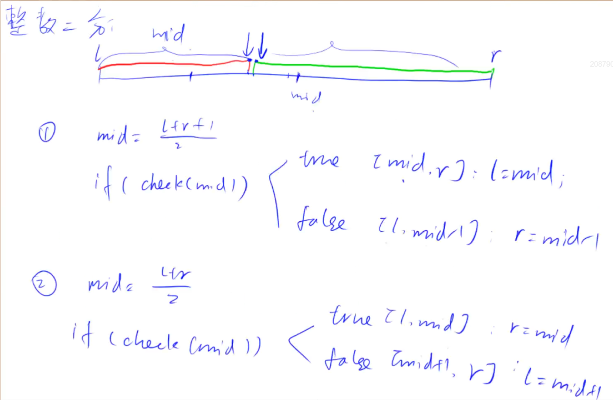

- 对于整数二分而言左右两个区间一定不相交，二分的作用是寻找是否满足某一性质的边界
- 第一种情况寻找红色靠中的边界点，即左边红色部分满足`check()`函数性质，右边绿色部分不满足`check()`函数性质
- 第二种情况寻找绿色靠中的边界点，即左边红色部分不满足`check()`函数性质，右边绿色部分满足`check()`函数性质 

> 两种模板如何选择？

观察当`check()函数`为真时边界如何更新，如果是`l = mid`，则`mid = (l+r+1)/2`；如果是`r = mid`，则`mid = (l+r)/2`

> 为什么两个模板的中点计算方式不同？

C++中整数的除法是向零取整，当`l = r - 1`时，此时`mid = (l+r)/2 = l`，则`check()`为真时的更新情况为`l = mid = l`，进而陷入死循环中。而`mid = (l+r+1)/2`可保证循环一次之后区间称为`[r, r]`，进而结束循环

:rocket:  **[AcWing 789. 数的范围](https://www.acwing.com/problem/content/791/)**  

:memo:  **解题思路**

整数二分的两种写法：
- 在升序情况下，右逼近答案(终点)的写法是返回不小于该数的第一个位置
- 在升序情况下，左逼近答案(起点)的写法是返回不大于该数的最后一个位置
- 二分迭代更新的思想是：每次缩小区间时都要保证寻找的答案在该区间中

:dart:  **参考代码**

```C++
#include <iostream>
using namespace std;

const int N = 1e5 + 10;
int n, q, k, a[N];
//n为数组元素的具体个数，q为查询次数，k为每次要查询的具体值

//当区间被划分为[l, mid]与[mid+1, r]时使用，找起点的函数肯定是逐渐向左缩小
int binary_search_st(int a[], int k)
{
	int l = 0, r = n - 1;
	while(l < r)
	{
		int mid = (l+r)/2;
		//如果判断条件成立，说明要寻找的点还在左边，所以区间要向左缩小
		if(a[mid] >= k) r = mid; //助记：起点(st)的右边(r=mid)都大于等于(a[mid]>=k)起点(st)
		else l = mid + 1;
	}

	return l;
}

//当区间被划分为[l, mid-1]与[mid, r]时使用，找终点的函数肯定是逐渐向右缩小
int binary_search_ed(int a[], int k)
{
	int l = 0, r = n - 1;
	while(l < r)
	{
		int mid = (l+r+1)/2;
		//如果判断条件成立，说明要寻找的点还在右边，所以区间要向右缩小
		if(a[mid] <= k) l = mid; //助记：终点(ed)的左边(l=mid)都小于等于(a[mid]<=k)终点(ed)
		else r = mid - 1;
	}
	
	return l;
}

int main(void)
{
	cin >> n >> q;
	for(int i = 0; i < n; i++) cin >> a[i];

	while(q--)
	{
		cin >> k;

		//binary_search_st()寻找起始坐标，binary_search_ed()寻找终止坐标
		int st = binary_search_st(a, k), ed = binary_search_ed(a, k);

		//判断问题是否有解
		if(a[st] != k) cout << "-1 -1" << endl;
		else cout << st << ' ' << ed << endl;
	}

	return 0;
}
```

:rocket:  **[AcWing 790. 数的三次方根](https://www.acwing.com/problem/content/792/)**  

:memo:  **解题思路**

- 浮点数二分不需要处理边界问题，因此要比整数二分容易的多
- 注意精度一般要**至少比题目要求的位数再多精确两位**，减小误差

:dart:  **参考代码**

```C++
#include <cstdio>
#include <cmath>

using namespace std;

const double eps = 1e-8;
double n;

bool check(double mid)
{
	mid = pow(mid, 3);

	return mid < n;
}

int main(void)
{
	scanf("%lf", &n);

	double l = -1e4, r = 1e4;
	while(r - l > eps)
	{
		double mid = (l+r)/2;
		if(check(mid)) l = mid;
		else r = mid;
	}

	printf("%f\n", l);
	return 0;
}
```
- 整数二分问题的写法：先写`check()`函数，判断当check为真时该如何更新区间
- 整数二分时每次循环将区间缩小一半，但都要保证答案始终在区间之中，因此最后输出`l`或`r`或`mid`均可
- 两个模板子函数助记：起点的右边均大于等于目标值，终点的左边均小于等于目标值

:rocket:  **[LeetCode 34. 在排序数组中查找元素的第一个和最后一个位置](https://leetcode.cn/problems/find-first-and-last-position-of-element-in-sorted-array/)**
- 这道题需要注意的是首先得判断一下传入的数组是否为空，如果为空直接查找的话会造成越界
- 其次在查找完成之后判断一下找到的区间是否合法，如果不合法说明数组中没有该元素，因此返回`{-1, -1}`

:rocket:  **[LeetCode 704. 二分查找](https://leetcode.cn/problems/binary-search/)**
- 题目已经给出数组的长度至少为1，因此不需要判断数组是否为空
- 这道题要找的数在数组中只会出现一次，因此随便用查找起点或查找终点的模板都可以

:rocket:  **[剑指Offer 53. 在排序数组中查找数字](https://leetcode.cn/problems/zai-pai-xu-shu-zu-zhong-cha-zhao-shu-zi-lcof/)**

## 第二次课

:date:  2022-08-04

### 高精度问题

:pushpin: **基本原理**

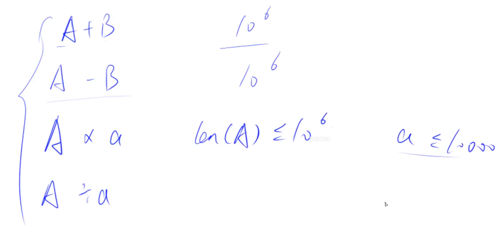

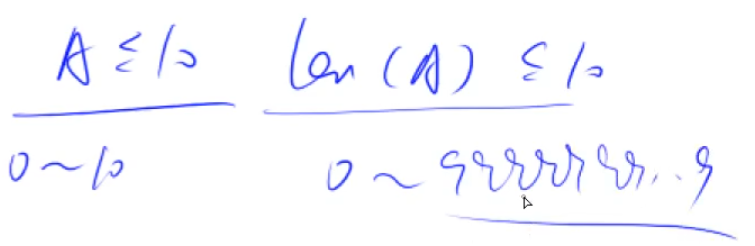

> 超长数据如何存储？

一般将超长数据存放到数组中，数据的每一位对应数组的一个元素，且个位对应的数组元素下标为0，十位对应的数组元素下标为1……依此类推。这样做的主要原因是考虑到乘法与加法可能会有进位问题，在数组的末尾添加元素比较容易，因此把数据的高位放到数组的末尾


> 如何计算高精度问题？

模拟计算过程，考虑进位、借位问题即可

:rocket:  **[AcWing 791. 高精度加法](hhttps://www.acwing.com/problem/content/793/)**

:memo:  **解题思路**

- 大整数是逆序储存在数组中的

:dart:  **参考代码**

```C++
#include <iostream>
#include <cstdio>
#include <vector>
#include <string>
using namespace std;

vector<int> add(vector<int> &A, vector<int> &B)
{//形参加引用是为了提高效率
    vector<int> C;  //用于存放计算结果，存储方式同读入时的存储方式
    int t = 0;  //t用于存放进位，且最开始时个位无进位

    for(int i = 0; i < A.size() || i < B.size(); i++)
    {
        //加完A和B各位上的数字
        if(i < A.size()) t += A[i];
        if(i < B.size()) t += B[i];

        C.push_back(t % 10);//此时t = A[i]+B[i]+上一位进位，t%10才是最终存储的值
        t /= 10;//更新进位，若有进位，则加到下一位中
    }
    
    //若进位到了最高位，增添一位数字，同时也避免了前导0
    if(t) C.push_back(t);   
    
    return C;
}

int main(void)
{
	string a, b;//超长数据只能先用字符串类型读取
	vector<int> A, B;
	cin >> a >> b;
	
	//逆序存储影响遍历起始问题，存储时像数组一样操作字符串
	for(int i = a.size() - 1; i >= 0; i--) A.push_back(a[i] - '0');
	//由于原数据类型是字符串，因此必须做减法才能转换成数字。**这是个易错点**
	for(int i = b.size() - 1; i >= 0; i--) B.push_back(b[i] - '0');
		
	auto C = add(A, B);
	for(int i = C.size() - 1; i >= 0; i--) printf("%d", C[i]);

	return 0;
}
```

:rocket:  **[AcWing 792. 高精度减法](https://www.acwing.com/problem/content/794/)**

:memo:  **解题思路**

这里的做法针对非负数的高精度减法，且满足`A>=B`。所以需要单独写一个比较函数来保证`A>=B`

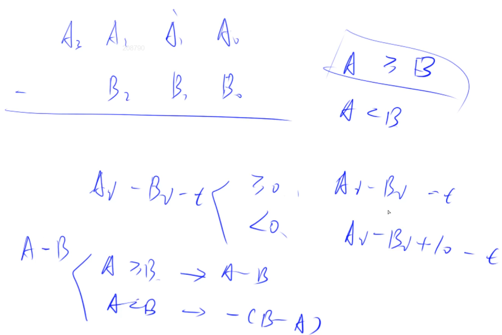

注意减去上一位的借位

:dart:  **参考代码**

```C++
#include <iostream>
#include <cstdio>
#include <vector>
#include <string>
using namespace std;

//确定A与B的大小关系，即判断是否有A>=B
bool cmp(vector<int> &A, vector<int> &B)
{
	if(A.size() != B.size()) 
		return A.size() >= B.size();
	
	for(int i = A.size() - 1; i >= 0; i--)
		if(A[i] != B[i]) return A[i] >= B[i];
	
	return true;
}

vector<int> sub(vector<int> &A, vector<int> &B)
{
    vector<int> C;
    //t用于储存借位
    for(int i = 0, t = 0; i < A.size(); i++)
    {
        //第0位没有借位，初始化为0，然后每一位先判断是否有借位，再相减
        t = A[i] - t;
        if(i < B.size()) t -= B[i];

        /*此处判断包含了两种情况：若t为负数，
        则该位加进去的数字是两位数字借位并相减后的结果
        反之，则加进去的是两位数字相减后的结果*/        
        C.push_back((t+10) % 10);

        //更新借位：判断是否借位，t小于0即发生借位
        if(t < 0) t = 1;
        else t = 0;
    }

    //消除前导0且不能使得C.size() = 0
    while(C.size() > 1 && C.back() == 0) C.pop_back();
    return C;
}

int main(void)
{
	string a, b;
	vector<int> A, B;
	cin >> a >> b;
	
	for(int i = a.size() - 1; i >= 0; i--) A.push_back(a[i] - '0');
	for(int i = b.size() - 1; i >= 0; i--) B.push_back(b[i] - '0');
	 
	if(cmp(A,B)) 
	{
		auto C = sub(A, B);
		for(int i = C.size() - 1; i >= 0; i--) printf("%d", C[i]);	
	}
	else 
	{
		auto C = sub(B, A);
		printf("-");
		for(int i = C.size() - 1; i >= 0; i--) printf("%d", C[i]);	
	}		
	
	return 0;
}
```

:rocket:  **[AcWing 793. 高精度乘法](https://www.acwing.com/problem/content/795/)**

:memo:  **解题思路**

- 这里的写法针对:高精度乘以低精度，且满足`大整数A>=0`，`小整数b>0`

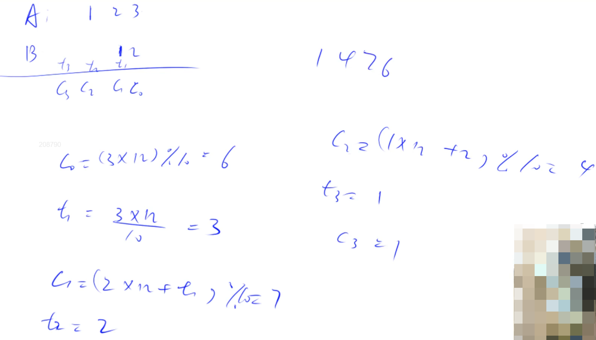

这里把小整数当成一个整体计算，这和一般列竖式计算乘法不一样

:dart:  **参考代码**

```C++
#include <iostream>
#include <cstdio>
#include <vector>
#include <string>
using namespace std;

vector<int> mul(vector<int> &A, int b)
{
    vector<int> C;

    int t = 0;  //和加法的t类似的作用

    //循环条件这么写，是包括了到了最高位还有进位的情况
    for(int i = 0; i < A.size() || t; i++)
    {
        //再判断一次i是否越界，防止只有t成立时，循环中的i<A.size()条件会失效
        if(i < A.size()) t += A[i] * b;
        C.push_back(t % 10);
        t /= 10;//更新进位信息
    }

    //同减法的消除前导0的方式
    while(C.size() > 1 && C.back() == 0) C.pop_back();

    return C;
}

int main(void)
{
	vector<int> A;
	string a;//只有高精度整数需要用字符串读入
	int b;
	cin >> a >> b;
	
	for(int i = a.size() - 1; i >= 0; i--) A.push_back(a[i] - '0');
	
	auto C = mul(A, b);
	
	for(int i = C.size() - 1; i >= 0; i--) printf("%d", C[i]);
	
	return 0;
}
```

:rocket:  **[AcWing 794. 高精度除法](https://www.acwing.com/problem/content/796/)**  

:memo:  **解题思路**

该写法针对于高精度除以低精度，且满足`大整数A>=0`，`小整数b>0`


:dart:  **参考代码**

```C++
#include <iostream>
#include <cstdio>
#include <vector>
#include <string>
#include <algorithm>
using namespace std;

//r存储余数，可以定义为全局变量。也可以在主函数中定义，在这里使用引用
vector<int> div(vector<int> &A, int b, int &r)
{
    vector<int> C;
    r = 0;  //r用来存储每次除完之后的余数
    for(int i = A.size() - 1; i >= 0; i--)
    {
        r = r * 10 + A[i];
        C.push_back(r / b);
        r %= b;//更新余数
    }
    //由于push_back函数是存数存到末尾，商是反着存的，为了便于输出要反转一下
    reverse(C.begin(), C.end());

    //消除前导0，同减法
    while(C.size() > 1 && C.back() == 0) C.pop_back();
    return C;
}

int main(void)
{
	string a;
	int b, r = 0;
	cin >> a >> b;
	
	vector<int> A;
	for(int i = a.size() - 1; i >= 0; i--) A.push_back(a[i] - '0');
	
	auto C = div(A, b, r);//A是被除数，b是除数，C是商，r是余数
	for(int i = C.size() - 1; i >= 0; i--) printf("%d", C[i]);
	cout << endl << r << endl;
	
	return 0;
}
```

### 前缀和与差分

:pushpin: **前缀和基本原理**


> 为什么读取原数组的下标和计算前缀和数组的循环都从1开始？

- 为了适应循环结构，免去处理边界问题，必须定义`s[0] = 0`

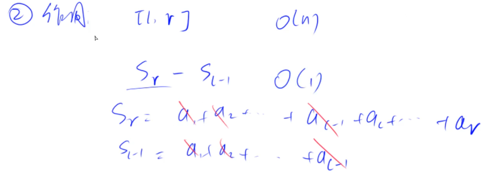

:rocket:  **[AcWing 795. 前缀和](https://www.acwing.com/problem/content/797/)**  

:memo:  **解题思路**

- 记`s[]`为前缀和数组，需要求前缀和的数组为`a[]`，那么有公式 `s[i] = s[i−1] + a[i]` 
- 为了计算方便，避免边界问题，`s[]`和`a[]`都以下标1开始，且`s[0] = 0`
- 区间[l, r]中元素的和的计算为`sum = s[r] - s[l - 1]`，**注意这里的区间是元素在数组中的顺序，而不是下标，所以对于传入下标的题要先加一转化成元素顺序再用模板**

:dart:  **参考代码**

```C++
#include <iostream>
#include <cstdio>

using namespace std;

const int N = 1e5 + 10;
int a[N], s[N];	//定义为全局变量，初始值为0

int main(void)
{
	int n, m;
	cin >> n >> m;
	for(int i = 1; i <= n; i++) 
	{
		scanf("%d", &a[i]);
		s[i] = a[i] + s[i-1];
	}//注意这里下标从1开始的话，循环结束条件必须取等
	
	int l, r;
	for(int i = 0; i < m; i++)
	{
		scanf("%d %d", &l, &r);
		printf("%d\n", s[r] - s[l-1]);
	}
	
	return 0;
}
```

:rocket:  **[AcWing 796. 子矩阵的和](https://www.acwing.com/problem/content/798/)**  

:memo:  **解题思路**

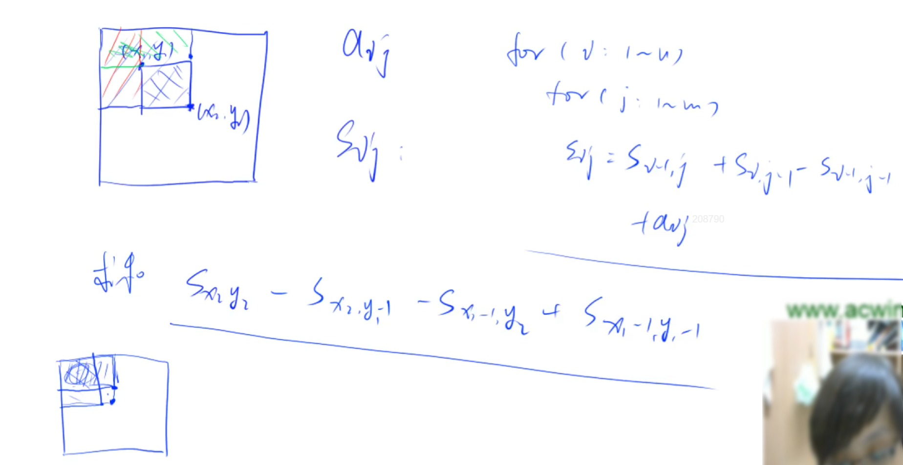

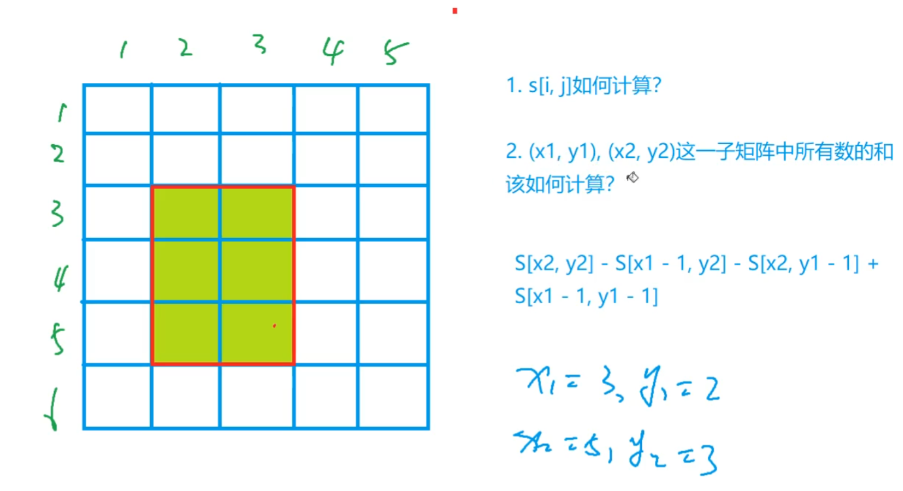

二维前缀和。记住公式即可：

- （类比一维前缀和）以坐标为`(i,j)`为右下角的点的矩阵的前缀和矩阵元素计算公式为 `s[i][j] = s[i−1][j] + s[i][j−1] − s[i−1][j−1] + a[i][j]`
- 求左上角点的坐标为`(x1,y1)` 右下角点的坐标为`(x2,y2)`的子矩阵的前缀和公式为`sum = s[x2​][y2​] − s[x1​−1][y2​] − s[x2​][y1​−1] + s[x1​−1][y1​−1]` 
- 若记不清楚公式了可以手工模拟，画一个`4×4`的矩阵即可，注意数据是离散的，点的下标是从`(1,1)`开始，并且注意二维数组中一维是行/竖向是$x$，二维是列/横向是$y$。为计算方便，下标从1开始。**因此这里的区间是元素在数组中的顺序，而不是下标，所以对于传入下标的题要先加一转化成元素顺序再用模板**

:dart:  **参考代码**

```C++
#include <iostream>
#include <cstdio>
using namespace std;

const int maxn = 1010;
int a[maxn][maxn], s[maxn][maxn];	

int main(void)
{
	int n, m, q;
	cin >> n >> m >> q;
	for(int i = 1; i <= n; i++)
	{
		for(int j = 1; j <= m; j++)
		{
			scanf("%d", &a[i][j]) ;
			s[i][j] = s[i-1][j] + s[i][j-1] - s[i-1][j-1] + a[i][j];
		}
	}
	
	int x1, y1, x2, y2;
	for(int i = 0; i < q; i++)
	{
		scanf("%d %d %d %d", &x1, &y1, &x2, &y2);
		printf("%d\n", s[x2][y2] - s[x2][y1-1] - s[x1-1][y2] + s[x1-1][y1-1]);
		//最后一定要把左上角点包围的部分加回来
	}
	
	return 0;
}
```

:rocket:  **[LeetCode 303. 区域和检索 - 数组不可变](https://leetcode.cn/problems/range-sum-query-immutable/)**
- 创建完一个`vector`之后，编译器并没有为其分配内存空间，因此还不可以使用下标访问，需要先使用`push_back()`函数初始化或列表初始化
- 初始化时传入数组的下标已从0开始，因此`sum[i]`表示的是`nums[0] + ... + nums[i - 1]`的和，但本质上还是前`i`个数的和，但数组下标是从0开始的，这一点要特别注意
- 计算区间和时传入的参数是原数组的下标，因此要将下标加一转化为在数组中的顺序再计算

:rocket:  **[LeetCode 304. 二维区域和检索 - 矩阵不可变](https://leetcode.cn/problems/range-sum-query-2d-immutable/)**

:rocket:  **[剑指Offer 013. 二维子矩阵的和](https://leetcode.cn/problems/range-sum-query-2d-immutable/)**

:pushpin: **差分基本原理**


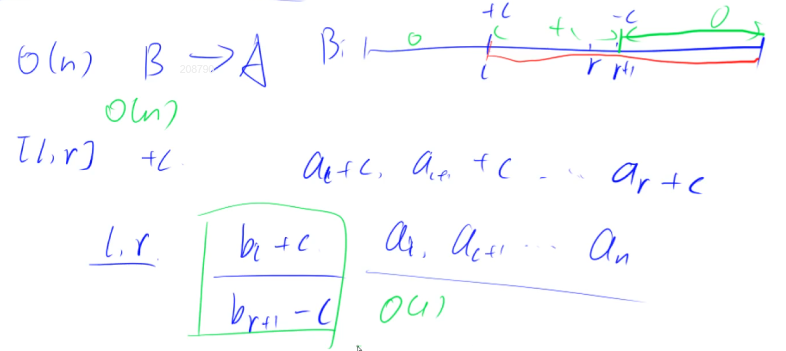

:rocket:  **[AcWing 797. 差分](https://www.acwing.com/problem/content/799/)**  

:memo:  **解题思路**

- 一维差分不需要记住如何构造的，先假设所给数组全为零，用`insert()`函数在某个位置插入该元素即可
- 记住公式（记`b[]`为差分数组）: `b[l] += c; b[r+1] −= c` ，效果是给原数组在区间`[l, r]`的每个数加上 c

:dart:  **参考代码**

```C++
#include <iostream>
#include <cstdio>
using namespace std;

const int N = 1e6 + 10;
int a[N], b[N];//全局变量初始化默认为零

void insert(int l, int r, int c)
{
	b[l] += c;
	b[r + 1] -= c;
}

int main(void)
{
	int n, m;
	cin >> n >> m;

	for(int i = 1; i <= n; i++)
	{
		scanf("%d", &a[i]);
		insert(i, i, a[i]);
	}

	int l, r, c;
	
	for(int i = 1; i <= m; i++)
	{
		scanf("%d %d %d", &l, &r, &c);
		insert(l, r, c);
	}
	
	for(int i = 1; i <= n; i++)
	{
		a[i] = a[i-1] + b[i];
		//将b数组还原为自己的前缀和(即操作完成之后的数组)以便输出
		printf("%d ", a[i]);
	}

	return 0;
}
```

:rocket:  **[AcWing 798. 差分矩阵](https://www.acwing.com/problem/content/800/)**  

:memo:  **解题思路**

a数组是b数组的前缀和，现在已知前缀和`a[][]`求`b[][]`


记住公式即可，（类比一维差分）得到以`(i,j)`为右下角坐标的矩阵的差 (详见下列代码中的`insert()`函数)，效果是给原数组以`(x1, y1)`为左上角点的坐标、`(x2, y2)`为右下角点的坐标的子数组中的所有元素`a[i][j]`加上c。

:dart:  **参考代码**

```C++
#include <iostream>
#include <cstdio>
using namespace std;

const int maxn = 1010;
int a[maxn][maxn], b[maxn][maxn];

void insert(int x1, int y1, int x2, int y2, int c)
{
  //和二维前缀和的求子矩阵前缀和对应起来记，它们是对称的
  b[x1][y1] += c;
  b[x2+1][y1] -= c;
  b[x1][y2+1] -= c;
  b[x2+1][y2+1] += c;
}

int main(void)
{
	int n, m, q;
	cin >> n >> m >> q;

	for(int i = 1; i <= n; i++)
	{
		for(int j = 1; j <= m; j++)
		{
			scanf("%d", &a[i][j]);
			insert(i, j, i, j, a[i][j]);
		}
	}
	
	int x1, y1, x2, y2, c;
	
	while(q--)
	{
		scanf("%d %d %d %d %d", &x1, &y1, &x2, &y2, &c);
		insert(x1, y1, x2, y2, c);
	}
	
	for(int i = 1; i <= n; i++)
	{
		for(int j = 1; j <= m; j++)
		{
			a[i][j] = a[i-1][j] + a[i][j-1] - a[i-1][j-1] + b[i][j];
			//已知差分求前缀和，使用二维前缀和的求和公式
			printf("%d ", a[i][j]);
		}
		puts("");
	}

	return 0;
}
```

:rocket:  **[LeetCode 1094. 拼车](https://leetcode.cn/problems/car-pooling/)**
- 注意在下车地点人数就已经减少了，因此直接在右端点操作即可
- 相当于差分数组中的元素表示的是车上人员的增减过程，因此最后判断是否超员时需要把所有增减过程求和

:rocket:  **[LeetCode 1109. 航班预订统计](https://leetcode.cn/problems/corporate-flight-bookings/)**
- 这道题所给数组下标从1开始，但题目要求返回数组的下标从0开始，因此插入增加操作之前先将序号减一，插入删除操作是要防止下标越界

## 第三次课

### 双指针算法

:date:  2022-08-08

:pushpin: **基本原理**

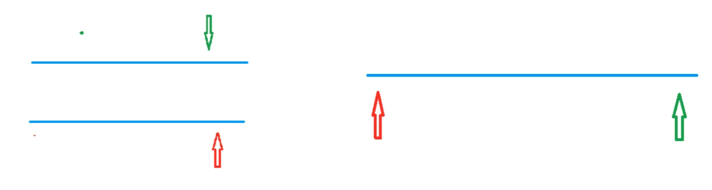

- 左边第一种情况表示两个指针分别指向两个不同的序列(归并排序，因此对两个指针都要有判断条件)
- 右边第二种情况表示两个指针指向同一个序列，不过更新条件不同(快速排序，一个指针移动到不满足条件后再移动另一个指针)
- 常见问题分类：
	(1) 对于一个序列，用两个指针维护一段区间
	(2) 对于两个序列，维护某种次序，比如归并排序中合并两个有序序列的操作


- 先从暴力做法出发寻找双指针的单调关系入手优化
- 可以将时间复杂度为O(n^2)的暴力算法优化至O(n)

:rocket:  **[AcWing 799. 最长连续不重复子序列](https://www.acwing.com/problem/content/801/)**  

:memo:  **解题思路**

指针`j`在前，指针`i`在后，通过`cnt`数组来统计每个数字是否有重复出现。  
每次移动`i`时，相当于序列中新加入了一个数字，此时`cnt`数组中下标为该数字的元素加 1，若序列这个位置的元素大于 1，则说明出现了重复元素。此时开始移动指针`j`，这个操作相当于把序列中一个已有的数字移出去，那么`cnt`数组中下标对应的元素会减一，不断移动指针`j`，使得序列中每个数字对应的`cnt`数组中的元素的值都为 1，即为没有重复的元素。

指针`j`的单调移动原理


- **双指针算法的核心是单调性**
- 通过`i`枚举数组中的每个元素，`j`表示的是以当前元素为终点，最远的起点位置

:dart:  **参考代码**

```C++
#include <cstdio>
#include <iostream>
#include <algorithm>

using namespace std;
const int N = 1e6 + 10;
int a[N], cnt[N];

int main(void)
{
	int n;
	cin >> n;
	
	for(int i = 0; i < n; i++) scanf("%d", &a[i]);
	
	int res = 0;
	for(int i = 0, j = 0; i < n; i++)
	{
		cnt[a[i]]++;//将原数组元素值作为下标，可实现计数功能
		
		while(cnt[a[i]] > 1)
		{
			cnt[a[j]]--;
			j++;
		}
		
		res = max(res, i - j + 1);
	}
	
	cout << res << endl;
	return 0;
}
```

:rocket:  **[AcWing 800. 数组元素的目标和](https://www.acwing.com/problem/content/802/)**  

:memo:  **解题思路**

这道题根据题意中的“升序排列”灵活处理了指针的起始位置，所以两指针分别指向两数组的头元素和尾元素。设`指针i`指向`数组A`的第一个元素，`指针j`指向`数组B`的最后一个元素，只要有`A[i]+B[j] > x`就往前移动`指针j`，否则往后移动`指针i`，直到有`A[i]+b[j]=x`为止。这里利用了`A[i]+B[j]>x`的单调性。时间复杂度为O(n+m)。 

:dart:  **参考代码**

```C++
#include <cstdio>
#include <iostream>
using namespace std;

const int maxn = 1e6+10;
int a[maxn], b[maxn];

int main(void)
{
	int n, m, x;
	cin >> n >> m >> x;
	
	for(int i = 0; i < n; i++) scanf("%d", &a[i]);
	for(int i = 0; i < m; i++) scanf("%d", &b[i]);
	
	int i, j;//i和j只要指向的分别是头元素和尾元素都可以
	for(i = 0, j = m - 1; i < n; i++)
	{
		//时间复杂度是O(n + m)，在n次i的循环中，j一共会移动m次，而不是每次都移动m次
		while(j >= 0 && a[i] + b[j] > x) j--;
		if(a[i] + b[j] == x) break;
	}
	
	cout << i << ' ' << j << endl;
	
	return 0;
}
```

:rocket:  **[AcWing 2816. 判断子序列](https://www.acwing.com/problem/content/2818/)**  

:memo:  **解题思路**

这道题也是双指针的思路，重要的是搞清楚这道题具体的问题逻辑。指针`i`遍历较长序列 `b`，指针`j`遍历较短序列`a`，当`a[j]=b[i]`时，`j`向右移动一位，若最后有`j == n`，则说明 b 是 a 的子序列。  
指针`j`只能和指针`i`同方向移动，这就是这道题的 “单调性”。

:dart:  **参考代码**

```C++
#include <cstdio>
#include <iostream>
using namespace std;

const int maxn = 1e6+10;
int a[maxn], b[maxn];

int main(void)
{
	int n, m;
	cin >> n >> m;
	
	for(int i = 0; i < n; i++) scanf("%d", &a[i]);
	for(int i = 0; i < m; i++) scanf("%d", &b[i]);
	
	int i, j;
	while (i < n && j < m)
	{
	    if (a[i] == b[j]) i++;
	    j++;
	}
	
	if(i == n) cout << "Yes" << endl;
	else cout << "No" << endl;
	
	return 0;
}
```

- 先想暴力如何求解，然后发现其中的单调性就可以应用双指针算法
- 在数组中并没有真正意义上的指针，但可以把数组下标索引当做指针，这样也可以在数组中施展双指针技巧
- 数组中快慢双指针和左右双指针都有可能出现：所谓左右双指针，就是两个指针相向⽽⾏或者相背⽽⾏；⽽所谓快慢双指针，就是两个指针同向⽽⾏，⼀快⼀慢。数组之中用的较多的是快慢双指针
- **使用双指针算法时主要考虑两个问题：1. 双指针指向的不同含义；2. 双指针移动的不同条件**

:rocket:  **[LeetCode 167. 两数之和 II - 输入有序数组](https://leetcode.cn/problems/two-sum-ii-input-array-is-sorted/)**
- 注意返回的是序号，而不是下标
- 可以看做是两个完全一样的升序数组，这样就可以使用左右双指针

:rocket:  **[LeetCode 26. 删除有序数组中的重复项](https://leetcode.cn/problems/remove-duplicates-from-sorted-array/)**
- 对于已升序排序的数组，找到每个第一次出现的数即可满足条件，并且不要忘记对数组首元素下标为零的情况进行特判
- 快慢双指针，快指针遍历数组中的元素，慢指针指向当前找到的不重复元素

:rocket:  **[LeetCode 27. 移除元素](https://leetcode.cn/problems/remove-element/)**
- 找到不是目标值的元素用于覆盖，因此判断条件是不等于
- 快慢双指针，快指针遍历给定数组的元素，慢指针指向当前不是目标元素的值

:rocket:  **[LeetCode 283. 移动零](https://leetcode.cn/problems/move-zeroes/)**
- 这连续的三道题几乎完全一样
- 快慢双指针，快指针遍历数组中的元素，慢指针指向当前的非零元素
- 题目要求是移动而不是移除，因此要使用库函数`swap`

:rocket:  **[LeetCode 344. 反转字符串](https://leetcode.cn/problems/reverse-string/)**
- 左右双指针，无需任何判断条件，直接交换即可

:rocket:  **[LeetCode 977. 有序数组的平方](https://leetcode.cn/problems/squares-of-a-sorted-array/)**
- 左右双指针，通过比较两个指针指向元素的平方大小来决定新数组中元素的位置
- 可以在开辟新数组时指定大小关系，判断大小关系后即可逆序放入元素，这样可以避免使用`push_back`、`reverse`函数

:rocket:  **[LeetCode 209. 长度最小的子数组](https://leetcode.cn/problems/minimum-size-subarray-sum/)**
- 快慢双指针，以所寻找区间的右端点为快指针，区间的左端点为慢指针，将慢指针移动后的区间和与目标值进行比较，如果还满足条件，才可以移动慢指针
- 因为慢指针移动的条件是移动后的区间总和满足条件，为防止出现永远也不满足的情况(例如目标值为数组所有元素之和)的情况出现，所以对区间长度的更新要单独进行，而不能在移动慢指针的同时进行
- 因为数组中的元素都是正整数，所以在快指针遍历的过程中，区间的左端点也一定会随之向右移动，这就是这道题的单调性，同时可以在遍历的过程中维护区间总和

:rocket:  **[剑指Offer 57. 和为s的两个数字](https://leetcode.cn/problems/he-wei-sde-liang-ge-shu-zi-lcof/)**

:rocket:  **[剑指Offer 006. 排序数组中两个数字之和](https://leetcode.cn/problems/two-sum-ii-input-array-is-sorted/)**

:rocket:  **[LeetCode 941. 有效的山脉数组](https://leetcode.cn/problems/valid-mountain-array/)**
- 左右双指针

:rocket:  **[LeetCode 15. 三数之和](https://leetcode.cn/problems/3sum/)**
- 要求返回数组中的元素而不是数组元素的下标，因此可以对所给数组排序后使用左右双指针算法，因为题意要求三个数，双指针只能指向两个数，所以还需要一层`for`循环枚举一个数

:rocket:  **[LeetCode 18. 四数之和](https://leetcode.cn/problems/4sum/)**
- 与上一题思路类似，因为是四个数求和，还需要两层`for`循环枚举两个数

### 位运算

:pushpin: **基本原理**

常用的两个二进制操作：

- 求$n$在二进制表示法下的第$k$位数字：`n >> k & 1`


- 返回 n 的最后一位(最右边的) 1 及其右边的二进制:`lowbit(n) = n & - n`


- 正数的原码、补码、反码三码合一
- 负数的原码取反得到补码，补码加 1 得到反码
- 使用补码的根本原因是计算机底层实现中没有减法，需要用加法实现减法

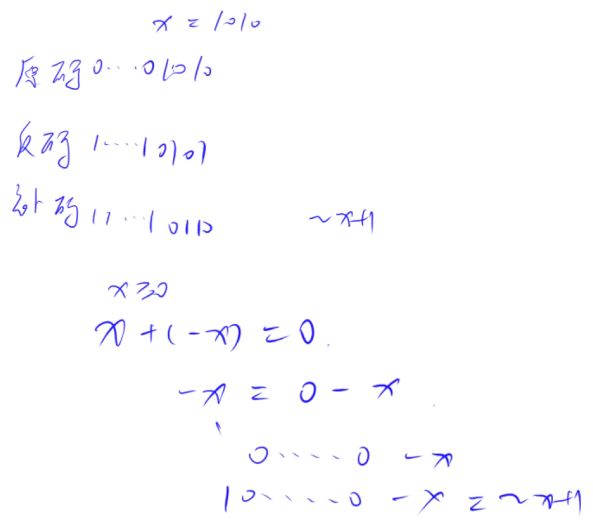

:rocket:  **[AcWing 801. 二进制中1的个数](https://www.acwing.com/problem/content/803/)**  

:memo:  **解题思路**

- 自定义`lowbit`函数操作

:dart:  **参考代码**

```C++
#include <cstdio>
#include <iostream>
using namespace std;

const int N = 1e6 + 10;
int a[N];

int lowbit(int x)
{
	return x & -x;
}

int main(void)
{
	int n;
	cin >> n;

	for(int i = 0; i < n; i++) scanf("%d", &a[i]);

	for(int i = 0; i < n; i++)
	{
		int res = 0;
		while(a[i])
		{
			a[i] -= lowbit(a[i]);//每次减去 a[i] 的最后一位1
			res++;
		}
		cout << res << ' ';
	}

	return 0;
}
```

### 整数离散化

:pushpin: **基本原理**

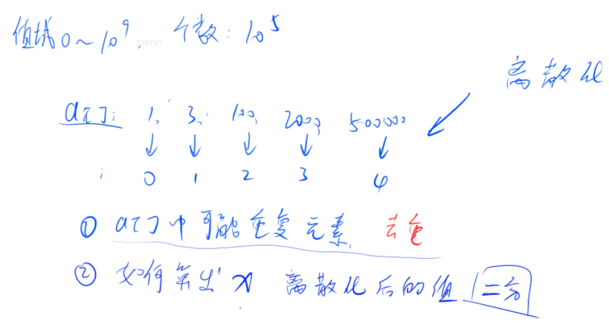

- 排序与去重操作：
```C++
sort(alls.begin(), alls.end()); // 将所有值排序
alls.erase(unique(alls.begin(), alls.end()), alls.end());//去掉重复元素
```


- 在有序数组中寻找`x`离散化后的值(即`x`在有序数组中的位次)可以用二分，前提必须是数组有序

:rocket:  **[AcWing 802. 区间和](https://www.acwing.com/problem/content/804/)**  

:memo:  **解题思路**

- 离散化主要用来处理数据范围跨度很大，但数据位置分布比较稀疏的情况。 
- 离散化中，用二分法来把稀疏坐标映射到一个数组中。映射之前，需要先排序、去重。其中排序是必要的，可以不用有去重操作，但是有这一步可以提高离散化的效率。


:dart:  **参考代码**

```C++
#include <iostream>
#include <vector>
#include <algorithm>
using namespace std;

/*
数组大小为3e5的原因：
需要离散化的数据个数不超过1e5个。其中不仅需要操作的位置需要映射，
询问时的区间边界也需要映射，所以x,l,r共有3种需要映射的数据，即为3*1e5 
*/

const int N = 3e5 + 10;
typedef pair<int,int> PII;//宏定义一个简写，无实际意义
int a[N], s[N];
vector<int> alls;//存储所有待离散化的坐标
vector<PII> add;//存储原稀疏数组区间
vector<PII> query;//存储要查询的区间

//二分求出x对应的离散化的值，找第一个大于等于x的位置
int find(int x) 
{
	int l = 0, r = alls.size() - 1;
	
	while(l < r)
	{
		int mid = (l+r)/2;
		if(alls[mid] >= x) r = mid;
		else l = mid + 1;
	}
	
    //映射到1, 2, ...n。这里可以根据题目需要映射到0, 1, ...n，
	//映射下标从1开始是为了方便前缀和等操作的处理 
	return l + 1;	
    
}

int main(void)
{
	int n, m;
	cin >> n >> m;
	
	//读入数据，并把需要离散化的数据加入到容器alls中 
	int x, c;
	for(int i = 0; i < n; i++)
	{
		cin >> x >> c;
		add.push_back({x, c});
		
		alls.push_back(x);
	}
	
	int l, r;
	for(int i = 0; i < m; i++)
	{
		cin >> l >> r;
		query.push_back({l, r});
		
		alls.push_back(l);
		alls.push_back(r);
	}
	
	//排序及去重。去重这一步是为了使离散化效率更高，不加也正确 
	sort(alls.begin(), alls.end());
	alls.erase(unique(alls.begin(), alls.end()), alls.end());
	
	//对去重后的数据进行离散化操作，注意映射的下标从1开始，方便后面前缀和的预处理 
	for(auto item : add)
	{
		x = find(item.first);
		a[x] += item.second;//在指定位置上加c，而不是随便加
	}
	
	//预处理前缀和
	for(int i = 1; i <= alls.size(); i++) s[i] = s[i-1] + a[i];
	
	//处理询问
	for(auto item : query) 
	{
		int l = find(item.first), r = find(item.second);
		cout << s[r] - s[l-1] << endl;
	}
	
	return 0;
}
```


### 区间合并

:pushpin: **基本原理**

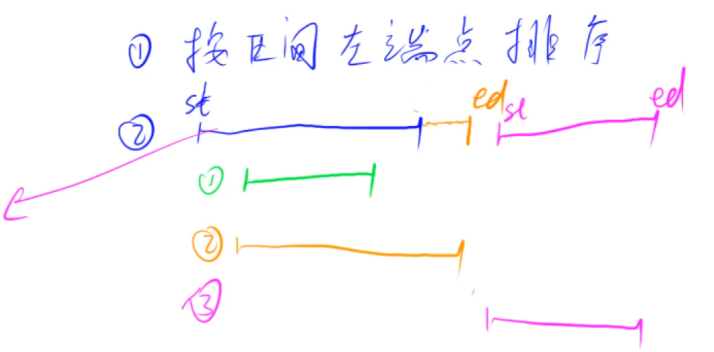

:rocket:  **[AcWing 803. 区间合并](https://www.acwing.com/problem/content/805/)**  

:memo:  **解题思路**

通过手工模拟即可知道，区间合并有三种情况，包含、有交集或没交集
对归并排序稍加修改即可处理这三种操作：
- 包含则继续遍历，无需合并，保留更宽的区间即可
- 有交集则取并集合并
- 没有交集则不需要合并，直接加入合并后的区间即可

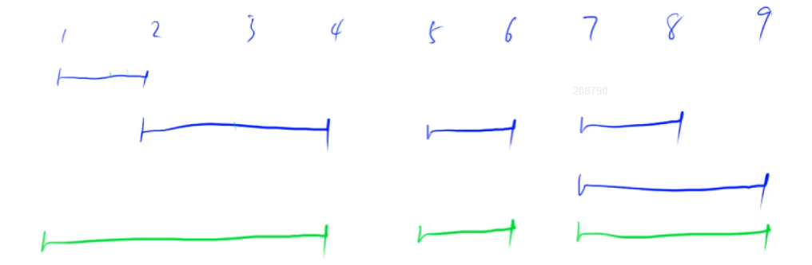

:dart:  **参考代码**

```C++
#include <cstdio>
#include <vector>
#include <algorithm>
using namespace std;

typedef pair<int, int> PII;
void merge(vector<PII> &segs)
{
    vector<PII> res; //存放合并结果
    
    sort(segs.begin(), segs.end()); //先排序再进行遍历合并

    int st = -2e9, ed = -2e9;   //视具体题目数据范围而定
    for(auto seg : segs)
    {
        if(ed < seg.first)
        {
            //若前面已经有区间的左端点，则该区间已经合并完毕
            if(st != -2e9) res.push_back({st, ed}); 
            //存储当前区间端点信息，继续遍历合并
            st = seg.first;
            ed = seg.second; 
        }
        else
        {
            //若ed大于或等于seg.first，则说明有交集，此时取合并并集
            ed = max(ed, seg.second);
        }
    }

    //特判segs里面没有需要合并的区间的情况
    if(st != -2e9)  res.push_back({st, ed});

    segs = res;
}

int main(void)
{
    int n;
    scanf("%d", &n);

    int l, r;
    vector<PII> segs;

    for(int i = 0; i < n; i++) 
    {
        scanf("%d %d", &l, &r);
        segs.push_back({l,r});
    }

    merge(segs);
    printf("%d\n", segs.size());

    return 0;
}
```