# 第二讲 数据结构


> - **主要参考来源：[AcWing 算法基础课](https://www.acwing.com/activity/content/introduction/11/)、[AcWing LeetCode究极班](https://www.acwing.com/activity/content/31/)、[代码随想录](https://programmercarl.com/other/say_feel.html)、[阿秀的学习笔记](https://interviewguide.cn/notes/03-hunting_job/03-algorithm/03-leetcode/01-introduce.html)、[labuladong](https://labuladong.github.io/algo/2/)**
> - **主要包含内容：单链表、双链表、邻接表、栈、单调栈、队列、单调队列、KMP、Trie树、并查集、堆、哈希表**

## 第一次课
:date:  2022-08-14

### 数组模拟链表

:pushpin: **基本原理**


- 用结构体模拟链表，称为动态链表，动态链表在大数据量创建新节点(`new Node();`)时非常耗时，所以一般在笔试题中不采用，而在面试题口述中采用的较多。用数组模拟链表，又称为静态链表。
```C++
struct Node
{
    int data;
    Node *next;
};
```
- 数组模拟链表的**本质是将结构体中的数值部分与指针部分分到两个数组中分别存放，数值数组存放的是当前节点的数值，指针数组存放的是当前节点的下一个节点的下标/位置**。即数值数组与指针数组通过各自数组的下标关联起来，`e[i]`表示节点$i$的值，`ne[i]`表示节点$i$的$next$指针。例如第二个节点的数值是$5$，第三个节点由于进行过插入与删除等一系列操作之后下标为`6`，则`e[2] = 5`、`ne[2] = 6`。

**[AcWing 826. 单链表](https://www.acwing.com/problem/content/828/)**  

:memo:  **解题思路**

- 模板题
- `head`为头指针，其存储头节点的下标；`e[]`存储节点的值，称为数值数组；`ne[]`存储节点的$next$指针/下标，称为指针数组；`idx`表示当前用到的节点的下标。

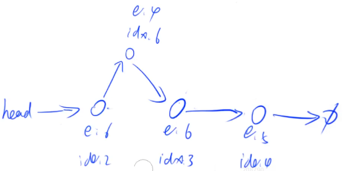

:dart:  **参考代码**

```C++
#include <iostream> 
#include <algorithm>
using namespace std;

const int N = 1e5 + 10; //开始时总共分配了N个可用节点
int head, e[N], ne[N], idx;	
//head存储头节点的下标；idx充当题目中k的作用，代表当前使用节点的下标
//但是注意是idx从0开始，而k从1开始，所以对应的用到k的地方需要减一
//idx必须是全局变量才能代表它本身的含义，表示这是总共用到的第(idx+1)个节点

void init(void)//初始化
{
	head = -1;
	idx = 0;//这种初始化方式下全局变量idx可以不用再初始化

    //head = 0, idx = 1; 只有这样初始化head才能是头指针
}

void add_to_head(int x)//将x插入到头节点位置，使用频率很高
{
	e[idx] = x;
	ne[idx] = head;
	head = idx++;//合并了 head = idx; idx++; 这两步
	//注意与Trie树中的idx++顺序相反，因为两者的初始值不一样
}

void remove(int k)//删除第k+1个插入的数后面的数
{
	ne[k] = ne[ne[k]];
}

void add_to_back(int k, int x)//将x插入到第k+1个插入的数后 
{
	e[idx] = x;
	ne[idx] = ne[k];
	ne[k] = idx++;
}

int main(void)
{
	int m;
	cin >> m;
	init();
	
	while(m--)
	{
		char op;
		cin >> op;
		
		if(op == 'H') 
		{
			int x;
			cin >> x;
			add_to_head(x);
		}
		
		else if(op == 'D')
		{
			int k;
			cin >> k;
			//k为0时删除头节点
			if(k == 0) head = ne[head];  
			else remove(k - 1);
		}
		
		else if(op == 'I')
		{
			int k, x;
			cin >> k >> x;
			add_to_back(k-1, x);
		}
	}
	
	for(int i = head; i != -1; i = ne[i]) cout << e[i] << ' ';
	cout << endl;
	return 0;
}
```

**[AcWing 827. 双链表](https://www.acwing.com/problem/content/829/)**  

:memo:  **解题思路**

- 模板题
- 代码中`e[]`存储节点的值，称为数值数组；`l[]`存储节点的左指针，称为前/左指针数组；`r[]`存储节点的右指针，称为后/右指针数组；`idx`表示当前用到的节点的下标。

:dart:  **参考代码**

```C++
#include <iostream>
#include <string>
using namespace std;

const int N = 1e5+10;
int e[N], l[N], r[N], idx;

void init(void)
{
	// 0表示左端点，1表示右端点
    r[0] = 1;
	l[1] = 0;
	idx = 2; //左右两个节点不存储具体内容，因此idx从2开始
}

//在下标是k的节点的右边插入一个数x
void insert(int k, int x)
{
	e[idx] = x;
	l[idx] = k;
	r[idx] = r[k];
	l[r[k]] = idx;//注意后两行的先后顺序 
	r[k] = idx++; 
}

//删除下标是k的节点
void remove(int k)
{
	l[r[k]] = l[k];
	r[l[k]] = r[k];
}

int main(void)
{
	int m;
	cin >> m;
	
	init();
	while(m--)
	{
		//这里注意定义为string，因为操作序列有字符串 
		string op;
		cin >> op;
		
		int k, x;
		if(op == "L")
		{
			cin >> x;
			insert(0, x);//最左端即为左端点后面插入 
		}
		else if(op == "R")
		{
			cin >> x;
			insert(l[1], x);//最右端插入即为右端点前插入 
		}
		else if(op == "D")
		{
			cin >> k;
			remove(k+1);
			//类比单链表，这里由于idx充当k的作用，且从2开始，而k从1开始，所以为idx比k多1 
		}
		else if(op == "IL")
		{
			cin >> k >> x;
			insert(l[k+1], x);	 
		}
		else 
		{
			cin >> k >> x;
			insert(k+1, x);
		}
	}
	
	for (int i = r[0]; i != 1; i = r[i]) cout << e[i] << ' ';
	cout << endl;
	
	return 0;
}
```
:memo: 解题思路

- 虚拟头节点做法：凡是有可能修改头节点、有可能出现空链表的情况都这样做。建立一个原链表中并不存在的节点，其中的元素值设为-1，永远不会对该节点进行任何操作；这样可以减少对原链表首节点操作时特殊情况的判断分支，最后返回虚拟头节点的指针即可。使用代码片段如下：
```C++
auto dummy = new ListNode(-1);
dummy->next = head;

return dummy->next；
```

- 快慢双指针算法：两个指针同向⽽⾏，⼀快⼀慢，通过调整两指针之间速度的差异可以使指针到达特定位置。一般用于寻找特定序号或满足特定条件的节点(比如中点、倒数第n个节点、环的入口点)
```C++
auto p = new ListNode(-1), q = ListNode(-1);
p = q = head;

// 快指针速度是慢指针速度的二倍
while (q && q->next){
    p = p->next; //慢指针
    q = q->next->next; //快指针
    // 注意判断条件中要同时对快指针和快指针的指针域进行判断
}

// 先让快指针出发，使得两指针起点不同
while (n--)
    q = q->next; //快指针
while (q->next) 
// 注意和上一种情况的判断条件不同，只需要判断快指针的指针域，而不需要判断其本身和慢指针
    p = p->next, q = q->next;

```

- 判断条件的选择：当需要对尾节点操作时(读取或修改其中的数据)，判断条件选择为`while (p)`；当不对尾节点进行操作时(只希望指针指向尾节点)，判断条件选择为`while (p->next)`；当不能对尾节点的前一个节点进行操作时，判断条件选择为`while (p->next->next)`

- 计算链表长度：
```C++
int len = 0;
for (auto p = head; p; p = p->next) len++;
```

- 将链表转换为数组：
```C++
vector<int> nums;
for (auto p = head; p; p = p->next) nums.push_back(p->val);
```

- 将数组转换为链表：
```C++
auto dummy = new ListNode(-1);
auto p = dummy;
for (auto num : nums){
    auto q = new ListNode(num);
    p->next = q;
    p = p->next;
}
```

- 寻找链表中的第`k`个节点：
```C++
auto dummy = new ListNode(-1);
auto p = dummy;
while (k --) p = p->next;
```

- 寻找链表中的第`k - 1`个节点：
```C++
auto dummy = new ListNode(-1);
auto p = dummy;
for (int i = 0; i < k - 1; i ++) p = p->next;
```

:rocket:  **[LeetCode 707. 设计链表](https://leetcode.cn/problems/design-linked-list/)**
- 需要用到计算链表长度、找到尾节点、寻找链表中的第`k - 1`个节点等操作

:rocket:  **[LeetCode 19. 删除链表的倒数第 N 个节点](https://leetcode.cn/problems/remove-nth-node-from-end-of-list/)**
- 找到要删除节点的前一个节点`p`，向后看两步即可实现删除操作：`p->next = p->next->next`
- 方法一：遍历整个链表，计算链表总长度，得知要删除节点的正序序号，再次遍历链表找到其的前一个节点进行删除
- 方法二：快慢双指针算法，快指针先走`n`步，然后快慢指针同步向后走，当快指针走到链表尾部时，慢指针指向的节点即为要删除节点的前一个节点
- 为了应对只有一个节点的链表删除成空链表的边界情况，让双指针指向虚拟头节点

:rocket:  **[剑指Offer 22. 链表中倒数第k个节点](https://leetcode.cn/problems/lian-biao-zhong-dao-shu-di-kge-jie-dian-lcof/)**
- 解题思路同上一题，但返回值不同

:rocket:  **[LeetCode 203. 移除链表元素](https://leetcode.cn/problems/remove-linked-list-elements/)**
- 与[LeetCode 27. 移除元素](https://leetcode.cn/problems/remove-element/)的思想一致，都是令快指针找到不是目标值的元素，赋给慢指针
- 区别在于本题要构造新的链表，所以要令慢指针遍历原链表，每次快指针都在慢指针的下一个位置开始搜索，当位置为空或不等于目标值时就跳出，找到不是目标值的节点时就令慢指针指向该节点，然后继续搜索；而数组的题目直接在原数组的基础上进行赋值，所以令快指针遍历原数组即可

:rocket:  **[LeetCode 21. 合并两个有序链表](https://leetcode.cn/problems/merge-two-sorted-lists/)**
- 为了减少特判，利用构造函数建立虚拟头节点
- 双指针算法/二路归并的思想，在归并排序中也用到了
- 因为所给链表本来就是有序的，所以在扫尾过程中只需要用`if`进行一次判断，将未归并的部分整体搬移即可

:rocket:  **[LeetCode 23. 合并K个升序链表](https://leetcode.cn/problems/merge-k-sorted-lists/)**
- 堆排序优化时间复杂度
```C++
class Solution {
public:

    struct Cmp{
        bool operator() (ListNode *a, ListNode *b){
            return a->val > b->val;
        }
    };

    ListNode* mergeKLists(vector<ListNode*>& lists) {
        priority_queue<ListNode *, vector<ListNode *>, Cmp> heap;
        auto dummy = new ListNode(-1), tail = dummy;
        for (auto l : lists) if (l) heap.push(l);

        while (heap.size()){
            auto t = heap.top();
            heap.pop();

            tail = tail->next = t;
            if (t->next) heap.push(t->next);
        }
        return dummy->next;
    }
};
```

:rocket:  **[剑指Offer 25. 合并两个排序的链表](https://leetcode.cn/problems/he-bing-liang-ge-pai-xu-de-lian-biao-lcof/)**
- 与上一题完全相同

:rocket:  **[LeetCode 876. 链表的中间节点](https://leetcode.cn/problems/middle-of-the-linked-list/)**
- 方法一：先计算链表长度，然后再将指向头节点的指针向后移动长度的一半次
- 方法二：快慢指针法，快指针的速度是慢指针的二倍，当快指针走到链表尾部时，慢指针指向的节点即为中间节点

:rocket:  **[LeetCode 141. 环形链表](https://leetcode.cn/problems/linked-list-cycle/)**
- 方法一：快慢双指针，快指针的速度是慢指针的二倍，如果链表中存在环，则快指针一定可以在套若干圈之后追上慢指针，题目也只要求判断是否有环，不要求找到环的入口节点，所以这种做法可以满足题意
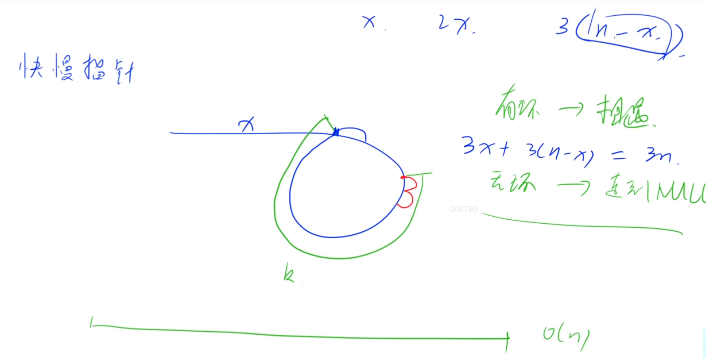
```C++
if (!head || !head->next) return false;
// 如果是空链表或链表中只有一个节点则一定无环
auto p = head, q = head;

// 做法一：进入循环时只判断快指针所指向的节点是否为空，因此不一定能连走两步
// 必须先走一步判断是否为空才能决定能不能走下一步
while (q){
    p = p->next, q = q->next;
    // 两个节点组成的链表可能有环也可能无环
    if (!q) return false;
    // 快慢指针同时向后移动一步之后先判断是否为空
    // 防止由奇数个节点组成的无环链表连走两步时指针为空
    q = q->next;
    if (p == q) return true;
    //如果快慢两个指针可以相遇则链表中一定有环
}

/*做法二：在进入循环时判断快指针的下一个节点是否为空
while (q && q->next){
    p = p->next, q = q->next->next;
    // 在进入循环时已判断快指针的下一个节点是否为空，因此无论什么情况都可以连走两步
    if (!q) return false;
    if (p == q) return true;
}
*/
return false;
```

- 方法二：哈希表，遍历链表，将每个节点的地址存入哈希表，如果遍历到的节点地址已经在哈希表中，则说明链表中存在环

:rocket:  **[LeetCode 142. 环形链表 II](https://leetcode.cn/problems/linked-list-cycle-ii/)**
- 快慢双指针，快指针的速度为慢指针速度的二倍。记快慢指针的相遇点为c点，记双指针同时出发的时刻为$t$<sub>1</sub>，记慢指针到达环形入口的时刻为$t$<sub>2</sub>，快慢双指针相遇的时刻为$t$<sub>3</sub>。$t$<sub>1</sub> ~ $t$<sub>2</sub>，慢指针a->b，快指针a->c'；$t$<sub>2</sub> ~ $t$<sub>3</sub>，慢指针b->c，快指针c'->c。所以当快慢指针相遇时，让其中一个指针回到原点，以同速前进，再次相遇时则为入口
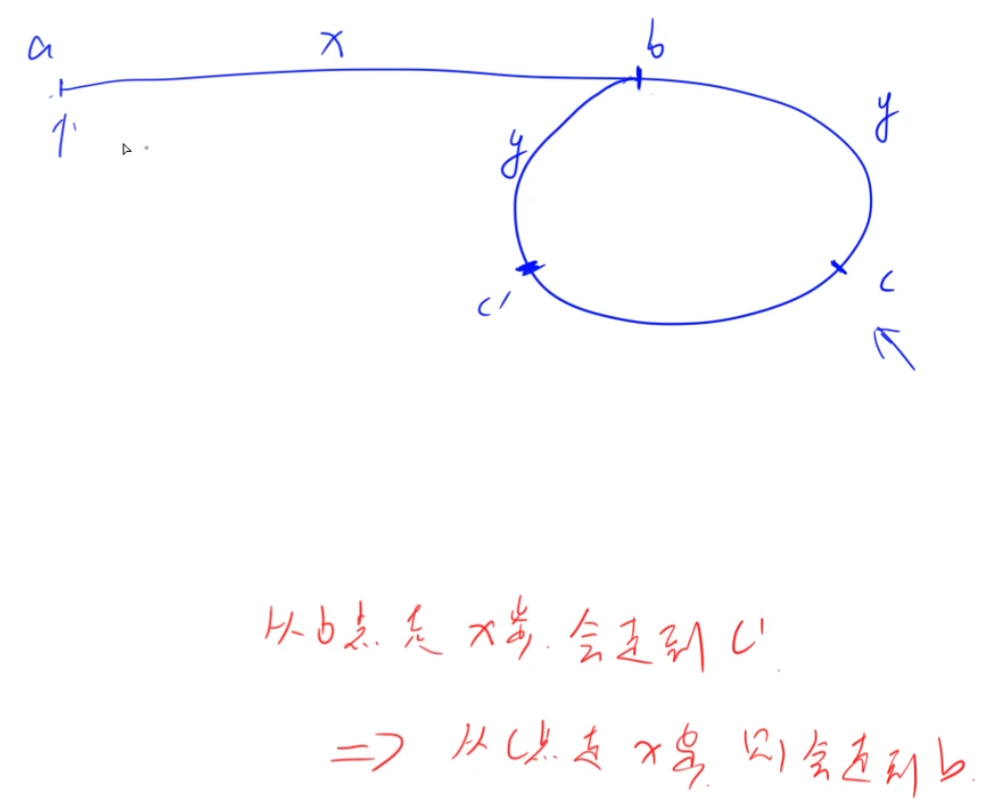
- 快慢双指针可以采用上一题中第二种`while()`循环的方式，也作为一种模板记忆，所以就是在上一题当快慢指针相遇时，让慢指针回退到起点再以相同的速度前进，再次相遇即为环的入口
```C++
if (!head || !head->next) return NULL;
auto p = head, q = head;
while (q && q->next) {
    p = p->next;
    q = q->next->next;
    if (!q) return NULL;
    if (p == q) {
        p = head;
        while (p != q) {
            p = p->next;
            q = q->next;
        }
        return p;
    }
}
return NULL;
```

:rocket:  **[LeetCode 160. 相交链表](https://leetcode.cn/problems/intersection-of-two-linked-lists/)**
- 方法一：逻辑上把两个链表连接到一起，让两个指针分别从两个链表的头节点出发，当走到本链表尾节点时从另一个链表的头节点再出发，这样两个指针相遇(即指向相交节点)时走的距离一定相同
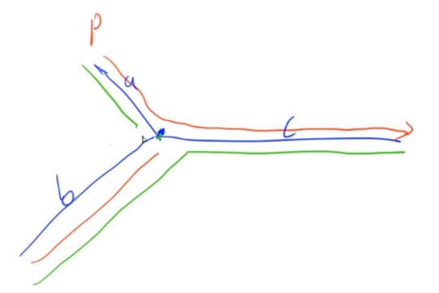
```C++
auto p = headA, q = headB;
while (p != q) {
    p = p ? p->next : headB;
    q = q ? q->next : headA;
    // 要保证两个指针都能走到各自的尾节点，所以三目运算符中的判断条件是p/q，而不是p->next/q->next
    // 要保证两个指针在相交节点相遇，最后直接返回任一指针，所以循环条件是p!=q，而不是p->next!=q->next
}
return p;
```

:rocket:  **[LeetCode 86. 分隔链表](https://leetcode.cn/problems/partition-list/)**
- 归并排序思想

:rocket:  **[LeetCode 148. 排序链表](https://leetcode.cn/problems/sort-list/)**

:rocket:  **[LeetCode 206. 反转链表](https://leetcode.cn/problems/reverse-linked-list/)**
- 方法一：先将链表转换为数组，然后数组逆序，最后将数组转换为链表返回
- 方法二：迭代法，最后还要将原链表的头节点的指针置空

```C++
if (!head || !head->next) return head;
auto a = head, b = head->next;
while (b) {
    auto c = b->next;
    b->next = a;
    a = b, b = c;
}
head->next = NULL;
return a;
```
- 方法三：递归法
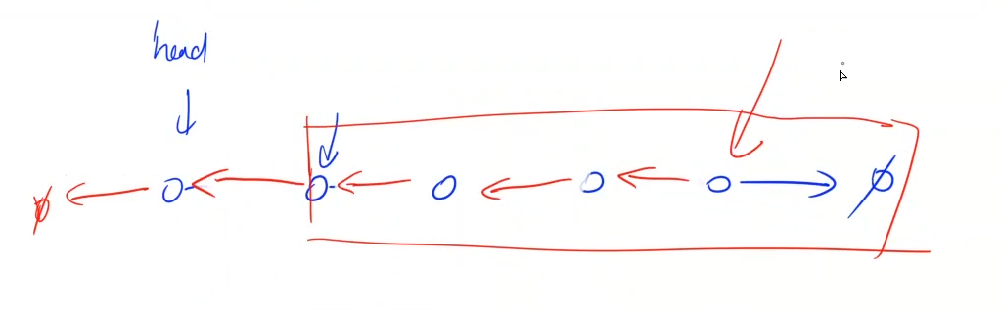
```C++
if (!head || !head->next) return head;
auto tail = reverseList(head->next);
head->next->next = head;
head->next = NULL;
return tail;
```

:rocket:  **[LeetCode 24. 两两交换链表中的节点](https://leetcode.cn/problems/swap-nodes-in-pairs/)**
- 方法一：迭代法
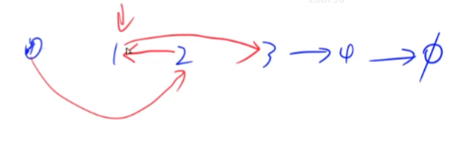
```C++
auto dummy = new ListNode(-1);
dummy->next = head;
for (auto p = dummy; p->next && p->next->next; ) {
    auto a = p->next, b = a->next;
    p->next = b;
    a->next = b->next;
    b->next = a;
    p = a;
}
return dummy->next;
```
- 方法二：递归法
```C++
if (!head || !head->next) return head;
auto p = head->next;
head->next = swapPairs(p->next);
p->next = head;
return p;
```

:rocket:  **[LeetCode 234. 回文链表](https://leetcode.cn/problems/palindrome-linked-list/)**

### 数组模拟栈与队列

:pushpin: **基本原理**

- 栈：先入后出；队列：先入先出。

:memo:  **解题思路**

- 求滑动窗口内的最大值或最小值是为数不多的应用场景

**[AcWing 828. 模拟栈](https://www.acwing.com/problem/content/830/)**  

:dart:  **参考代码**

```C++
#include <iostream>
#include <string>
using namespace std;

const int N = 1e5 + 10;
int stk[N], tt;//tt表示栈顶。这里的栈的下标是从0开始的，也可以从1开始

int main(void)
{
    int m;
    cin >> m;

    string op;
    while(m--)
    {
        cin >> op;
        if(op == "push")// 向栈顶插入一个数
        {
            int x;
            cin >> x;
            stk[++tt] = x;
        }
        else if(op == "pop")// 从栈顶弹出一个数
        {
            tt--;
        }
        else if(op == "empty")// 判断栈是否为空
        {
            if(tt > 0) cout << "NO" << endl;
            else cout << "YES" << endl;
        }
        else// 栈顶的值
        {
            cout << stk[tt] << endl;
        }
    }

    return 0;
}
```

**[AcWing 3302. 表达式求值](https://www.acwing.com/problem/content/831/)** 

:memo:  **解题思路**

表达式树：节点是运算符，叶子是参与运算的数字 

:dart:  **参考代码**

```C++

```

:rocket:  **[LeetCode 232. 用栈实现队列](https://leetcode.cn/problems/implement-queue-using-stacks/)**

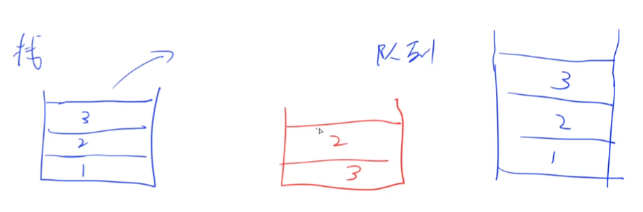
- 使用两个栈，一个主栈，一个辅助栈，辅助栈主要用于每次寻找栈底元素时存放主栈栈底上面的元素，操作完成之后再将辅助栈的元素存回到主栈即可

:rocket:  **[LeetCode 225. 用队列实现栈](https://leetcode.cn/problems/implement-stack-using-queues/)**
- 与上一题类似，使用两个队列，一个主队列，一个辅助队列，辅助队列主要用于每次寻找队尾元素时存放主队列队尾前面的元素，操作完成之后再将辅助队列的元素存回到主队列即可。注意这种做法中当只返回队尾元素而不删除时，也需要将队尾元素存入辅助队列
- 使用一个队列，每次入队时先在队尾插入元素，然后再将原队列中的元素依次出队，再入队，这样就可以保证每次入队的元素都在队列的头部，即栈顶元素
- 使用一个队列，每次入队时直接在队尾插入元素，返回栈顶元素和弹出栈顶元素时使用上一种做法中的方法，即先出队再入队的方法

:rocket:  **[LeetCode 20. 有效的括号](https://leetcode.cn/problems/valid-parentheses/)**
- 弹出栈顶元素前一定要判断栈是否为空，如果栈为空也是无法匹配的一种情况
- 判断是否匹配时，可以利用ACSII码的差值进行判断
```C++
if (stk.size() && abs(stk.top() - c) <= 2)
    stk.pop();
else
    return false;
```

:rocket:  **[LeetCode 1047. 删除字符串中的所有相邻重复项](https://leetcode.cn/problems/remove-all-adjacent-duplicates-in-string/)**
- 由于 std::string 类本身就提供了类似「入栈」和「出栈」的接口，因此我们直接将需要被返回的字符串作为栈即可。对于其他的语言，如果字符串类没有提供相应的接口，则需要在遍历完成字符串后，使用栈中的字符显式地构造出需要被返回的字符串
```C++
class Solution {
public:
    string removeDuplicates(string s) {
        string stk;
        for (char ch : s) {
            if (!stk.empty() && stk.back() == ch) {
                stk.pop_back();
            } else {
                stk.push_back(ch);
            }
        }
        return stk;
    }
};
```

:rocket:  **[LeetCode 921. 使括号有效的最少添加](https://leetcode.cn/problems/minimum-add-to-make-parentheses-valid/)**
- 一个有效的 “()” 序列的条件是在该序列中 '(' 的数量等于 ')' 的数量，并且**该序列的任意前缀中 '(' 的数量不少于 ')' 的数量**。利用栈可以证明，在将 “()” 序列逐元素入栈的过程中，要么栈为空，要么栈中存放的是 '('
- 其实本题更像是使用双指针做法解决的题目，但是由于有效括号字符串的性质可以使用栈来证明，所以归类为栈的习题

:rocket:  **[LeetCode 1541. 平衡括号字符串的最少插入次数](https://leetcode.cn/problems/minimum-insertions-to-balance-a-parentheses-string/)**
- 变量`res`表示需要插入的次数，`need`表示需要的右括号的数量

:rocket:  **[LeetCode 150. 逆波兰表达式求值](https://leetcode.cn/problems/evaluate-reverse-polish-notation/)**
- 标准栈的应用题，注意在进行运算时，先弹出的是第二个操作数，后弹出的是第一个操作数

**[AcWing 829. 模拟队列](https://www.acwing.com/problem/content/831/)**  

:dart:  **参考代码**

**普通队列**

```C++
#include <iostream>
#include <string>

using namespace std;

//hh表示队头，tt表示队尾
//这里的队列起始坐标是从0开始的
const int N = 1e5 + 10;
int q[N], hh, tt = -1;

int main(void)
{
    int m;
    cin >> m;

    string op;
    while(m--)
    {
        cin >> op;
        if(op == "push")//向队尾插入一个数
        {
            int x;
            cin >> x;
            q[++tt] = x;
        }
        else if(op == "pop")//从队头弹出一个数
        {
            hh++;//队头指针向后移动一位
        }
        else if(op == "empty")//判断队列是否为空
        {
            if(hh <= tt) cout << "NO" << endl;
            else cout << "YES" << endl;
        }
        else//队头的值
        {
            cout << q[hh] << endl;
        }
    }

    return 0;
}
```

**循环队列**

```C++
#include <iostream>
#include <string>
using namespace std;

const int N = 1e5+10;
int q[N], hh, tt;//hh表示队头，tt表示队尾的后一个位置

int main(void)
{
    int m;
    cin >> m;

    string op;
    while(m--)
    {
        cin >> op;
        if(op == "push")// 向队尾插入一个数
        {
            int x;
            cin >> x;
            q[tt++] = x;//注意这里的tt表示的是队尾的后一个位置
            if(tt == maxn) tt = 0;
        }
        else if(op == "pop")// 从队头弹出一个数
        {
            hh++;
            if(hh == maxn) hh = 0;
        }
        else if(op == "empty")//判断队列是否为空
        {
            if(hh != tt) cout << "NO" << endl;
            else cout << "YES" << endl;
        }
        else//队头的值
        {
            cout << q[hh] << endl;
        }
    }

    return 0;
}
```
### 单调栈/单调队列

:pushpin: **基本原理**

- 单调栈/单调队列的题目均是先从朴素做法入手，发现其中的单调性，进而维护一个单调栈或单调队列，这样可以求栈/队列之中的最大值/最小值/某个值

**[AcWing 830. 单调栈](https://www.acwing.com/problem/content/832/)**  

:dart:  **参考代码**

```C++
#include <iostream>
using namespace std;

const int N = 1e5 + 10;
int stk[N], tt;

int main(void)
{
	int n;
	cin >> n; 

	int x; 
	while(n--)
	{
		cin >> x; //scanf("%d", &n);
        //大量数据输入输出时scanf、printf快很多
		
		//遍历单调栈寻找满足条件的数字，并且删除掉逆序对，维护栈的递增性
        //注意while中的>=不能写为>，题目中描述的是“找到比它小的数”，并不包含小于等于的情况
		while(tt && stk[tt] >= x) tt--; //出栈

		//若存在最优解则输出，否则输出-1
		if(tt) cout << stk[tt] << ' ';
		else cout << "-1" << ' ';

		//让待查找序列中的数字入栈
		stk[++tt] = x;
	}

	return 0;
}
```

:memo: 解题思路

- 单调栈的应用场景大致可以归类为以下四种：求序列中每个数左边距离最近且比它大的数(正序遍历原数组入递减栈)、求序列中每个数左边距离最近且比它小的数(正序遍历原数组入递增栈)、求序列中每个数右边距离最近且比它大的数(逆序遍历原数组入递减栈)、求序列中每个数右边距离最近且比它小的数(逆序遍历原数组入递增栈)，记忆方法：**最后的答案肯定是从栈顶弹出，所以求最大时构造递减栈，求最小时构造递增栈，左边正序遍历，右边逆序遍历**

```C++
// 正序遍历入递增栈
stack<int> stk;
for (int i = 1; i <= n; i ++ )
{
    while (tt && stk.top() >= x[i]) stk.pop();
    // 此时栈顶元素就是左边最近的比它小的数
    // 先找到元素，因此这里会进行一些计数、统计之类的操作，再插入新元素
    stk.push(x[i]); //这一步是肯定要做的，如果不符合单调性，下一次循环就会将其弹出，不必担心
}

// 正序遍历入递减栈
stack<int> stk;
for (int i = 1; i <= n; i ++ )
{
    while (tt && stk.top() <= x[i]) stk.pop();
    // 此时栈顶元素就是左边最近的比它大的数
    stk.push(x[i]);
}

// 逆序遍历入递增栈
stack<int> stk;
for (int i = n; i >= 1; i -- )
{
    while (tt && stk.top() >= x[i]) stk.pop();
    // 此时栈顶元素就是右边最近的比它小的数
    stk.push(x[i]);
}

// 逆序遍历入递减栈
stack<int> stk;
for (int i = n; i >= 1; i -- )
{
    while (tt && stk.top() <= x[i]) stk.pop();
    // 此时栈顶元素就是右边最近的比它大的数
    stk.push(x[i]);
}
```

:rocket:  **[LeetCode 496. 下一个更大元素 I](https://leetcode.cn/problems/next-greater-element-i/)**
- 求序列中每个数右边第一个比它大的数(逆序入递减栈)
- 首先完整求一遍`nums2`中每个数右边第一个比它大的数，然后再通过哈希表查找`nums1`中标记了`nums2`中的元素

:rocket:  **[LeetCode 503. 下一个更大元素 II](https://leetcode.cn/problems/next-greater-element-ii/)**
- 求序列中每个数右边第一个比它大的数(逆序入递减栈)
- 破环成链的常用技巧：将原数组复制一份，然后将两个数组连到一起，这样每个长度为原数组长度的区间都是一个循环数组组成的顺序链
  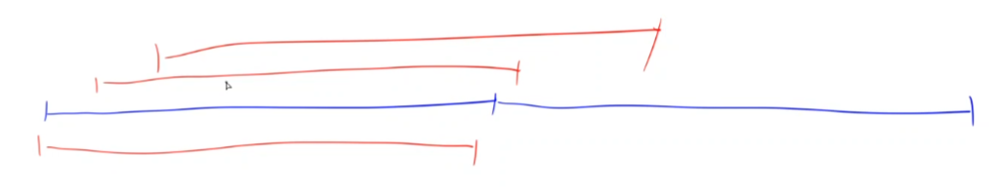
  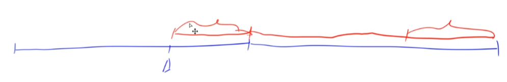
- 第一种方法是逆序遍历新数组时，当循环变量进入原数组范围内时才开始记录答案；第二种方法是将新数组全部遍历一遍，最后只返回前一半作为最终答案

:rocket:  **[LeetCode 739. 每日温度](https://leetcode.cn/problems/daily-temperatures/)**
- 因为要求输出的是下一个更高温度出现在几天后，因此栈中存放的是下一个更大元素的位置(从当前元素记起)，出栈条件判断时要套一层原数组

:rocket:  **[LeetCode 42. 接雨水](https://leetcode.cn/problems/trapping-rain-water/submissions/)**
- 每一个柱子可以存放的雨水数量由其左右两边最高的柱子高度差决定，因此可以维护两个单调栈，分别存放每个柱子左右两边最高的柱子高度

:rocket:  **[LeetCode 84. 柱状图中最大的矩形](https://leetcode.cn/problems/largest-rectangle-in-histogram/)**
- 找出每个矩形左右两边第一个比它小的矩形，然后枚举每个矩形高度所能勾勒成的矩形面积

**[AcWing 154. 滑动窗口](https://www.acwing.com/problem/content/156/)**  

:pushpin: **基本原理**

- 模板题。滑动窗口是用**单调队列**来维护下标（当然直接在队列里面存值也可以，但不便于理解）。因为涉及到窗口的移动，下标可以唯一对应到数组元素值并确保使得维护窗口长度不超过`k`。而原序列中的数是储存在另一个数组`a`中
- 单调队列指的是双端队列

:dart:  **参考代码**

```C++
#include <iostream>

using namespace std;

const int N = 1e6 + 10;
int a[N], q[N];//队列之中存储的是原数组的下标，这样就可以判断单调队列何时出队头

int main(void)
{
	//cin和cout关闭同步，使得在输入输出较多的情况下能有更快的速度
	//这里一定要两句都写，只写第二句速度提升效果并不显著
	cin.tie(0);
	ios::sync_with_stdio(false);

	int n, k;
	cin >> n >> k;

	//这里也可以把读入写到下面的循环里
	for (int i = 0; i < n; i++) cin >> a[i];
	
	int hh = 0, tt = -1;
	for (int i = 0; i < n; i++)
	{
		//判断队头是否滑出窗口
		while (hh <= tt && i-k+1 > q[hh]) hh++;
        //这里也可以用if判断，因为滑动窗口每次只移动一格
		
		//对于这道题，这里的等号可有可无，最值可以不唯一，所以不必为严格单调
		while (hh <= tt && a[q[tt]] >= a[i]) tt--;
		q[++tt] = i; //维护一个单调递增序列

		//注意是输出窗口内的最值,数字若不足3个则不构成窗口，不输出
        //但现在队列之中的元素数量却不一定与窗口要求的元素数量相等
		if(i+1 >= k) cout << a[q[hh]] << ' ';
	}
	cout << endl;
	
	hh = 0, tt = -1;
	for (int i = 0; i < n; i++)
	{
		//判断队头是否滑出窗口
		while (hh <= tt && i-k+1 > q[hh]) hh++;
		
		//最大值同理，删除掉数组中的升序逆序对，维护为单调递减序列即可
		while (hh <= tt && a[q[tt]] <= a[i]) tt--; //双端队列，队尾出队
        
		q[++tt] = i; //维护一个单调递减序列
		
		if(i+1 >= k) cout << a[q[hh]] << ' ';
	}

	return 0;
}
```
:memo:  **解题思路**

- 单调双端队列的应用场景大致可以归类为以下两种：求滑动窗口内的最大值(单调递减队列)、求滑动窗口内的最小值(单调递增队列)，记忆方法：**答案最后肯定要从队头弹出**

```C++
// 常见模型：找出滑动窗口中的最大值/最小值
int hh = 0, tt = -1;
for (int i = 0; i < n; i ++ )
{
    while (hh <= tt && check_out(q[hh])) hh ++ ;  // 判断队头是否滑出窗口
    while (hh <= tt && check(q[tt], i)) tt -- ;
    q[ ++ tt] = i;
}
```

:rocket:  **[LeetCode 239. 滑动窗口最大值](https://leetcode.cn/problems/sliding-window-maximum/)**
- 双端单调递减队列
- 注意队列中存的是数组元素的下标，返回要求返回数组元素

:rocket:  **[LeetCode 347. 前 K 个高频元素](https://leetcode.cn/problems/top-k-frequent-elements/)**

:rocket:  **[剑指Offer 59 - I. 滑动窗口的最大值](https://leetcode.cn/problems/hua-dong-chuang-kou-de-zui-da-zhi-lcof/)**
- 与上一题完全一样

:rocket:  **[面试题59 - II. 队列的最大值](https://leetcode.cn/problems/dui-lie-de-zui-da-zhi-lcof/)**
- 解题思路与注意点

### KMP算法

:pushpin: **基本原理**

> 参考链接：**[KMP算法易懂版 | 天勤公开课](https://www.bilibili.com/video/BV1jb411V78H?spm_id_from=333.337.search-card.all.click&vd_source=b98318d041cbf4bb95352d0d9cf8446e)**、**[数据结构与算法 | 左程云版](https://www.bilibili.com/video/BV13g41157hK?p=13&vd_source=b98318d041cbf4bb95352d0d9cf8446e)**、**[帮你把KMP算法学个通透！ | 代码随想录](https://www.bilibili.com/video/BV13g41157hK?p=13&vd_source=b98318d041cbf4bb95352d0d9cf8446e)**

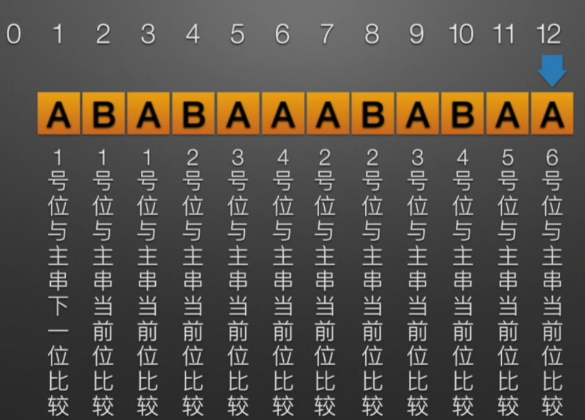


> 模拟样例如下：

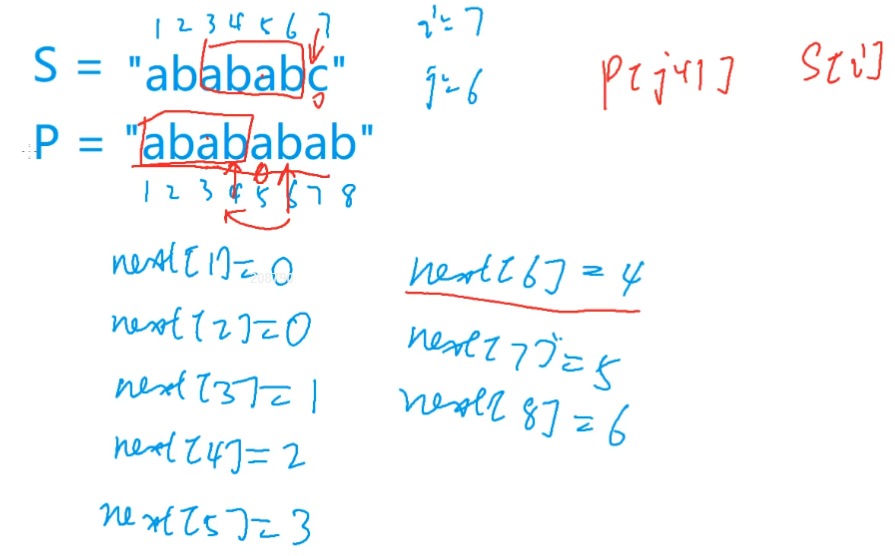

> 如何求`ne`数组(核心是数学归纳法)：

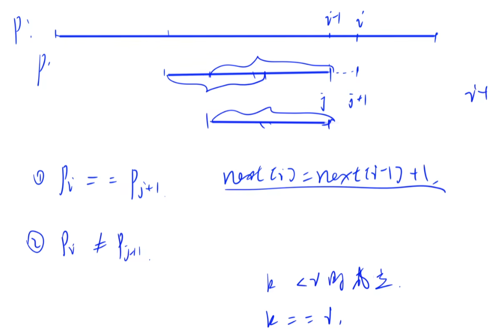

> `n - next[n]`代表循环节


**[AcWing 831. KMP字符串](https://www.acwing.com/problem/content/833/)**  

:memo:  **解题思路**

注意上下两个指针的错位问题


:dart:  **参考代码**

```C++
#include <iostream>
using namespace std;

const int N = 1e5 + 10;
const int M = 1e6 + 10;
int n, m, ne[N];//m是s的长度，n是p的长度
/*ne[N]存储的是含当前位的模式串的子串的最长相等前后缀的长度：
即若ne[i] = j,则p[1, j] = p[i - j + 1, i]*/
char p[N], s[M];//s[]是长文本，p[]是模式串

int main(void)
{
	cin.tie(0), cout.tie(0);ios::sync_with_stdio(false);

	//此处KMP算法的下标从1开始
	cin >> n >> (p + 1) >> m >> (s + 1);

	//得到next数组(双指针算法)：j指向前缀末尾，i指向后缀末尾
	//next数组为模式串的子串中前缀和后缀相同的最大长度
	//即若有不匹配的情况时可以让模式串往后移动 / 比较指针向前回溯的最少位置
	for(int i = 2, j = 0; i <= n; i++)
	{//i = 1时，相等的前后缀长度为0，所以i从2开始即可

		//处理前后缀不相同的情况
		while(j && p[i] != p[j+1]) j = ne[j];//看当前位的ne数组元素值即可 
		//这一步是j指针先回退后，模式串移动到j指针所指向的地方

		//处理前后缀相同的情况
		if(p[i] == p[j+1]) j++;

		//更新ne数组
		ne[i] = j;
	}

	//匹配过程
	for(int i = 1, j = 0; i <= m; i++)
	{
		//连续的回退过程，必须用while判断
		while(j && s[i] != p[j+1]) j = ne[j];

		if(s[i] == p[j+1]) j++;

		if(j == n)
		{
			j = ne[j];//因为这里模式串数组从0开始编号，
			//所以指针在模式串中回溯的位置是最长相等前后缀的长度
			cout << i-n << ' ';
		}
	}

	return 0;
}
```
## 第二次课

:date: 2022-09-09

### 字典树

:pushpin: **基本原理**

**[Trie树（Prefix Tree）介绍](https://blog.csdn.net/lisonglisonglisong/article/details/45584721)**

- Trie树又叫字典树、前缀树、单词查找树或键树，是用来快速存储与查找字符串集合的一种数据结构

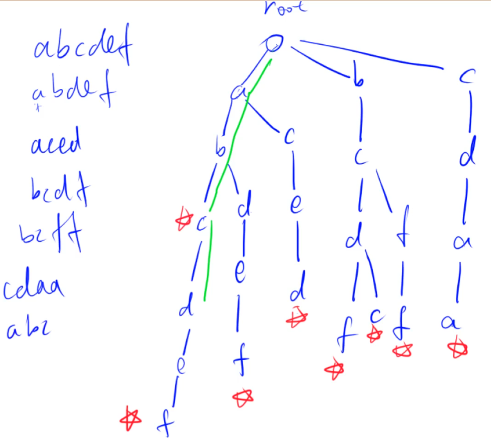

- 根节点不包含字符，除根节点外的每一个子节点都包含一个字符，且互不相同
- 在实现的时候，会在节点结构中设置一个标志，用来标记到该节点为止的路径是否构成一个字符串
- 从根节点到某一个标记节点，路径上经过的字符连接起来，为该节点对应的字符串

**[AcWing 835. Trie字符串统计 ](https://www.acwing.com/problem/content/837/)** 
 
:dart:  **参考代码**

```C++
#include <cstdio>
#include <cstring>
#include <iostream>

//下列写法适用于只包含小写字母的字符串
//0号点既是根节点，又是空节点，所以idx从1开始即可
/* son[][]存储树中每个节点的子节点，第一维为节点总数，第二维为某节点的子节点最大数量。
比如：son[1][0]=2 表示下标为1的节点的一个值为a的子节点为节点2，即是树中第2个插入的节点；
如果son[1][0] = 0，则意味着没有值为a的子节点。这里的son[N][26]相当于链表中的ne[N]*/
//比如这里是26，因为小写字母只有26种情况，若为二进制串则只有两种情况
// cnt[i] 表示以第i个节点为结尾的字符串的个数
//idx = i 表示这是插入树的第i个节点，正是因为如此才在不存在分支时对idx++，且每次调用insert函数时idx不会都从1开始

const int N = 1e5 + 10;
int n, son[N][26], cnt[N], idx;
char str[N];

//每次查询或插入时，p都要从0开始，也就是每次都要从树的根节点开始

// 插入一个字符串
void insert(char str[])
{
    int p = 0;
    for (int i = 0; str[i]; i++ )
    {
        int u = str[i] - 'a';
        if (!son[p][u]) son[p][u] = ++idx;
        p = son[p][u];//往下一层走，因此有一个类似递归的过程
    }
    cnt[p]++;//此时 p = idx，但每次调用该函数时p都从0开始，而idx却会沿用之前的值继续++
    //表明以当前节点为结尾可构成一个有效的字符串，因此计数要加一
}

// 查询字符串出现的次数
int query(char str[])
{
    int p = 0;
    for (int i = 0; str[i]; i++ )
    {
        int u = str[i] - 'a';
        if (!son[p][u]) return 0;//如果这条路不通那就说明查找的字符串不存在
        p = son[p][u];
    }
    return cnt[p];
}

int main(void)
{
    int n;
    cin >> n;
    
    while (n--)
    {
      char op;
      cin >> op >> str;
      
      if (op == 'I') insert(str);
      else cout << query(str) << endl;
    }
    
    return 0;
}
```

**[AcWing 143. 最大异或对](https://www.acwing.com/problem/content/145/)**  

:memo:  **解题思路**

> 异或操作是一种位运算，相同为0，不同为1，因此又称为不进位加法。

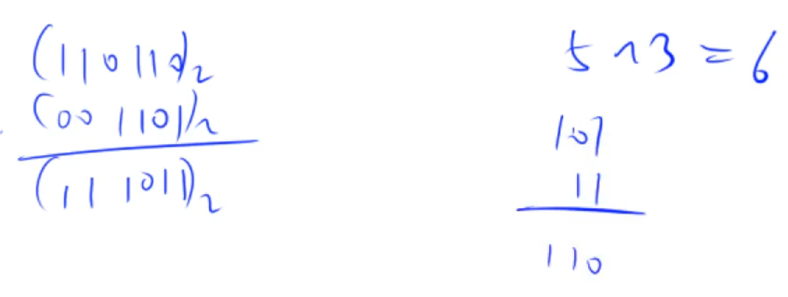

> 要使得异或和最大，从最高位开始遍历，两数二进制表示在高位不同的数的个数越多，异或和就越大。


> 存储答案res的更新原理：原res先左移一位(扩大两倍)再做加法

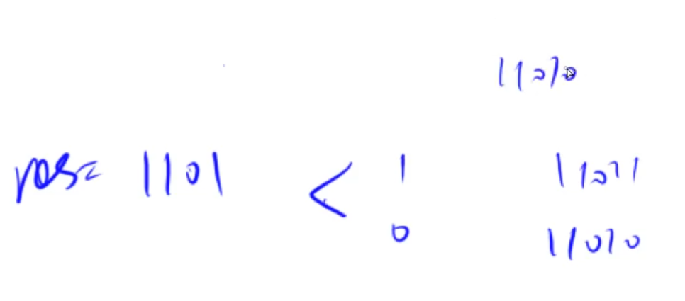

:dart:  **参考代码**

```C++
#include <iostream>
#include <algorithm>

using namespace std;

const int N = 1e5 + 10, M = 31 * N; //最多可能会有M个节点
int son[M][2], idx, a[N];

void insert(int x)
{
	int p = 0; //二进制数的最低位为第0位，最高位为第30位
	for(int i = 30; i >= 0; i--) //从二进制最高位开始遍历存储到trie树中
	{
		int u = x >> i & 1; //二进制运算操作，取出十进制数x在二进制表示法下的第i位数
		//输入数据的时候是以十进制输入的，但以二进制存储之后就可以看成Trie树
		if(!son[p][u]) son[p][u] = ++idx;
		p = son[p][u];
	}
}

int query(int x)
{
	int p = 0, res = 0;//res存放的是匹配到的另一个数
	for(int i = 30; i >= 0; i--)
	{
		//求得二进制表示的第i位数字
		int u = x >> i & 1;
		if(son[p][!u]) //尽量往与当前位不同的方向走
		{
			p = son[p][!u];
			res = res * 2 + !u;
		}
		else
		{
			p = son[p][u];
			res = res * 2 + u;
		}
	}

	return res;
}

int main(void)
{
	int n;
	scanf("%d", &n);
	for(int i = 0; i < n; i++) scanf("%d", &a[i]);

	int ans = 0; //ans存放的是最终异或的结果
	for(int i = 0; i < n; i++) //枚举的先后顺序不会影响最终结果，因此可以边插入边查找
	{
		insert(a[i]); //为了应对第一个插入的数，先进行插入操作，避免空集特判
		int t = query(a[i]);
		ans = max(ans, a[i] ^ t);
	}
	printf("%d\n", ans);

	return 0;
}
```

:rocket:  **[LeetCode 208. 实现 Trie (前缀树)](https://leetcode.cn/problems/implement-trie-prefix-tree/)**

:rocket:  **[LeetCode 211. 添加与搜索单词 - 数据结构设计](https://leetcode.cn/problems/design-add-and-search-words-data-structure/)**

:rocket:  **[LeetCode 421. 数组中两个数的最大异或值](https://leetcode.cn/problems/maximum-xor-of-two-numbers-in-an-array/)**

:rocket:  **[LeetCode 648. 单词替换](https://leetcode.cn/problems/replace-words/)**

:rocket:  **[LeetCode 677. 键值映射](https://leetcode.cn/problems/map-sum-pairs/)**

### 并查集

:pushpin: **基本原理**

每个集合用一棵树(用数组模拟树)来表示，树根的编号就是整个集合的编号，每个节点存储其父节点，即数组元素`p[x]`表示$x$的父节点，例如`p[1] = 3`表示结点$1$的父节点是节点$3$
问题$1$：如何判断到达树根？树根的条件是`p[x] == x`为真;
问题$2$：如何求$x$的集合编号？`while (p[x] != x) x = p[x]`;
问题$3$：如何合并两个集合？`p[x]`是$x$的集合编号，`p[y]`是$y$的集合编号，`p[x] = y`(令$x$的集合编号为$y$)一步操作即可

路径压缩优化：走过的路径上面的所有节点全部指向根节点

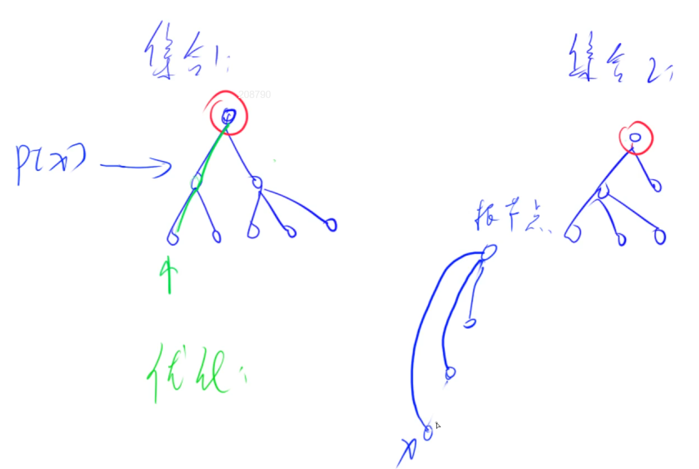

**[AcWing 836. 合并集合](https://www.acwing.com/problem/content/838/)**

:memo:  **解题思路**

:dart:  **参考代码**

```C++
#include <iostream>

using namespace std;

const int N = 1e5 + 10;
int n, m;
int p[N];

int find (int x) //返回x的祖宗节点，含路径压缩优化
{
    if (p[x] != x) p[x] = find(p[x]); //回溯的时候进行路径压缩
    return p[x];
}

int main()
{
    cin >> n >> m;
    
    for (int i = 1; i <= n; i++) p[i] = i;
    
    while (m--)
    {
        char op;
        int a, b;
        cin >> op >> a >> b;
        
        if (op == 'M') 
            p[find(a)] = find(b);
            //这条语句的含义是把节点a的祖宗节点的父节点设置为节点b的祖宗节点，也就是把节点a放入节点b所在的集合
        else 
        {
           if (find(a) == find(b)) cout << "Yes" << endl;
           else cout << "No" << endl;
        }
    }
    
    return 0;
}
```

**[AcWing 837. 连通块中点的数量](https://www.acwing.com/problem/content/839/)**

:memo:  **解题思路**

- 用一个集合维护一个连通块，因此在两个连通块之间连一条边的操作等价于将对应的两个集合合并
- 前两个操作与并查集的操作完全一样，与并查集的区别在于新增维护集合中元素的个数

:dart:  **参考代码**

```C++
#include <iostream>

using namespace std;

const int N = 1e5 + 10;
int p[N], s[N];
//p[i]表示节点i的父节点
//s[i]表示节点i所在集合中节点的数量，这里只保证当节点i是根节点时该集合意义即可

int find(int x)
{
    if (p[x] != x) 
    {
        p[x] = find(p[x]);
    }
    return p[x];
}

int main()
{
    int n, m;
    cin >> n >> m;
    
    for (int i = 1; i <= n; i++)
    {
        p[i] = i;
        s[i] = 1;
    }
    
    while (m--)
    {
        char op[5];
        int a, b;
        scanf("%s", op);
        
        if (op[0] == 'C')
        {
            scanf("%d%d", &a, &b);
            if (find(a) == find(b)) continue;
            //这里必须进行特判，如果本身就在一个集合中，自然不需要再合并
            s[find(b)] += s[find(a)];
            p[find(a)] = find(b);
        }
        else if (op[1] == '1')
        {
            scanf("%d%d", &a, &b);
            if (find(a) == find(b)) puts("Yes");
            else puts("No");
        }
        else
        {
            scanf("%d", &a);
            cout << s[find(a)] << endl;
        }
    }
    
    return 0;
}
```

**[AcWing 240. 食物链](https://www.acwing.com/problem/content/242/)**

:memo:  **解题思路**


:dart:  **参考代码**

```C++
#include <iostream>

using namespace std;

const int N = 5e5 + 10;
int p[N], d[N];
//p[i]表示节点i的父节点编号，d[i]表示节点i到其祖宗节点的距离

int find(int x)
{
    if (p[x] != x)
    {
        int t = find(p[x]);
        d[x] += d[p[x]];
        p[x] = t;
    }
    return p[x];
}

int main()
{
    int n, m;
    cin >> n >> m;
    
    for (int i = 1; i <= n; i++)
    {
        p[i] = i;
        d[i] = 0;//也可以略去这一步，因为数组d定义为了全局变量
    }
    
    int res = 0;
    
    while (m--)
    {
        int k, x, y;
        cin >> k >> x >> y;
        
        if (x > n || y > n) res++;
        else
        {
            int px = find(x), py = find(y);
            //先记录节点x与节点y的祖宗节点，用于后续判断是否在同一棵树中
            if (k == 1)
            {
                if (px == py && (d[x] - d[y]) % 3 == 0) res++; 
                //如果本身就在一个集合中，则对3取余应该是相等的，才能说明是同一类；否则这一句话是假话
                else if (px != py)
                {
                    p[px] = py; //如果不在一个集合中则这句话是真话，要进行合并操作
                    d[px] = d[y] - d[x];
                }
            }
            else 
            {
                if (px == py && (d[x] - d[y] - 1) % 3 == 0) res++;
                else if (px != py)
                {
                    p[px] = py; 
                    d[px] = d[y] + 1 - d[x];
                }
            }
        }
    }
    cout << res << endl;
    
    return 0;
}
```

:rocket:  **[LeetCode 684. 冗余连接](https://leetcode.cn/problems/redundant-connection/)**

:rocket:  **[LeetCode 685. 冗余连接 II](https://leetcode.cn/problems/redundant-connection-ii/)**

:rocket:  **[LeetCode 130. 被围绕的区域](https://leetcode.cn/problems/surrounded-regions/)**

:rocket:  **[LeetCode 990. 等式方程的可满足性](https://leetcode.cn/problems/satisfiability-of-equality-equations/)**

### 手写堆

**[AcWing 838. 堆排序](https://www.acwing.com/problem/content/840/)**

:pushpin: **基本原理**

堆所支持的操作：插入、查找最小值、删除最小值、删除任意元素、修改任意元素。

堆是一棵完全二叉树，除最底层节点外其它层都是非空的，最底层节点由左向右排列。

堆排序的基本思路就是把一个数组构造成堆，最小值为根节点，每次输出时输出根节点并删除即可。

> 以小根堆为例，父节点小于其左右两个子节点，因此堆的最小值即为根节点(下标从1开始)


:memo:  **解题思路**

> 以上五种操作可最终归纳为两种基本操作：将大节点下移down与将小节点上移up


> 求最小值的时间复杂度为O(1)，插入与删除的时间复杂度为O(logn)。

:dart:  **参考代码**

```C++
#include <iostream>
#include <algorithm>

using namespace std;

const int N = 1e5 + 10;
int h[N], s;//s表示当前堆中有几个元素，从1开始

void down(int u)
{
    int t = u;
    if (u * 2 <= s && h[u * 2] < h[t]) t = u * 2; //父节点与左儿子比较
    if (u * 2 + 1 <= s && h[u * 2 + 1] < h[t]) t = u * 2 + 1; //父节点与右儿子比较
    //t是元素值较小的节点的编号
	 
    if (u != t)
    {
        swap(h[u], h[t]);
        down(t);
    }
}

void up(int u)
{
	while (u / 2 && h[u / 2] > h[u])
	{
		swap(h[u / 2], h[u]);
		u /=2;
	}
}

int main()
{
    int n, m;
    cin >> n >> m;
    
    for (int i = 1; i <= n; i++) cin >> h[i];
    s = n;
    
    for (int i = n / 2; i; i--) down(i);//构造堆操作，时间复杂度是O(n)
    /*如果一棵树的大小是n，即下标为n的点在树的最后一层。要进行 down 操作，
    从最后一层无法操作，只能从最后一个节点的所在层的上一层开始操作，即寻找最后一个节点的父节点。
    那么按照树中的下标排序方式，当n为偶数时，它的父节点下标为 n/2；
    当n为奇数时，它的父节点下标为(n-1)/2。利用语言整数相除向下取整的特性可以一并写为 n/2。
	从下往上递归的好处就是处理到上层的时候，其子节点部分已经是一个排好序的堆了*/
    
    while (m--)
    {
        cout << h[1] << ' ';
        h[1] = h[s];//输出根节点之后要删除它
        s--;
        down(1);
    }
    
    return 0;
}
```

> 建堆的时间复杂度分析：


**[AcWing 839. 模拟堆](https://www.acwing.com/problem/content/841/)**

:memo:  **解题思路**

题目中是对第k个插入的数进行操作，而不是对下标为k的数进行操作。
因此必须知道插入顺序与堆中下标之间的映射关系，开两个数组分别存储。

> 指针映射关系图示：


:dart:  **参考代码**

```C++
#include <iostream>
#include <algorithm>
#include <string.h>

using namespace std;

const int N = 1e5 + 10;
int h[N], s;
int ph[N], hp[N];//映射关系标记：ph表示从插入顺序到堆中下标，hp表示从堆中下标到插入顺序
//ph[i]代表第i个插入的数在堆中的下标，hp[i]代表堆中下标为i的数是第几个插入的数
//hp与ph互为逆映射：即ph[j] = k, hp[k] = j

void heap_swap(int a, int b)//传入的是在堆中的下标
{
    swap(ph[hp[a]], ph[hp[b]]);
    swap(hp[a], hp[b]);
    swap(h[a], h[b]);
}

void down(int u)
{
    int t = u;
    if (u * 2 <= s && h[u * 2] < h[t]) t = u * 2;
    if (u * 2 + 1 <= s && h[u * 2 + 1] < h[t]) t = u * 2 + 1;
    if (t != u)
    {
        heap_swap(u, t);
        down(t);
    }
}

void up(int u)
{
    while (u / 2 && h[u / 2] > h[u])
    {
        heap_swap(u / 2, u);
        u /= 2;
    }
}


int main()
{
    int n, m = 0;//m表示当前第几个插入的数
    cin >> n;
    
    while (n--)
    {
        char op[10];
        int k, x;
        
        cin >> op;
        if (!strcmp(op, "I"))
        {
            cin >> x;
            s++, m++;
            ph[m] = s, hp[s] = m;
            h[s] = x;
            up(s);
        }
        else if (!strcmp(op, "PM")) cout << h[1] <<endl;
        else if (!strcmp(op, "DM"))
        {
            heap_swap(1, s);
            s--;
            down(1);
        }
        else if (!strcmp(op, "D"))
        {
            cin >> k;
            k = ph[k];
            heap_swap(k, s);
            s--;
            down(k), up(k); //两个操作最多只会执行一个
        }
        else
        {
            cin >> k >> x;
            k = ph[k];
            h[k] = x;
            down(k), up(k);
        }
    }
    
    return 0;
}
```

## 第三次课

:date: 2022-09-10

### 哈希表

:pushpin: **基本原理**

**[一文搞定哈希表](https://zhuanlan.zhihu.com/p/95156642)**

- 散列函数的输入是"键"，输出是"值"，所以叫"键值对(key - value)"
- 哈希表的主要作用是把大范围数据映射到小范围的连续数据上，比如把一堆字符串映射到一个小范围的整数上，因此关键是构造哈希函数(即映射关系)


> 拉链法解决哈希冲突：开一个存放"值"的数组，本质是"数组 + 链表"结构


> 开放寻址法解决哈希冲突：开一个两倍大小的存放"值"的数组


> 在算法题中，哈希表的操作一般只有添加与查找，时间复杂度基本均为O(1)

**[AcWing 840. 模拟散列表](https://www.acwing.com/problem/content/842/)**

:dart:  **参考代码**

> **拉链法：**

```C++
#include <iostream>
#include <cstring>

using namespace std;

const int N = 1e5 + 3; //一共操作N次，在不发生哈希冲突的情况下最多开N个键就足够
//这里可以证明，选择距离1e5最近的质数发生哈希冲突的概率最小
/* 求大于100000的最小质数
for (int i = 100000; ; i ++) {
    bool flag = true;
    for (int j = 2; j * j <= i; j ++) {
        if (i % j == 0) {
            flag = false;
            break;
        }
    
    if (flag) {
            cout << i << endl; //输出100003
            break;
    }
}
*/

int h[N], e[N], ne[N], idx; //使用拉链法，相当于在每个槽上有一个链表的头节点，每次插入可以给链表头节点插入
//与图论中节点的存储方式非常类似

void insert(int x)
{
    int k = (x % N + N) % N; //为了确保负数哈希值也是正数需要再加上N模N
    //例如：-10 % 3 = -10 - (3 * (-3)) = -1
    e[idx] = x, ne[idx] = h[k], h[k] = idx++; 
    //在每个槽的链表的最前面插入。即h[k]指向了所属链表的首节点
}

bool find(int x)
{
    int k = (x % N + N) % N;
    for (int i = h[k]; i != -1; i = ne[i])
    {
        if (x == e[i]) return true;
        
    }
    return false;
}

int main()
{
    int n;
    cin >> n;
    
    memset(h, -1, sizeof(h)); //将数组赋初值为-1，详见memset函数用法
    
    while (n--)
    {
        char op[2];
        int x;
        cin >> op >> x;
        
        if (op[0] == 'I') insert(x);
        else
        {
            if (find(x)) puts("Yes");
            else puts("No");
        }
    }
    
    return 0;
}
```

> **开放寻址法：**

```C++
#include <iostream>
#include <cstring>

using namespace std;

const int N = 2e5 + 3, null = 0x3f3f3f3f; //开放寻址法所开数组的大小一般是总数的2-3倍
//这里可以证明，选择距离2e5最近的质数发生哈希冲突的概率最小
// 0x3f3f3f3f = 1061109567

int h[N]; //使用开放寻址法只需要开一个数组

int find(int x) //若x存在，则返回x所在位置；若x不存在，则返回x应该存储的位置
{
    int k = (x % N + N) % N;
    
    while (h[k] != null && h[k] != x)
    {
        k++;
        if (k == N) k = 0; //从头再开始找空位
        //寻找的过程一定会停止，因为所开数组的大小是所需空位的二倍
    }
    
    return k;
}

int main()
{
    int n;
    cin >> n;
    
    memset(h, 0x3f, sizeof(h)); //将数组赋初值为0x3f3f3f3f
    //函数memset按字节进行初始化，int型数组一共四个字节，将每个字节都赋值为0x3f
    
    while (n--)
    {
        char op[2];
        int x;
        cin >> op >> x;
        
        int k = find(x);
        if (op[0] == 'I') h[k] = x;
        else
        {
            if (h[k] != null) puts("Yes");
            else puts("No");
        }
    }
    
    return 0;
}
```

- 在算法竞赛中，我们常常需要用到设置一个常量用来代表“无穷大”。比如对于int类型的数，有的人会采用`INT_MAX`，即`0x7fffffff`作为无穷大。但是以INT_MAX为无穷大常常面临一个问题，即加一个其他的数会溢出。而这种情况在动态规划，或者其他一些递推的算法中常常出现，很有可能导致算法出问题

- 所以在算法竞赛中，我们常采用`0x3f3f3f3f`来作为无穷大。`0x3f3f3f3f`主要有如下好处：`0x3f3f3f3f`的十进制为`1061109567`，和`INT_MAX`一个数量级，即`10^9`数量级，而一般场合下的数据都是小于10^9的。`0x3f3f3f3f * 2 = 2122219134`，无穷大相加依然不会溢出。可以使用`memset(array, 0x3f, sizeof(array))`来为数组设初值为`0x3f3f3f3f`，因为这个数的每个字节都是`0x3f`

**[AcWing 841. 字符串哈希](https://www.acwing.com/problem/content/843/)**

:memo:  **解题思路**

- 这里的字符串哈希方式指的是字符串前缀哈希法
- 哈希算法的本质就是把复杂信息提前预处理映射为整数，将判断两个字符串是否相等的问题转换为映射之后的整数是否相等(假设不发生哈希冲突)，时间复杂度从O(n)降低为O(1)


- 最终的结果是把字符串映射到`0 ~ Q-1`之间的数，进而求得任意一个子串的哈希值


- 相当于在`h[L - 1]`的末尾补上一段长为`[L, R]`的零

:dart:  **参考代码**

```C++
#include <iostream>
#include <cstring>

using namespace std;
typedef unsigned long long ULL; //采用unsigned long long数据类型，若发生溢出等价于对2^64进行了取模操作

const int N = 1e5 + 10, P =131; //选取P = 131 或 133331，可以最大程度避免哈希冲突
char str[N];
ULL h[N], p[N]; //h[i]表示的是原始字符串中前i个字符对应的哈希值
//p[i]表示的是区间长度的预处理值，p[i]表示P的i次方

ULL get(int l, int r)
{
    return h[r] - h[l - 1] * p[r - l + 1];
}

int main()
{
    int n, m;
    scanf("%d%d%s", &n, &m, str + 1);
    
    p[0] = 1; //131 ^ 0 = 1

    //如果需要用strlen函数获得字符串的长度，记得要提前计算并存储到变量中，
    //不要在循环中计算，否则会超时，详见AcWing131. 兔子与兔子
    for (int i = 1; i <= n; i++)//整个字符串的下标从1开始，因此读入时要str + 1
    {
        p[i] = p[i - 1] * P; //相乘的值也进行预处理
        h[i] = h[i - 1] * P + str[i];
        //进行运算时会把str[i]转化为ULL类型计算，因此可以直接相加此类型的溢出等价于对2^64进行了取模操作
    }
    
    while (m--)
    {
        int x, y, a, b;
        cin >> x >> y >> a >> b;
        
        if (get(x, y) == get(a, b)) puts("Yes");
        else puts("No");
    }
    
    return 0;   
}
```

- 哈希表是一种用空间换时间的算法，使用该算法的关键在于选取哪一类容器
- 有些能使用哈希表做的题目也可以使用其他算法：比如双指针算法解决
- 哈希表非常擅长解决是否出现、出现次数的问题

:rocket:  **[LeetCode 242. 有效的字母异位词](https://leetcode.cn/problems/valid-anagram/)**
- 方法一：查找哈希表中不存在的`key`时，对应的`value`默认值为0，因此直接比较两个`unordered_map`是否相等
- 方法二：使用数组的哈希原理，如果最后该数组中有元素不为零，则两个字符串中一定多了或少了某个字符

:rocket:  **[LeetCode 383. 赎金信](https://leetcode.cn/problems/ransom-note/)**

:rocket:  **[LeetCode 205. 同构字符串](https://leetcode.cn/problems/isomorphic-strings/)**
- 不需要管具体的映射关系是什么，只需要维护两个哈希表，每次判断彼此的映射关系即可

:rocket:  **[LeetCode 1002. 查找共用字符](https://leetcode.cn/problems/find-common-characters/)**
- 在给定的字符串数组中，统计每个字母在其中每个元素出现的最小次数，即为最后答案中该字母应该出现的次数

:rocket:  **[LeetCode 349. 两个数组的交集](https://leetcode.cn/problems/intersection-of-two-arrays/)**
- 利用`set`不允许重复元素出现的特性进行去重

:rocket:  **[LeetCode 202. 快乐数](https://leetcode.cn/problems/happy-number/)**
- 给定一个正整数，求其各位数字的平方和。例如，给定数字$19$，其各位数字上的平方和为$1^2 + 9^2 = 82$
```C++
int get(int x) {
    int res = 0;
    while (x) {
        res += (x % 10) * (x % 10);
        x /= 10;
    }
    return res;
}
```
- 快慢双指针方法：快指针一次求两步，慢指针一次求一步(即求一次各位数字的平方和)，看快慢指针最后相遇的位置结果是否为$1$，为$1$的话给定的数字是快乐数，反之不是快乐数
- 哈希表方法：求快乐数的过程一定会进入循环之中，就看这个循环里面的数是多少，如果循环之中的数全是$1$，则给定的数字是快乐数，反之不是快乐数

:rocket:  **[LeetCode 1. 两数之和](https://leetcode.cn/problems/two-sum/)**
- 注意题目输入的并不是有序数组，并且不能对所给数组进行排序，因为这样就会破坏原输入数组各元素的下标，因此在[LeetCode 167. 两数之和 II - 输入有序数组](https://leetcode.cn/problems/two-sum-ii-input-array-is-sorted/)中使用过的快慢双指针方法不管用
- 因为要查询数组元素是否存在并且返回元素对应的下标，所以只能使用关联式容器，又因为不关心顺序，所以使用`unordered_map`，`key`为数组元素，`value`为数组元素对应的下标，这样才能进行查询

:rocket:  **[LeetCode 454. 四数相加 II](https://leetcode.cn/problems/4sum-ii/)**
- 先遍历预处理后两个数组，然后再遍历前两个数组，用`key`查询是否有对应和
- 题目只要求返回方案数量，不要求返回方案下标元组，所以第二个属性存储方案数即可，不需要使用容器的嵌套。有时候要求返回不同的属性则可能对应完全不同的容器/算法

:rocket:  **[LeetCode 15. 三数之和](https://leetcode.cn/problems/3sum/)**
- 要求返回数组中的元素而不是数组元素的下标，因此可以对所给数组排序后使用左右双指针算法，因为题意要求三个数，双指针只能指向两个数，所以还需要一层`for`循环枚举一个数
- 哈希表与双指针的时间复杂度相同，但是空间复杂度更高，所以这里使用性能较优的双指针算法

:rocket:  **[LeetCode 18. 四数之和](https://leetcode.cn/problems/4sum/)**
- 与上一题思路类似，因为是四个数求和，还需要两层`for`循环枚举两个数
- 注意题目所给的数据范围，四个数加起来可能超过`int`，因此在求和时要先进行`(long long)`强制类型转换

:rocket:  **[LeetCode 1365. 有多少小于当前数字的数字](https://leetcode.cn/problems/how-many-numbers-are-smaller-than-the-current-number/)**

### STL使用方法

`vector`：变长数组，基于倍增思想，尽量减少向系统申请内存空间的次数，而浪费空间无所谓
- 支持随机存取与访问，支持数组间的比较运算(字典序比较原理)
- `size()`用于返回元素个数，`empty()`用于返回数组是否为空，`clear()`用于清空数组
- `front()`用于返回数组的第一个元素，`back()`用于返回数组的最后一个元素
- `push_back()`用于向数组末尾插入一个元素，`pop_back()`用于删除数组的最后一个元素
- `begin()`用于返回数组第一个元素的首地址，`end()`用于返回数组最后一个元素的下一个地址

`pair<int, int>`：可以存储一个二元组，为一个东西的二元属性建模
- 支持比较运算(字典序比较原理或自定义关键字比较方式)
- `first()`第一个元素，`second()`第二个元素，初始化方式`make_pair()`

`string`：字符串，C++语言独有的库
- `size()`用于返回字符个数，`empty()`用于返回字符串是否为空，`clear()`用于清空字符串
- `subset()`用于返回某一子串，`c_str()`用于获取字符数组的头指针
- 其中的字符下标从0开始，可以使用+进行两个字符串的连接，`strlen()`用于返回字符串长度

`queue`：普通队列，队尾插入，队头弹出
- `push()`用于向队尾插入，`pop()`用于弹出队头元素
- `front()`用于返回队头元素，`back()`用于返回队尾元素
- `size()`用于返回元素个数，`empty()`用于返回队列是否为空，但没有`clear()`

`priority_queue`：优先队列，本质上是一个堆，默认是大根堆
- `push()`用于向堆中插入，`top()`用于返回堆顶元素，`pop()`用于弹出堆顶元素
- `size()`用于返回元素个数，`empty()`用于返回优先队列是否为空，但没有`clear()`

`stack`：栈
- `push()`用于栈顶插入，`top()`用于返回栈顶元素，`pop()`用于弹出栈顶元素
- `size()`用于返回元素个数，`empty()`用于返回栈是否为空，但没有`clear()`

`deque`：双端队列，队头队尾都可以弹出，且支持随机访问与寻址
- `front()`用于返回队头元素，`back()`用于返回队尾元素
- `push_back()`/`push_front()`用于向队尾/队首插入，`pop_back()`/`pop_front()`用于弹出队尾/队头元素
- `size()`用于返回元素个数，`empty()`用于返回双端队列是否为空，`clear()`用于清空双端队列
- 支持`begin()`、`end()`迭代器

`set`、`multiset`：基于平衡二叉树(红黑树)实现，动态维护有序序列
- `size()`用于返回元素个数，`empty()`用于返回是否为空，`clear()`用于清空
- 支持`begin()`、`end()`迭代器，可进行加减操作，时间复杂度是`O(logn)`
- `set`中不允许有重复元素，`multiset`中允许有重复元素。`insert()`用于插入，`find()`用于查找，`count()`用于返回某一元素的个数，`erase()`用于删除所有x或指定迭代器，这取决于输入
- `lower_bound()`用于返回大于等于x的最小数的迭代器，`upper_bound()`用于返回大于x的最小数的迭代器

`map`、`multimap`：基于平衡二叉树(红黑树)实现，动态维护有序序列
- `map`中不允许有重复元素，`multimap`中允许有重复元素
- `insert()`插入函数，输入的是一个数，`erase()`输入的参数是`pair`或迭代器，`find()`用于查找

`unordered_set`、`unordered_map`、`unordered_multiset`、`unordered_multimap`：基于哈希表实现
- 增删改查的时间复杂度是`O(1)`，缺点是不支持`lower_bound()`与`upper_bound()`，也不支持迭代器的加减操作

`bitset`：压位运算
- 可看作整数，进行比较运算
- `count()`用于返回有多少位1，`any()`用于判断是否至少有一个$1$，`none()`用于判断至少全为$0$
- `set()`用于把所有位置成$1$，`reset()`用于把所有位置成$0$，`set(k, v)`用于把第$k$位置成$v$
- `flip()`用于取反，`flip(k)`用于把第k位取反

```C++
#include <map>
#include <cstdio>
#include <vector>
#include <cstring>
#include <iostream>
#include <algorithm>

using namespace std;

int main()
{
    vector<int> a(10, 1); //定义一个长度为10的int类型的变长数组a，其中每一个元素的值均为3
    for (auto x : a) cout << x << endl; //这种方式可以遍历所有容器，C++11新特性

    for (int i = 0; i < a.size(); i++) cout << a[i] << ' '; cout << endl;
    for (vector<int>::iterator i = a.begin(); i != a.end(); i++)
        cout << *i << endl; cout << endl; //迭代器的遍历方式，可以看成是指针作为循环变量

    priority_queue<int> heap; //默认定义为大根堆
    priority_queue<int, vector<int>, greater<int>> heap;//定义了一个小根堆

    map<string, int> = a;
    a["wy"]= 1;

    cout << a["wy"] << endl; //像数组一样使用map，但时间复杂度是O(logn)

    bitset<10000> s;

    
    return 0;
}
```
