# 搜索与图论

> - **主要参考来源：[AcWing 算法基础课](https://www.acwing.com/activity/content/introduction/11/)、[AcWing LeetCode究极班](https://www.acwing.com/activity/content/31/)、[代码随想录](https://programmercarl.com/other/say_feel.html)、[阿秀的学习笔记](https://interviewguide.cn/notes/03-hunting_job/03-algorithm/03-leetcode/01-introduce.html)、[labuladong](https://labuladong.github.io/algo/2/)**
> - **主要包含内容：深度优先搜索DFS、宽度优先搜索BFS、树与图的存储、树与图的深度优先遍历、树与图的广度优先遍历、拓扑排序、Dijkstra、Bellman-Ford、SPFA、Floyd、Prim、Kruskal、染色法判定二分图、匈牙利算法**

> memset函数用法：[关于memset函数和赋值0x3f的使用](https://blog.csdn.net/qq_42386788/article/details/116427457)，包含在头文件 'cstring'中

> Debug方法：cout输出变量法(多用于Wrong Answer)、删除部分代码法(多用于Sagmentation Fault、Runtime Error)

## 第一次课

:date: 2022-09-11

- **DFS：递归结束条件的选择+状态标记+递归后的恢复(回溯)**
- **BFS：模拟队列 q[N], d[N] 使用d数组标记状态**
- **搜索：解空间的搜索往往需要DFS+剪枝，BFS用来找最短路**
- **树和图的存储：邻接表 h[N], e[N], ne[N], idx**
- **树和图的遍历：遍历不用像搜索解空间一样递归后恢复，只用遍历一次即可**

### 深度优先搜索DFS

:rocket:  **[AcWing 842. 排列数字](https://www.acwing.com/problem/content/844/)**  

:pushpin: **基本原理**

- DFS，英文全称为Depth First Search；BFS，英文全称为Breadth First Search

> DFS原理：每一次回溯时都会检查当前路径是否全部被遍历过，性格表现为“执着”


> BFS原理：每一次搜索时会把当前层所有节点全部搜索完毕，性格表现为“稳重”


> DFS与BFS的比较：

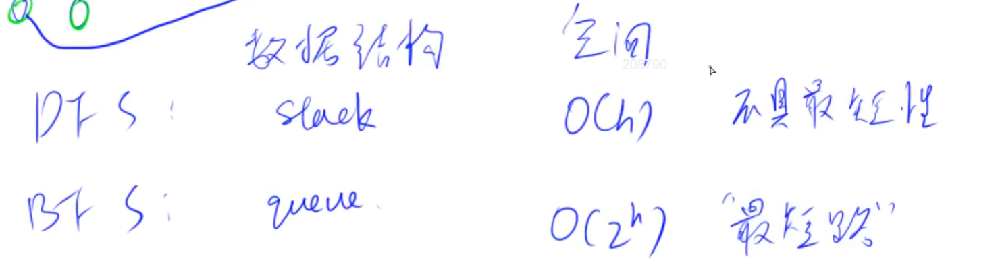

- h表示树的最大深度
- DFS在具体应用时的两个重要思想是“回溯”与“剪枝”
- 使用DFS时不需要手动开栈，函数递归调用时系统会自动实现
- BFS擅长解决“最短”、“最小”、“最少”之类的问题，但在空间复杂度上不占优


:rocket:  **[AcWing 842. 排列数字](https://www.acwing.com/problem/content/844/)**

:memo:  **解题思路**

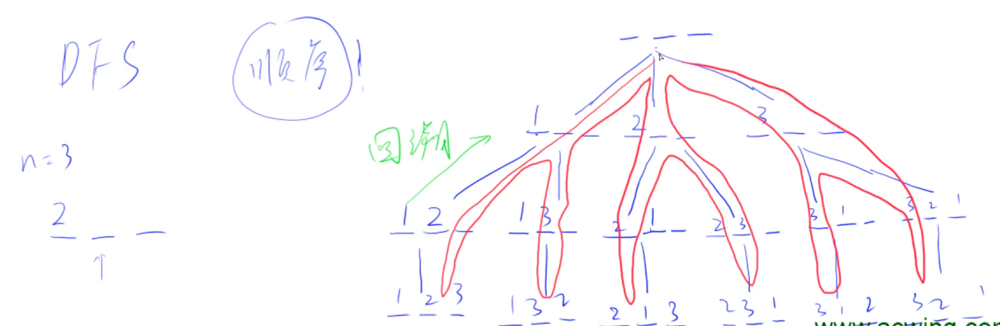

- 画树只是为了方便理解，回溯时要注意恢复现场
- 每次只存储当前搜索的路径，而不是一整棵树
- DFS采用的搜索顺序不同，也会对应不同的搜索框架，例如八皇后问题

:dart:  **参考代码**

```C++
#include <iostream>

using namespace std;

const int N = 10;

int n;
int path[N]; //path[i] = k 表示当前方案的第(i + 1)位为数字k，数组path值存储本次搜索的路径
//位置的索引与函数dfs中的填充和输出有关
bool st[N]; //st[k] = true 表示数字k已经被使用过
//全局变量下的布尔数组默认值为false，即刚开始时每个数都没被使用过

void dfs(int u)
{
    if (u == n) //如果搜索的位次与数字总个数相同，则说明已经搜索完最后一位，可以将方案输出
    {
        for (int i = 0; i < n; i++) printf("%d ", path[i]);
        //注意在数组path中是从下标0开始索引的，下文填充时也是填充path[u]，而不是path[u + 1];
        puts("");
        return;
    }
    
    //按照字典序顺次使用给定的数字
    for (int i = 1; i <= n; i++)
        if (!st[i]) //这个数之前必须之前没有被使用过
        {
            path[u] = i; 
            st[i] = true;
            dfs(u + 1); //递归至下一位进行处理
            st[i] = false; //恢复现场
        }
}

int main()
{
    scanf("%d", &n);
    
    dfs(0);//从第零位开始递归，即填充第零位，进入下一位
    
    return 0;
}
```

:rocket:  **[AcWing 843. n-皇后问题](https://www.acwing.com/problem/content/845/)**  

:memo:  **解题思路**

- 这道题可以穷竭搜索，但是更优的解法是剪枝。  
- 穷竭搜索是每个格子挨个 DFS，选择放或者不放，最坏复杂度约为 O(2n^2)；  
- 由于已经放了皇后的行、列以及主、副对角线都不能放，一旦前面的位置有不合法的放置，后面怎么放也不合法，所以可以不用继续递归，直接剪枝并回溯即可，最坏复杂度约为 O(n!)。

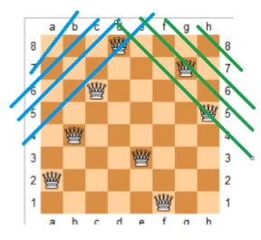

- 图解不同位置映射到不同对角线的序号上

:dart:  **参考代码**

> 第一种搜索方法：剪枝搜索

```C++
#include <iostream>

using namespace std;
const int N = 20; //因为对角线的映射，数量加倍

int n;
char g[N][N];
bool col[N], dg[N], udg[N]; //按行进行搜索，
//col[i] = true 表示第i列已经有皇后
//dg[i] = true 表示第i条正对角线(右上至左下)上已有皇后
//udg[i] = true 表示第i条反对角线(左上至右下)上已有皇后

void dfs(int u)
{
    if (u == n)
    {
        for (int i = 0; i < n; i++) puts(g[i]); //直接输出整行
        puts("");
        return;
    }
    
    for (int i = 0; i < n; i++) //按行进行搜索，枚举每一列，因此相比第二种方法没有row[N]
    {
        //u表示行，i表示列，但为了防止反对角线的下标索引出现负数要加n
        if (!col[i] && !dg[u + i] && !udg[n - u + i])
        {
            g[u][i] = 'Q';
            col[i] = dg[u + i] = udg[n - u + i] = true;
            dfs(u + 1);
            col[i] = dg[u + i] = udg[n - u + i] = false; //逆序恢复现场
            g[u][i] = '.';
        }
        
    }
}

int main()
{
    cin >> n;
    
    for (int i = 0; i < n; i++)
        for (int j = 0; j < n; j++)
            g[i][j] = '.';
    //先统一初始化棋盘，然后再在满足要求的位置上进行覆盖
            
    dfs(0);
    
    return 0;
}
```

> 第二种搜索方法：穷竭搜索，更符合DFS的原始思路

```C++
#include <iostream>

using namespace std;
const int N = 20;

int n;
char g[N][N];
bool row[N], col[N], dg[N], udg[N]; 
//row[i] = true 表示第i行已有皇后，col[i] = true 表示第i列已有皇后
//dg[i] = true 表示第i条正对角线上已有皇后，udg[i] = true 表示第i条反对角线上已有皇后

void dfs(int x, int y, int s)
{
    if (y == n) y = 0, x ++; //搜索位置超出棋盘时，重新定义x与y，进入下一行搜索
    
    if (x == n)
    {
        if (s == n) //如果在整个遍历过程中摆放了n个皇后
        {
            for (int i = 0; i < n; i++) puts(g[i]);
            puts("");
        }
        return;
    }
    
    //每个棋盘位置都有两种选择：放皇后或者不放皇后

    //不放皇后
    dfs(x, y + 1, s);
    
    //放皇后。x表示行，y表示列
    if (!row[x] && !col[y] && !dg[x + y] && !udg[x - y + n])
    {
        g[x][y] = 'Q';
        row[x] = col[y] = dg[x + y] = udg[x - y + n] = true;
        dfs(x, y + 1, s + 1);
        row[x] = col[y] = dg[x + y] = udg[x - y + n] = false;
        g[x][y] = '.';
    }
}

int main()
{
    cin >> n;
    
    for (int i = 0; i < n; i++)
        for (int j = 0; j < n; j++)
            g[i][j] = '.';
            
    dfs(0, 0, 0); //在棋盘上的(0, 0)处开始放置第0个皇后
    
    return 0;
}
```

:memo:  **解题思路**

- DFS采用的搜索顺序不同，也会对应不同的搜索框架，例如八皇后的两种不同搜索方式
- 递归函数传递参数时，尽可能多用变量的引用，减少执行用时；尽量减少递归函数的参数，多使用全局变量，有利于提高代码的可读性，更能体现回溯的思想精髓
- 回溯时要记得按照搜索现场的逆序恢复现场，有时需要恢复的现场可能不只一处，做到不重不漏
- **回溯法一般是在给定的集合中递归搜索，集合的大小构成了树的宽度，组合的元素数量/目标路径上节点的个数决定了递归的深度，进而构成了树的深度**
- 剪枝精髓是：`for`循环在寻找起点的时候要有一个范围，如果这个起点到集合终止之间的元素已经不够题目要求的`k`个元素了，就没有必要继续搜索了
- 组合问题是无序的，例如`{2,3}`与`{3,2}`为同一种组合，排列问题是有序的，例如`{2,3}`与`{3,2}`为两种不同排列。因此**组合问题为了不重复记录答案，遍历过程需要“勇往直前”**，一般情况下在`for`循环中对于同一集合的组合问题要记录起始下标(特殊情况是不同集合的组合问题也要从头开始：LC17)；而**排列问题为了不遗漏记录答案，遍历过程需要“瞻前顾后”**，在`for`循环中每次遍历给定集合，但需要额外使用状态标记数组表明当前元素是否被使用过
- **对于给定集合中无重复元素的组合问题，为了树枝去重需要人为规定选取元素的顺序，即每个节点的`for`循环不能每次都遍历给定集合，因此需要带开始下标**，当不允许重复使用给定集合中元素时，下一层递归时必须更新起始下标(递归函数传参)，使下标递增，才能做到不重复选取当前元素(LC77、LC216)；当允许重复使用给定集合中的数时，下一层递归不更新起始下标，只由`for`循环做到“树层内的遍历向前看”(LC39)
- **对于给定集合中有重复元素的组合问题，首先要将给定集合排序，使重复元素相邻**。当不允许重复使用给定集合中的数时，要进行树层去重，也就是同一父节点下的同层上使用过的元素就不能再使用；当允许重复使用给定集合中的数时，题目本身没多大意义，因为可以无限组合下去
- **组合、分割、排列问题都是收集树的叶节点，因此一定要设置递归的返回条件，否则会无限递归下去造成堆栈溢出；而子集问题是找树的所有节点，有的题目`for`循环就会终止递归，有时可以不用设置递归的返回条件**
- 

```C++
int sum = 0;
vector<int> path;
vector<vector<int>> res;

vector<vector<int>> func(vector<int>& nums) {
    path.clear(), res.clear();
    int n = nums.size();
    vector<bool> used(n, false); //树层标记数组
    sort(nums.begin(), nums.end()); //排序，使重复元素相邻
    dfs(参数);
    return res;
}

void dfs(参数) {
    if (到达叶结点的终止条件) {
        if (符合题意要求的叶节点) { //有时候并不是所有叶节点都是满足题意的，所以要有两次判断
            // 存放结果
        };
        return;
    }

    // 组合问题、子集问题：肯定要进行树枝去重，都不能回头看
    for (int i = st; i < nums.size(); i ++) {
        if (i > st && nums[i] == nums[i - 1] && used[i - 1] == false) {
            continue; //树层去重，同一父节点下的同层上使用过的元素就不能再使用
        }
        // 处理节点
        dfs(路径，选择列表); // 递归，不允许重复使用元素时要更新起始下标
        // 回溯, 撤销处理结果
        
    }

    // 排列问题，顺序影响最终结果，所以可以回头看
    for (int i = 0; i < nums.size(); i++) {
        if (i > 0 && nums[i] == nums[i - 1] && used[i - 1] == false) {
                continue; //已在主函数中对给定数组排序，对同一父结点下的树层去重，三个判断条件缺一不可
            }
        if (i > 0 && nums[i] == nums[i - 1] && used[i - 1] == true) {
                continue; //已在主函数中对给定数组排序，对同一条路径下的数枝去重，三个判断条件缺一不可
            }
        if (used[i] == false) {
            // 处理节点
            dfs(路径，选择列表); // 递归
            // 回溯, 撤销处理结果
        }
    }
}
```
:rocket:  **[LeetCode 77. 组合](https://leetcode.cn/problems/combinations/)**
- 普通DFS思路，人为规定选取顺序去重

- 剪枝优化：`for`循环在寻找起点的时候要有一个范围，如果这个起点到集合终止之间的元素已经不够题目要求的`k`个元素了，就没有必要继续搜索了。因为本次循环的数还占一位，所以要加一


:rocket:  **[LeetCode 216. 组合总和 III](https://leetcode.cn/problems/combination-sum-iii/)**
- 给定集合中无重复元素且不允许重复使用其中元素的组合问题
- 到达叶节点的终止条件是路径上节点数等于目标数，符合题意要求的叶节点是路径上节点和等于目标和

:rocket:  **[LeetCode 17. 电话号码的字母组合](https://leetcode.cn/problems/letter-combinations-of-a-phone-number/)**
- 注意特判所给字符串是否为空，若为空可直接返回空集
- 因为所给字符串汇总每一个数字代表的是不同集合，也就是求不同集合之间的组合，因此`for`循环一直要从`0`开始
- 使用字符数组`string map[10]`表示数字与字母的对应关系，`map[digits[i] - '0']`即为数字`digits[i]`对应的字符串，这种通过字符的ASCII码值的偏移来索引的方式可以用于任何字符的索引

:rocket:  **[LeetCode 39. 组合总和](https://leetcode.cn/problems/combination-sum/)**
- 给定集合中无重复元素但允许重复使用其中元素(也就是每个元素的使用次数不允许超过其在给定集合中的重复次数)的组合问题
- 由于不限制给定集合中元素的重复使用，因此递归时还可以继续上一轮递归的起始位置
- 到达叶节点的终止条件是路径之和大于或等于目标和，因为不限制路径上节点的数目，因此不会出现小于的情况，同时也无法根据元素数量进行剪枝

:rocket:  **[LeetCode 40. 组合总和 II](https://leetcode.cn/problems/combination-sum-ii/)**
- 给定集合中有重复元素但不允许重复使用其中元素的组合问题

- `used[i - 1] == true`，说明是进入下一层递归，去下一个数，同一树枝虽然`candidates[i - 1]`使用过，无需去重；`used[i - 1] == false`，说明当前取的`candidates[i]`是从 `candidates[i - 1]`回溯而来的，同一树层`candidates[i - 1]`已使用过，需要去重，也就是不执行递归操作，`for`循环中加一个特判，若满足则`continue`

:rocket:  **[LeetCode 131. 分割回文串](https://leetcode.cn/problems/palindrome-partitioning/)**
- 暂未解决

:rocket:  **[LeetCode 93. 复原 IP 地址](https://leetcode.cn/problems/restore-ip-addresses/)**
- 暂未解决

:rocket:  **[LeetCode 78. 子集](https://leetcode.cn/problems/subsets/)**
- 子集问题是收集路径上的所有子节点，因此将`path`加入`res`时没有判断条件
- 递归终止条件只需要判断是否找无可找，`if (st == nums.size())`
- 子集问题不需要也不能进行剪枝，因为就是要遍历整棵树的所有节点
- 可以不写递归终止条件，因为当`st == nums.size()`时，`for`循环也执行完毕了

:rocket:  **[LeetCode 90. 子集 II](https://leetcode.cn/problems/subsets-ii/)**
- 基本思路沿用上一题，额外增加树层去重操作
```C++
if (i > 0 && nums[i] == nums[i - 1] && used[i - 1] == false) {
    continue;
}
```

:rocket:  **[LeetCode 491. 递增子序列](https://leetcode.cn/problems/non-decreasing-subsequences/)**
- 本题要求自增子序列，因此是不能对原数组进行排序的，否则排完序的数组其子集都是自增子序列
- 本题因为数组内元素是乱序的，所以不能再使用树层去重模板，因此在递归函数中使用`unordered_set`，每一次新的递归都会重新定义，即每次只对同一父节点下的同层元素负责，记录本层元素是否被使用过

:rocket:  **[LeetCode 46. 全排列](https://leetcode.cn/problems/permutations/)**
- 排列问题模板题，使用状态数组标记元素是否被使用过，每次递归都从`0`开始遍历，因为出现顺序会影响最终结果

:rocket:  **[LeetCode 47. 全排列 II](https://leetcode.cn/problems/permutations-ii/)**
- 本题最好还是使用树层去重(`used[i - 1] == false`、`continue`)的模板，树层去重之后还要判断当前位是否使用过，若已使用也不能递归
- 对于排列问题，树层去重和树枝去重(`used[i - 1] == true`、`continue`)，都是可以的，但是树层去重更彻底、效率更高！


:rocket:  **[LeetCode 31. 下一个排列](https://leetcode.cn/problems/next-permutation/)**

:rocket:  **[LeetCode 332. 重新安排行程](https://leetcode.cn/problems/reconstruct-itinerary/)**

:rocket:  **[LeetCode 51. N 皇后](https://leetcode.cn/problems/n-queens/)**
- 基础做法是遍历棋盘上的每一个格子，对于每个格子都有放皇后与不放皇后两种选择
- 进阶做法是因为每行、每列、每条对角线上只放一个皇后，因此可以使用一维递归，递归函数遍历行(每一行上的皇后放在哪里)，内部循环遍历列
- 上述两种做法都好理解都好用，但进阶做法因为递归层数少、执行效率更高

:rocket:  **[LeetCode 52. N 皇后 II](https://leetcode.cn/problems/n-queens-ii/)**

:rocket:  **[LeetCode 37. 解数独](https://leetcode.cn/problems/sudoku-solver/)**
- 本题要求棋盘的每一个位置都要放一个数字(而N皇后是一行只放一个皇后)，并检查数字是否合法，因此解数独抽象而成的树形结构相比比N皇后更宽更深
- 由于每一个位置都需要放置一个数字，因此不能再使用N皇后的进阶做法，必须递归棋盘摆放方式，然后在每一层中使用两层`for`循环遍历当前棋盘的每一行每一列
- 还可以使用y总关于N皇后的基础做法，遍历棋盘上的每一个格子，这样的话内部还是一层`for`循环，循环的意义是对于当前格子一次遍历放`1~9`是否合法，这种做法更像是深度优先搜索，而上一种做法是纯回溯，所以比较难理解

### 宽度优先搜索BFS

:pushpin: **基本原理**

- BFS,英文全称为Breadth First Search
- **只有每条路的权重都是1时，才可以用宽度优先搜索寻找最短路**

:rocket:  **[AcWing 844. 走迷宫](https://www.acwing.com/problem/content/846/)**

:memo:  **解题思路**

- BFS：这里找的是最短路，需要标记的是否第一次达到此位置。


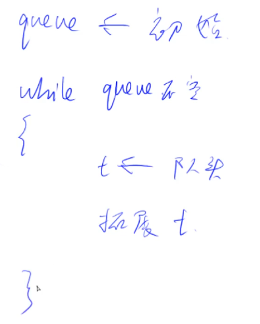

:dart:  **参考代码**

```C++
#include <iostream>
#include <algorithm>
#include <cstring>
//不使用<queue>头文件，手动实现队列

using namespace std;

typedef pair<int, int> PII; //分别存储点的横纵坐标
const int N = 110;

int n, m;
int g[N][N]; //二维数组g用来存储迷宫
int d[N][N]; //d[i][j] = k 表示点(i, j)到起点的距离为k
PII Prev[N][N]; //二维数组Prev用来存储路径，其中每一个元素的类型都是PII
//Prev[x][y] = t 表示点(x, y)是由点t走过来的
PII q[N * N]; 

int bfs()
{
    int hh = 0, tt = 0;
    q[0] = {0, 0}; //构建队列
    
    memset(d, -1, sizeof d); //将迷宫中各点到起点的距离初始化为-1，表示还没有走过
    //memeset函数的作用是将数字以单个字节逐个拷贝的方式放到指定的内存中去
    d[0][0] = 0;
    
    int dx[4] = {-1, 0, 1, 0}, dy[4] = {0, 1, 0, -1}; 
    //横纵坐标组合依次表示上、右、下、左四个方向，从12点方向顺时针方向循环一圈
    
    while (hh <= tt) //当队列不为空时
    {
        auto t = q[hh ++]; //每次取出队头元素并删除原队头
        //PII类型
        
        for (int  i = 0; i < 4; i ++)//依次枚举四个方向
        {
            int x = t.first + dx[i], y = t.second + dy[i];
            //当所选方向在迷宫范围内且可以走但还没走时，才更新搜索
            if (x >= 0 && x < n && y >= 0 && y < m && g[x][y] == 0 && d[x][y] == -1)
            {
                d[x][y] = d[t.first][t.second] + 1; //更新距离
                Prev[x][y] = t; //点(x, y)是由点t走过来的
                q[++ tt] = {x, y}; //将下一个可以走的点加入队列
            }
        }
    }
    
    int x = n - 1, y = m - 1;
    while (x || y) //倒序输出存储路径
    {
        cout << x << " " << y <<endl;
        auto t = Prev[x][y]; //PII类型
        x = t.first, y = t.second;
    }
    
    return d[n - 1][m - 1]; //因为起点是(0, 0)，返回终点到起点的距离
}

int main()
{
    cin >> n >>m;
    
    for (int i = 0; i < n; i ++)
        for (int j = 0; j < m; j ++)
            cin >> g[i][j];
    
    cout << bfs() <<endl;
    
    return 0;
}
```

:rocket:  **[AcWing 845. 八数码](https://www.acwing.com/problem/content/847/)**  

:memo:  **解题思路**

- 把每一个状态抽象为一个节点，终状态即为 “迷宫” 的终点 这道题就转化为求起点到终点的最短距离，显然用BFS达不到的状态就输出-1。即只需要检查达到的所有状态中有没有终状态，若没有就输出-1。

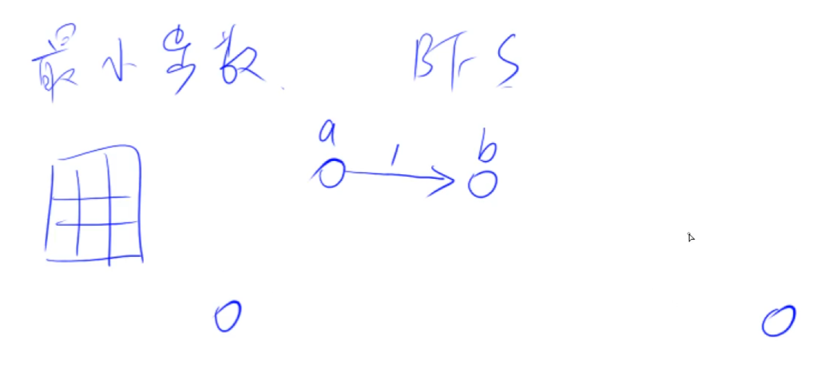

- **难点在于如何表示状态及状态间的转移，如何表示状态之间的距离**


:dart:  **参考代码**

```C++
#include <iostream>
#include <algorithm>
#include <unordered_map>
#include <queue>

using namespace std;

string start; //用字符串表示状态

int bfs(string start)
{
    string end = "12345678x";
    
    queue<string> q; //用字符串队列表示状态转移序列
    unordered_map<string, int> d; //用哈希表表示状态"string"到目标状态之间的距离
    
    q.push(start); //首先将初始状态放入队列
    d[start] = 0; //初始状态距自己的距离为零
    
    int dx[4] = {-1, 0, 1, 0}, dy[4] = {0, 1, 0, -1};
    
    while (q.size())
    {
        auto t = q.front();
        q.pop();
        
        int distance = d[t];
        
        if (t == end)
            return distance;
            
        //状态转移
        int k = t.find('x'); //返回x的下标
        int x = k / 3, y = k % 3; //确定x在矩阵中的位置
        
        for (int i = 0; i < 4; i ++)
        {
            int a = x + dx[i], b = y + dy[i];
            if (a >= 0 && a < 3 && b >= 0 && b < 3)
            {
                swap(t[k], t[a * 3 + b]); //在一个状态中交换两个数字
                //将两个位置上的数交换，注意一维坐标向二维坐标的转换
                
                if (!d.count(t)) //如果当前这个状态还没有被计入过
                {
                    d[t] = distance + 1;
                    q.push(t); //把交换后的状态加入队列
                }
                
                swap(t[k], t[a * 3 + b]); //恢复现场
                
            }
        }
    }
    
    return -1;
}

int main()
{
    
    for (int i = 0; i < 9; i ++)
    {
        char c;
        cin >> c;
        start += c; //字符串拼接
    }
    
    cout << bfs(start) << endl; 
    
    return 0;
}
```

:rocket:  **[LeetCode 200. 岛屿数量](https://leetcode.cn/problems/number-of-islands/)**
- Flood Fill算法

### 树与图的深度优先遍历

:rocket:  **[AcWing 846. 树的重心](https://www.acwing.com/problem/content/848/)**  

:pushpin: **基本原理**

- 树是一种特殊的图，是一种无环连通图，因此只讲图
- 图又可分为有向图和无向图，对于无向图的每条边均可看作两条方向相反的有向边，因此无向图又是特殊的有向图，所以只讲有向图

> 树与图的存储


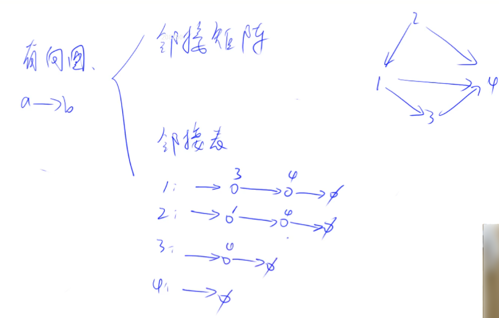

- **邻接表类似于哈希表的拉链法，以每个节点为头节点的链表存储的是这个点直接连通的其他所有点；**
- **稠密图用邻接矩阵存储，以便尽可能利用空间，稀疏图用邻接表存储；**
- **邻接表中每个链表对应邻接矩阵中的一行，链表中节点个数等于矩阵一行中非零元素的个数；**
- **对于任一确定的无向图，邻接矩阵是唯一的（行列号与顶点编号一致），但邻接表不唯一（链接次序与顶点编号无关）。**
- **参考链接：[图的存储结构：邻接矩阵与邻接表](https://www.jianshu.com/p/b50ba1b3c327)、[邻接表和邻接矩阵](https://blog.csdn.net/AAMahone/article/details/82772360)**

**假设给定一个有n个点、m条边的无向图，邻接表、结构体、邻接矩阵存储方式分别如下：**
> 邻接表存储方式：朴素版Dijkstra、

```C++
#include <cstring>
#include <iostream>

using namespace std;

const int N = 100010, M = N * 2;

int n, m, u;
int h[N], w[M], e[M], ne[M], idx;
//N：节点数量，M：边的数量。N个节点的有向图最多可有(2N-2)条边
//i：节点的下标索引；idx：边的下标索引。整个树或图中节点与边的下标索引都是唯一的
//数组h[N]存储 N 个单链表的头节点；h[i] = idx：表示从第i个节点出发的第一条边下标为idx
//数组w[idx]存储 M 条边的权值；w[i] = k: 表示第idx条边的权值为k
//数组e[M]存储 M 条边的终点；e[idx] = i：表示第idx条边的终点下标为i(或表述为终点是第(i-1)个节点)
//数组ne[M]存储与M条边共起点的下一条出边；ne[idx] = j：表示与第idx条边同起点的下一条出边的下标为j

void add(int a, int b, int w)
{
    e[idx] = b; //新加入的边编号为idx，其终点下标为b
    w[idx] = w; //新加入的边编号为idx，其终点下标为w
    ne[idx] = h[a]; //与编号为b的边同起点的下一条边的编号为h[a]
    h[a] = idx ++; //a节点出发的第一条边置为当前边，idx移动到下一条边
}

int main()
{
    cin >> n >> m >> u;

    memset(h, -1, sizeof(h)); //初始化链表的头节点

    while (m --) //依次读入m条边
    {
        int a, b, w;
        scanf("%d%d%d", &a, &b, &w);
        add(a, b, w), add(b, a, w); //无向图相当于在两点之间插入两条有向边
    }

    //遍历以第u个结点为起点的所有出边
    for (int i = h[u]; i != -1; i =ne[i])
    {
        int j = e[i];

        //循环处理所有与第u个结点直接相连的结点，可以加判断(引入布尔数组)
    }

    return 0;
}
```

> 结构体存储方式：Bellman-Ford、

```C++
#include <iostream>

using namespace std;

const int N = 100010, M = N * 2;

int n, m;

struct Edge //结构体只能存储边的信息，不能存储点的信息
{
    int a, b, w;
}edges[M];

int main()
{
    cin >> n >> m;

    int a, b, w;

    //这里推荐循环变量从1开始，因为这恰好可以对应图中边的编号
    for (int i = 1; i <= m; i ++)
    {
        
        cin >> a >> b >> w;
        edges[i] = {a, b, w};
    }

    //遍历时的循环变量也从1开始
    for (int i = 1; i<= m; i ++)
    {
        int a = edges[i].a, b = edges[i].b, w = edges[i].w;

        //依次对各条边操作
    }

    return 0;
}

```

> 邻接矩阵存储方式

```C++
#include <cstring>
#include <iostream>
#include <algorithm>

using namespace std;

const int N = 100010;

int n, m;
int g[N][N]; //即使是无向图，二维矩阵g也必是方阵。
//若是无向图，则g是对称阵；若是有向图，则g是上/下三角阵

int main()
{
    cin >> n >> m;

    memset(g, 0x3f, sizeof(g)); //初始化邻接矩阵

    while (m --)
    {
        int a, b, c;
        scanf("%d%d%d", &a, &b, &c);
        g[a][b] = min(g[a][b], c);
    }

    for (int i = 1; i <= n; i ++) //遍历n次
    {
        int t = -1;
        for (int j = 1; j <= n; j ++)
        {
            //依次对各个点进行操作
        }
    }

    return 0;
}
```

> 树与图的遍历

- 深度优先遍历：一条路走到黑，然后再回溯


- 宽度优先遍历：一层一层寻找，当前层全部找完再往下


**单链表中节点的顺序无所谓**

:memo:  **解题思路**

- 使用邻接表时，一定记得初始化头指针为空
- 另外，这里是无向图，用有向图的方式存储无向图对于边数来说，需要两倍的大小。图的存储主要就是存节点之间的边，有时会开一个新的空间存储权重（边的距离之类的）
- 时间复杂度为`O(n+m)`，其中`n`为点数，`m`为边数

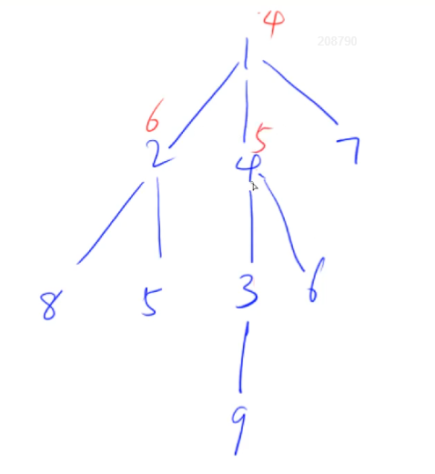

:dart:  **参考代码**

**其中邻接表存储图的初始化方式与遍历方式非常重要**

```C++
#include <cstring>
#include <iostream>
#include <algorithm>

using namespace std;

const int N = 100010, M = N * 2;

int n, m;
int h[N], e[M], ne[M], idx;
//N：节点数量，M：边的数量。N个节点的有向图最多可有(2N-2)条边
//i：节点的下标索引；idx：边的下标索引。整个树或图中节点与边的下标索引都是唯一的
//数组h[N]存储 N 个单链表的头节点；h[i] = idx：表示从第i个节点出发的第一条边下标为idx
//数组e[M]存储 M 条边的终点；e[idx] = i：表示第idx条边的终点下标为i(或表述为终点是第(i-1)个节点)
//数组ne[M]存储与M条边共起点的下一条出边；ne[idx] = j：表示与第idx条边同起点的下一条出边的下标为j

bool st[N]; //st[i] = false : 表示下标为i的节点还没有被搜索过
int ans = N; //全局变量ans存储的是最大连通块中节点数量的最小值

void add(int a, int b)
{
    e[idx] = b; //新加入的边下标为idx，其终点下标为b
    ne[idx] = h[a]; //与下标为b的边同起点的下一条边的下标为h[a]
    h[a] = idx ++; //a节点出发的第一条边置为当前边，idx移动到下一条边
}

//返回以第u个节点为根节点的子树中节点的数量，存储在sum中
int dfs(int u)
{
    st[u] = true; //标记一下当前位已经被搜索过
    
    int sum = 1, res = 0; //res存储把当前节点删掉后剩余连通块所含节点的个数最大值
    for (int i = h[u]; i != -1; i = ne[i]) //遍历以第u个节点为起点的所有出边
    {
        int j = e[i]; //以第u个节点为起点的第i条边的终点下标为j
        if (!st[j]) //如果这条边的终点还没有被遍历，那么深度优先搜索这个终点
        {
            int s = dfs(j); //s代表的是以第j个节点为根节点的子树中节点的数量
            res = max(res, s); //取联通块中节点个数的最大值
            sum += s; //累加所有子树节点的数量
        }    
    }
    //cout << u << ' ' << sum << endl;
    
    res = max(res, n - sum); //必须和非子树部分再取一个最大值
    ans = min(ans, res);
    
    return sum;
}

int main()
{
    cin >> n;
    memset(h, -1, sizeof h);
    
    for (int i = 0; i < n - 1; i ++)
    {
        int a, b;
        cin >> a >> b;
        add(a, b), add(b, a);
    }
    
    dfs(1); //按照节点的编号开始搜索
    
    cout << ans << endl;
    
    return 0;
}
```

### 树与图的广度优先遍历
:rocket:  **[AcWing 847. 图中点的层次](https://www.acwing.com/problem/content/849/)**

:pushpin: **基本原理**


:memo:  **解题思路**

- 树与图的广度优先遍历模板题。和宽搜类似的思路，用到了队列(STL或数组模拟均可)
- 这道题主要利用了宽搜能够搜到最短路径的特点。这里的自环对长度的影响可以忽略，因为边权都为非负数，显然不会考虑到自环。而对于权重边，则只需要在读入时保留最短的那条边即可
- 时间复杂度为`O(n+m)`，其中`n`为点数，`m`为边数

:dart:  **参考代码**

```C++
#include <cstring>
#include <iostream>
#include <algorithm>

using namespace std;

const int N = 100010;

int n, m;
int h[N], e[N], ne[N], idx;
int d[N], q[N];

void add(int a, int b)
{
    e[idx] = b, ne[idx] = h[a], h[a] = idx ++;
}

int bfs()
{
    int hh = 0, tt = 0;
    q[0] = 1;
    
    memset(d, -1, sizeof d); //距离置为-1表示该点未被遍历过
    
    d[1] = 0; //从第一个节点开始遍历，因此距离置为0
    
    while (hh <= tt)
    {
        int t = q[hh ++];
        
        for (int i = h[t]; i != -1; i = ne[i])
        {
            int j = e[i];
            if (d[j] == -1)
            {
                d[j] = d[t] + 1; //直接扩展临边即可，所有边的权值均为1
                q[++ tt] = j; //将该点加入队列
            }
        }
    }
    return d[n];
}

int main()
{
    cin >> n >> m;
    
    memset(h, -1, sizeof h);
    
    for (int i = 0; i < m; i ++)
    {
        int a, b;
        cin >> a >> b;
        add(a, b); //有向图，只需在两点之间插入一条边
        //cout << a << ' ' << b << endl;
    }
    
    cout << bfs() << endl;
    
    return 0;
}
```

:rocket:  **[LeetCode 797. 所有可能的路径](https://leetcode.cn/problems/all-paths-from-source-to-target/)**

:rocket:  **[AcWing 848. 有向图的拓扑序列](https://www.acwing.com/problem/content/850/)**

:pushpin: **基本原理**

- 拓扑序列只针对有向图，无向图不存在拓扑序列
- 可以证明，有向无环图一定存在拓扑序列，因此又被称为拓扑图
- 有向图中点的度数：入度：指向该点的边的数量；出度：由该点出发的边的数量
- 一个有向无环图一定至少存在一个入度为零的点

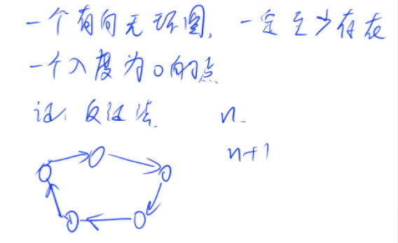


:memo:  **解题思路**

- 树与图的广度优先遍历的一种应用  
- 时间复杂度为`O(n+m)`，其中`n`为点数，`m`为边数
- 入度为零的点必是拓扑序列中的第一个点，因此第一步是把所有入度为零的点入队

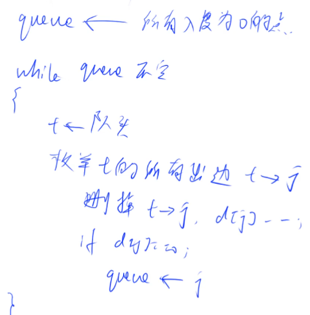

:dart:  **参考代码**

```C++
#include <cstring>
#include <iostream>
#include <algorithm>

using namespace std;

const int N = 100010, M = 100010;

int n, m;
int h[N], e[N], ne[N], idx;
int q[N], d[N]; //d[i] = k : 表示下表为i的点的入度为k

void add(int a, int b)
{
    e[idx] = b;
    ne[idx] = h[a];
    h[a] = idx ++;
}

bool topsort()
{
    int hh= 0, tt = -1;
    
    for (int i = 1; i <= n; i ++)
    {
        if (!d[i])
            q[++ tt] = i; //首先遍历所有入度为零的点插入队列
    }
    
    while (hh <= tt)
    {
        int t = q[hh ++]; //取出队头元素，但移出后前面的顺序不会变
        for (int i = h[t]; i != -1; i = ne[i]) //遍历队头元素的所有邻接点
        {
            int j = e[i];
            d[j] --;
            if (d[j] == 0) //当这个点的入度为零时就可以入队
                q[++ tt] = j;
        }
    }
    
    return tt == n -1; //判断是否所有点都进入过队列
}

int main()
{
    cin >> n >> m;
    
    memset(h, -1, sizeof h);
    
    for (int i = 0; i < m; i ++)
    {
        int a, b;
        cin >> a >> b;
        add(a, b);
        d[b] ++; //新增一条a指向b的边，所以下标为b的点的入度要加1
    }
    
    if (topsort())
    {
        //队列中的次序恰好是拓扑序，因此按序输出队列即可
        for (int i = 0; i < n; i ++) 
            cout << q[i] << ' '; 
        puts(" ");
    }
    else puts("-1");
     
    return 0;
}
```
:rocket:  **[LeetCode 207. 课程表](https://leetcode.cn/problems/course-schedule/)**

:rocket:  **[LeetCode 210. 课程表 II](https://leetcode.cn/problems/course-schedule-ii/)**

## 第二次课

:date: 2022-10-01

> 最短路问题分类及对应算法

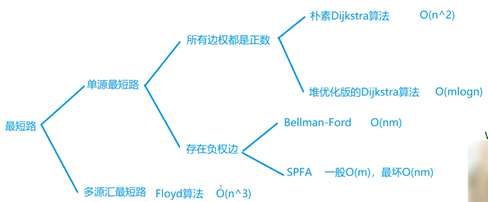

- 最短路问题不区分有向图与无向图，源指起点，汇指终点。“单源最短路”问题指的是求图中某一个点到其他所有点的最短距离，“多源汇最短路”问题一般是给定多个询问，每个询问中都有起点和终点，求这两点之间的最短距离。
- 图中`n`为点数，`m`为边数。需根据不同情况选择不同的算法；**注意区分不同算法的使用情景与时间复杂度；** 
- **当`m`与`n^2`同级别时，所给图为稠密图，应使用朴素Dijkstra算法(与所给边数无关)；当`m`与`n`同级别时，所给图为稀疏图，应使用堆优化Dijkstra算法**；
- 虽然说SPFA算法是Bellman—Ford算法的优化(一般情况下时间复杂度要好)，但并不是所有情况下都可以使用SPFA算法，后者也具有解决特殊限制问题的本领；
- 最短路问题的难点在如何从具体问题中抽象出图，即如何定义点和边；
- 单源汇最短路问题初始化dist数组之后别忘了先把1号点归零。

### Dijkstra

:rocket:  **[AcWing 849. Dijkstra求最短路 I](https://www.acwing.com/problem/content/851/)**

:pushpin: **基本原理**


:memo:  **解题思路**

这道题是稠密图，所以应该用邻接矩阵存储，两个下标分别对应边的两个节点，而数组中元素的值则为边权。  
稠密图的边数比较多，而节点数比较少，从而应该用朴素 Dijkstra 算法，它的时间复杂度为 O(n^2+m)，其中 n 为点数，m 为边数。这个算法主要利用了贪心的思想，总共迭代 n 次。步骤如下：

1.  在所有未确定最短距离的点中找到找到距起点最短的点。
2.  利用找到的这个点来更新起点到各点的距离。
3.  经过 n 次这样的迭代后，就得到了源点到每个点的最短距离。

:dart:  **参考代码**

```C++
#include <cstring>
#include <iostream>
#include <algorithm>

using namespace std;

const int N = 510;

int n, m;
int g[N][N]; //二维数组g是用来存储稠密图的邻接矩阵
int dist[N]; //dist[i] = k: 表示第i个点到源点的最短距离为k
bool st[N]; //st[i] = false: 表示第i个点到源点的最短距离未确定

int dijkstra() //利用了贪心算法的思想
{
    memset(dist, 0x3f, sizeof(dist));
    dist[1] = 0; //初始化距离矩阵，因为是单源点问题所以dist[1] = 0
    
    //遍历n个节点，但并不是按照点的编号顺序进行遍历的，只是说明遍历次数为n
    //所以写成 `for (int i = 1; i <= n; i ++)` 也可
    for (int i = 0; i < n; i ++) 
    {
        int t = -1; //起始位置

        //下面的这层循环才是按照点的编号进行遍历
        for (int j = 1; j <= n; j ++) //在还没有确定最短距离的点当中寻找距离源点最近的点
        //若还在起始位置，则直接赋值；否则比较和源点的距离，保留距离更小的那个点
            if (!st[j] && (t == -1 || dist[t] > dist[j]))
                t = j;
                
        st[t] = true;
        
        for (int j = 1; j <= n; j ++) //用这一次循环找到的最短距离点去更新其他点的距离
            dist[j] = min(dist[j], dist[t] + g[t][j]);
    }
    
    //0x3f3f3f3f表示可用的“无穷大”，保证在一个数量级但又不溢出
    if (dist[n] == 0x3f3f3f3f) return -1;
    else return dist[n];
}

int main()
{
    scanf("%d%d", &n, &m);
    
    memset(g, 0x3f, sizeof(g)); //初始化邻接矩阵
    
    /*for (int i = 1; i <= n; i ++) //可以使用循环来初始化邻接矩阵，但是要注意循环变量的开始位置
        for (int j = 1; j <= n; j ++)
            if (i == j) g[i][j] = 0;
            else g[i][j] = INF;*/
            
    while (m --) //图的初始化
    {
        int a, b, c;
        scanf("%d%d%d", &a, &b, &c);
        g[a][b] = min(g[a][b], c); //如果出现重边，只需保留距离最短也即权重最小的边即可
    }
    
    int t = dijkstra();
    
    cout << t << endl;
    
    return 0;
}
```

:rocket:  **[AcWing 850. Dijkstra求最短路 II](https://www.acwing.com/problem/content/852/)**  

:pushpin: **基本原理**


- 遍历所有点的所有出边就相当于遍历图中的所有边
- 同时对于`m`与`n^2`同级别的稠密图而言，“用t更新其他点距离的操作”时间复杂度为O(n^2)，又可以写为O(m)。

:memo:  **解题思路**

这道题是稀疏图，对于稀疏图应该使用堆优化的 Dijkstra 算法，注意这里使用的堆是 STL 中现成的，并且是小根堆。步骤仍然和朴素 Dijkstra 算法类似，只不过 “在还没有确定最短距离的点当中寻找距离源点最近的点” 这一步中，由于堆中取最小的点的复杂度为 O(1)，而堆改变每一个点的复杂度为 O(logn)，优化过后，Dijkstra 算法的复杂度就变成了 O(mlogn)，其中 n 为点数，m 为边数。  
另外，在建堆时应该注意，这里堆中的元素是 pair，而我们希望以距离的长短来排列堆中的元素，以便直接使用库函数弹出距离最短的点，所以要把源点到每个点的距离放在 pair 中的第一个位置，而节点坐标放在第二个位置。

:dart:  **参考代码**

```C++
#include <cstring>
#include <iostream>
#include <algorithm>
#include <queue>

using namespace std;

typedef pair<int, int> PII; 


const int N = 100010;

int n, m;
int h[N], w[N], e[N], ne[N], idx; //采用邻接表存储稀疏图
int dist[N]; //dist[i] = k: 表示第i个点到源点的最短距离为k
bool st[N]; //st[i] = false: 表示第i个点到源点的最短距离未确定

void add(int a, int b, int c) //邻接表存储图插入边的模板，直接秒
{
    e[idx] = b;
    w[idx] = c;
    ne[idx] = h[a];
    h[a] = idx ++;
}

int dijkstra()
{
    memset(dist, 0x3f, sizeof(dist));
    dist[1] = 0;
    
    priority_queue<PII, vector<PII>, greater<PII>> heap; //小根堆
    heap.push({0, 1}); //放入1号点
    
    while (heap.size())
    {
        auto t = heap.top(); //返回堆顶元素，根据有效队列小根堆的性质，堆顶元素就是最小的元素
        heap.pop(); //弹出堆顶元素
        
        //把源点到每个点的距离放在 pair 中的第一个位置，而节点坐标放在第二个位置。
        //这样弹出堆顶元素时就是距离最短的点
        int ver = t.second, distance = t.first;
        if (st[ver]) continue; 
        //如果为真，则说明该点的这个距离在堆中是个冗余备份，则不再继续寻找，直接进入下一次循环
        
        //st[ver] = true;
        
        //只能更新与这个点直接相连的点，而不是更新余下的所有点
        //因为如果没有直接相连，从更新方式中也可以看出无法更新
        for (int i = h[ver]; i != -1; i = ne[i]) //邻接表的遍历方式
        {
            int j = e[i];
            if (dist[j] > distance + w[i])
            {
                dist[j] = distance + w[i];
                heap.push({dist[j], j}); //把下标为j的点放入优先队列
            }
        }
    }
    
    
    if (dist[n] == 0x3f3f3f3f) return -1;
    return dist[n];
}

int main()
{
    scanf("%d%d", &n, &m);
    
    memset(h, -1, sizeof(h));
            
    while (m --) //图的初始化
    {
        int a, b, c;
        scanf("%d%d%d", &a, &b, &c);
        add(a, b, c);
    }
    
    int t = dijkstra();
    
    cout << t << endl;
    
    return 0;
}
```

:rocket:  **[LeetCode 1514. 概率最大的路径](https://leetcode.cn/problems/path-with-maximum-probability/)**

:rocket:  **[LeetCode 1631. 最小体力消耗路径](https://leetcode.cn/problems/path-with-minimum-effort/)**

:rocket:  **[LeetCode 743. 网络延迟时间](https://leetcode.cn/problems/network-delay-time/)**

### Bellman-Ford

:rocket:  **[AcWing 853. 有边数限制的最短路](https://www.acwing.com/problem/content/855/)**  

:pushpin: **基本原理**


- 当题目有限制“路径不超过k条边时”，必须使用Bellman_Ford算法，其他存在负权边的大多数问题都是用SPFA算法，因为大多数题目中虽然会有负权边，但一般不会有负权回路；
- Bellman-Ford算法也可以求出图中是否存在负权回路，但一般不会使用；
- 如果图中存在负权回路，那么将不一定存在最短距离，当负权回路在所选路径上时一定不存在最短距离；


- Dijkstra不能解决负权边是因为 Dijkstra要求每个点被确定后`st[j] = true`，`dist[j]`就是最短距离了，之后就不能再被更新；而如果有负权边的话，那已经确定的点的`dist[j]`不一定是最短路。

:memo:  **解题思路**

由于这里有负权边，Dijkstra算法不再适用。时间复杂度为 O(mn)。也是迭代$n$次（这个迭代次数是根据题目限制的最短路中所包含的边的条数），步骤如下：

1.  迭代中先备份边的距离的情况，防止最短路中包含的边数超过限制。
2.  遍历所有边，进行松弛操作(详见代码)

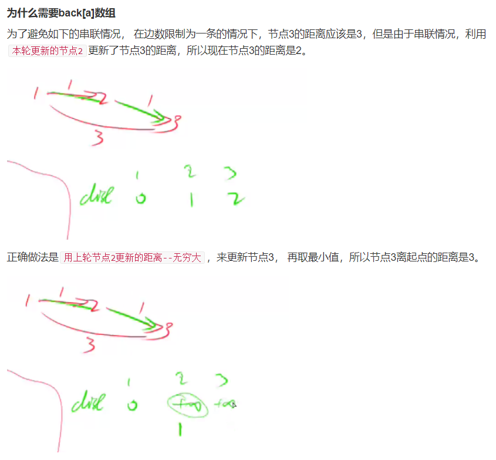

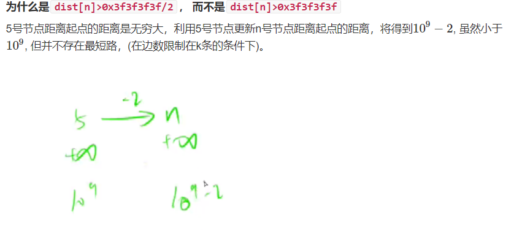

即只要`dist[n]`在某个数量级范围内，就可以认为不存在题目要求的最短路。

:dart:  **参考代码**

```C++
#include <cstring>
#include <iostream>
#include <algorithm>

using namespace std;

const int N = 510, M = 100010;

int n, m, k;
int dist[N], backup[N];
//数组dist存储的是不超过k条边的最短距离，dist[i] = l: 表示编号为i的点到1号点不超过k条边的最短距离为l

//BF算法特有的存储图的方式：使用结构体，只要把边的信息存储即可
struct Edge 
{
    int a, b, w; //a表示边的起点，b表示边的终点，c表示边的权重
}edges[M];

int bellman_ford()
{
    memset(dist, 0x3f, sizeof(dist));
    dist[1] = 0;
    
    //求不超过k条边的最短距离，因此最多迭代k次，如果还找不到那说明不存在
    for (int i = 0; i < k; i ++) 
    {
        memcpy(backup, dist, sizeof(dist)); 
        //以下步骤只使用上一次迭代产生的结果，防止本次迭代发生串联
        
        for (int j = 1; j <= m; j ++) //遍历所有边
        {
            int a = edges[j].a, b = edges[j].b, w = edges[j].w;
            dist[b] = min(dist[b], backup[a] + w);
        }
    }
    
    if (dist[n] == 0x3f3f3f3f / 2) return 0x3f3f3f3f;
    return dist[n];
}


int main()
{
    cin >> n >> m >> k;
    
    for (int i = 1; i <= m; i ++)
    {
        int a, b, w;
        cin >> a >> b >> w;
        edges[i] = {a, b, w}; 
    }
    
    bellman_ford();
    
    if (dist[n] > 0x3f3f3f3f / 2) puts("impossible");
    else printf("%d\n", dist[n]);
    
    return 0;
}
```

### SPFA

:rocket:  **[AcWing 851. SPFA求最短路](https://www.acwing.com/problem/content/853/)**

:pushpin: **基本原理**


- 只要图中不存在负权回路就可以使用SPFA算法，即使有负权边但不构成负环即可，因此有时比 Dijkstra算法 还要好用;
- Bellman-Ford 算法中的距离更新并不会每次都进行实质更新，有可能 dist[b] 仍然是较小者；因此SPFA算法针对 Bellman-Ford 算法进行了优化，即只用距离变短了的点去更新其他的点。

:memo:  **解题思路**

spfa 算法，复杂度为 O(m)，最坏为 O(nm)，n 为点数，m 为边数。求含有负权的最短路，这时候不能用 Dijkstra 算法。  


:dart:  **参考代码**

```C++
#include <cstring>
#include <iostream>
#include <algorithm>
#include <queue>

using namespace std;

const int N = 100010;

int n, m;
int h[N], w[N], e[N], ne[N], idx;
int dist[N];
bool st[N]; //布尔数组st存储的是该点是否已在队列中，防止队列中存储重复的点

void add(int a, int b, int c)
{
    e[idx] = b, w[idx] = c, ne[idx] = h[a], h[a] = idx ++;
}

int spfa()
{
    memset(dist, 0x3f, sizeof(dist));
    dist[1] = 0;
    
    queue<int> q;
    q.push(1);
    st[1] = true;
    
    while (q.size())
    {
        int t = q.front();
        q.pop();
        
        st[t] = false;
        
        for (int i = h[t]; i != -1; i = ne[i])
        {
            int j = e[i];
            if (dist[j] > dist[t] + w[i])
            {
                dist[j] = dist[t] + w[i];
                if (!st[j])
                {
                    q.push(j);
                    st[j] = true;
                }
            }
        }
    }
    
    return dist[n];
}

int main()
{
    cin >> n >> m;
    
    memset(h, -1, sizeof(h));
    
    while (m--)
    {
        int a, b, c;
        cin >> a >> b >> c;
        add(a, b, c);
    }
    
    int t = spfa();
    
    if (t == 0x3f3f3f3f) puts("impossible");
    else cout << dist[n] << endl;
    
    return 0;
}
```

:rocket:  **[AcWing 852. SPFA判断负环](https://www.acwing.com/problem/content/854/)**  

:pushpin: **基本原理**

应用抽屉原理判断负环，需要增加一个`cnt`数组来判断走到当前点走了多少条边。

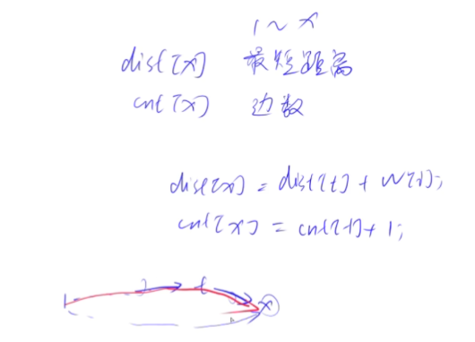

:memo:  **解题思路**

判断负环只需要增加一个 cnt 数组来判断走到当前点走了多少条边，如果从`1号点`走到`n号点`走了超过`n-1条边`，也即`大于或等于n`条边，也即`走过了至少(n + 1)个点`，而图中一共有`n个点`，那么显然路径中存在环。同时由于算法在执行过程中会判断距离的长短，因此若距离短点数还超过限制，那么图中一定存在负环。

:dart:  **参考代码**

```C++
#include <cstring>
#include <iostream>
#include <algorithm>
#include <queue>

using namespace std;

const int N = 100010;

int n, m;
int h[N], w[N], e[N], ne[N], idx;
int dist[N], cnt[N];
bool st[N]; //布尔数组st存储的是该点是否已在队列中，防止队列中存储重复的点

void add(int a, int b, int c)
{
    e[idx] = b, w[idx] = c, ne[idx] = h[a], h[a] = idx ++;
}

int spfa()
{
    memset(dist, 0x3f, sizeof(dist));
    dist[1] = 0;
    /*这里也可以不对dist进行初始化，因为主要是要看一个相对变小的状态，
    所以没必要初始化以求最短路精确值，重点是看到dist减小的趋势，所以与dist全零或是全无穷无关。
    但为了与上一道题的模板统一，这里还是建议进行初始化*/
    
    queue<int> q;
    
    //可能图中的负环无法由第一个节点到达，因此要把所有点都加入队列
    for (int i = 0; i <= n; i ++)
    {
        st[i] = true;
        q.push(i);
    }
    
    while (q.size())
    {
        int t = q.front();
        q.pop();
        
        st[t] = false;
        
        for (int i = h[t]; i != -1; i = ne[i])
        {
            int j = e[i];
            if (dist[j] > dist[t] + w[i])
            {
                dist[j] = dist[t] + w[i];
                cnt[j] = cnt[t] + 1; //最短路径经过的边数
                
                if (cnt[j] >= n) return true;
                
                if (!st[j])
                {
                    q.push(j);
                    st[j] = true;
                }
            }
        }
    }
    
    return false;
}

int main()
{
    cin >> n >> m;
    
    memset(h, -1, sizeof(h));
    
    while (m--)
    {
        int a, b, c;
        cin >> a >> b >> c;
        add(a, b, c);
    }
    
    if (spfa()) puts("Yes");
    else puts("No");
    
    return 0;
}
```

### Floyd

:rocket:  **[AcWing 854. Floyd求最短路](https://www.acwing.com/problem/content/856/)**  

:pushpin: **基本原理**


- **时间复杂度为O(n^3)，是最短路问题中时间复杂度最高的。**

:memo:  **解题思路**

Floyd 算法的应用，用于求多源最短路。思想是动态规划。复杂度为 O(n3)。

:dart:  **参考代码**

```C++
#include <cstring>
#include <iostream>
#include <algorithm>

using namespace std;

const int N = 210, INF = 1e9;
int n, m, Q;

//本题是稠密图，因此用邻接矩阵来存储
int d[N][N]; //d[i][j] = k: 表示从i号点到j号点的最短路长度为k

void floyd()
{
    for (int k = 1; k <= n; k ++)
        for (int i = 1; i <= n; i ++)
            for (int j = 1; j <= n; j ++)
                d[i][j] = min(d[i][j], d[i][k] + d[k][j]);
                //动态规划的思想更新距离
}

int main()
{
    cin >> n >> m >> Q;
    
    for (int i = 1; i <= n; i ++)
        for (int j = 1; j <= n; j ++)
        //题目中保证不存在负权回路，因此若存在正权自环的话，最短的距离还是0
            if (i == j) d[i][j] = 0; 
            else d[i][j] = INF;
            
    while (m--) //插入m条边
    {
        int a, b, w;
        cin >> a >> b >> w;
        
        d[a][b] = min(d[a][b], w); //有多重边时保留最小的边
    }
    
    floyd();
    
    while (Q--) //处理所有询问
    {
        int a, b;
        cin >> a >> b;
        
        //判断条件中只要保证与INF处于同一数量级即可，不一定恰好等于INF
        //因为有可能两点之间的距离被其他点更新过了
        if (d[a][b] > INF / 2) puts("impossible");
        else cout << d[a][b] << endl;
    }
    
    return 0;
}
```

## 第三次课

:date: 2022-10-03

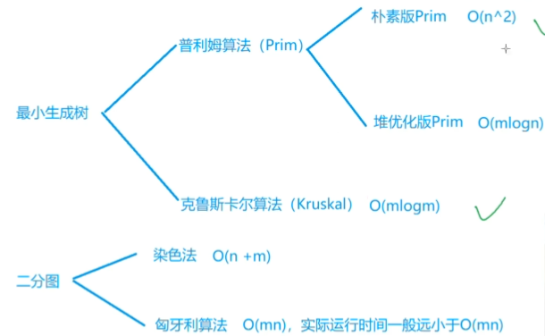

### Prim算法

:rocket:  **[AcWing 858. Prim算法求最小生成树](https://www.acwing.com/problem/content/860/)**  

:pushpin: **基本原理**

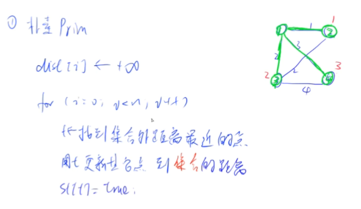

思路和 Dijkstra 算法类似。步骤如下：

1.  先在不在生成树所属连通块中找距离这个连通块最近的点，找到后将其加入生成树所属连通块(并查集)
2.  **利用这个点更新其他点到这个连通块的距离(具体表现在 dist 的更新方式上)**

:memo:  **解题思路**

**Prim 算法适用于稠密图，时间复杂度为 O(n^2)。** 

给定一张边带权的无向图 G=(V,E)，其中 V 表示图中点的集合，E 表示图中边的集合，n=|V|，m=|E|。**由 V 中的全部 n 个顶点和 E 中 n−1 条边构成的无向连通无自环子图被称为 G 的一棵生成树，其中边的权值之和最小的生成树被称为无向图 G 的最小生成树。**

:dart:  **参考代码**

```C++
#include <cstring>
#include <iostream>
#include <algorithm>

using namespace std;

const int N = 510, INF = 0x3f3f3f3f;

int n, m;
int g[N][N]; //稠密图用邻接矩阵存储
int dist[N]; //dist[i] = k: 表示第i个点到连通块(其中可能含有多个点)的最短距离是k
//这里应该注意与Dijkstra算法的区别，后者dist表示的是第i个点到底1个点的最短距离
bool st[N]; //st[i] = true: 表示第i个点已加入连通块

int prim()
{
    memset(dist, 0x3f, sizeof(dist));
    
    int res = 0; //表示最小生成树的边权之和
    for (int i = 0; i < n; i ++) //最小生成树中要求有n个点，因此要循环n次
    {
        int t = -1; //标志位，表示当前还没有找到任何一个点
        for (int j = 1; j <= n; j ++)
            if (!st[j] && (t == -1 || dist[t] > dist[j]))
                t = j;
                
        if (i && dist[t] == INF) return INF;
        if (i) res += dist[t]; //写在循环更新距离之前是因为防止有负权自环进入
        
        for (int j = 1; j <= n; j ++)
            dist[j] = min(dist[j], g[t][j]);
        
        st[t] = true;
    }
    
    return res;
}

int main()
{
    cin >> n >> m;
    
    memset(g, 0x3f, sizeof(g));
    
    while (m --)
    {
        int a, b, c;
        cin >> a >> b >> c;
        g[a][b] = g[b][a] = min(g[a][b], c); //无向图的邻接矩阵是对称阵
    }
    
    int t = prim();
    
    if (t == INF) puts("impossible");
    else cout << t <<endl;
    
    return 0;
}
```

### Kruskal算法

:rocket:  **[AcWing 859. Kruskal算法求最小生成树](https://www.acwing.com/problem/content/861/)**

:pushpin: **基本原理**


- **上图中的第二步需要用到并查集的操作**

:memo:  **解题思路**

**Kruskal 算法适用于稀疏图。复杂度为 O(mlogm)。**
 
步骤如下：

1.  将所有边按边权升序排序(可以手写快排，也可以调用函数 sort)。
2.  遍历所有边，由于是升序排列，只要这条边不在连通块中，则将其加入到连通块。
3.  判断最后若连通块中的边数是否小于`n-1`，若是，则说明不能形成最小生成树。

:dart:  **参考代码**

```C++
#include <iostream>
#include <algorithm>

using namespace std;

const int N = 200010;

int n, m;
int p[N];

struct Edge //只需要开结构体来存储边
{
    int a, b, w;
    
    bool operator< (const Edge &W) const
    {
        return w < W.w;
    }
}edges[N];

int find(int x) //并查集寻找祖先的模板
{
    if (p[x] != x) p[x] = find(p[x]);
    return p[x];
}

int main()
{
    cin >> n >> m;
    
    for (int i = 0; i < m; i ++)
    {
        int a, b, w;
        scanf("%d%d%d", &a, &b, &w);
        edges[i] = {a, b, w};
    }
    
    sort(edges, edges + m);
    
    for (int i = 1; i <= n; i ++) p[i] = i; //并查集中的建立集合操作
    
    int res = 0, cnt = 0; //res表示最小生成树的权值之和，cnt表示最小生成树中所含边的数量
    for (int i = 0; i < m; i ++)
    {
        int a = edges[i].a, b = edges[i].b, w = edges[i].w;
        
        a = find(a), b = find(b); //寻找a、b两点的祖先
        if (a != b) //如果a、b两点此前不连通
        {
            p[a] = b;
            res += w;
            cnt ++;
        }
    }
    
    if (cnt < n - 1) puts("impossible");
    else cout << res << endl;
    
    return 0;
}
```

:rocket:  **[LeetCode 1584. 连接所有点的最小费用](https://leetcode.cn/problems/min-cost-to-connect-all-points/)**

### 染色法判定二分图

:rocket:  **[AcWing 860. 染色法判定二分图](https://www.acwing.com/problem/content/862/)**  

:pushpin: **基本原理**

设 G=(V,E) 是一个无向图，如果顶点 V 可分割为两个互不相交的子集(A,B)，并且图中的每条边 (i, j) 所关联的两个顶点 i 和 j 分别属于这两个不同的顶点集(i in A,j in B)，则称图G为一个二分图。

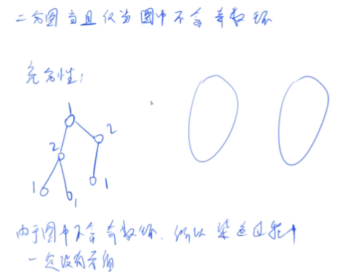

:memo:  **解题思路**

**判断二分图的充要条件：图中不存在奇数环**。那么利用染色法也就是看在遍历所有点的过程中能否将相邻的点都染成不同的颜色，如果能，则为二分图。 

**染色过程是用 DFS 实现的，复杂度为 O(n+m)，其中 n 为点数，m 为边数。**

:dart:  **参考代码**

```C++
#include <cstring>
#include <iostream>
#include <algorithm>

using namespace std;

const int N = 100010, M = 200010; //注意无向图的边数问题

int n, m;
int h[N], e[M], ne[M], idx;
int color[N]; //color[i] = 1/2: 表示第i个点已经被染色成第1/2种颜色

void add(int a, int b)
{
    e[idx] = b, ne[idx] = h[a], h[a] = idx ++;
}

bool dfs(int u, int c)
{
    color[u] = c; //存储当前节点的颜色
    
    for (int i = h[u]; i != -1; i = ne[i])
    {
        int j = e[i]; //这条边的下一个节点编号是j
        if (!color[j]) //如果下一个节点没有被染色，就继续染下去
        {
            if (!dfs(j, 3 - c)) return false;
        }
        //如果下一个节点已经被染色，就判断颜色是否不同
        else if (color[j] == c) return false;
    }
    
    return true;
}

int main()
{
    cin  >> n >> m;
    
    memset(h, -1, sizeof(h));
    
    while (m --)
    {
        int a, b;
        scanf("%d%d", &a, &b);
        add(a, b), add(b, a);
    }
    
    bool flag = true; //标志位，表示染色过程中是否有冲突发生
    
    //这里并不知道所给图是否是完全连通图，所以保险起见要遍历所有点
    for (int i = 1; i <= n; i ++)
    {
        if (!color[i])
        {//对当前节点所处的树/连通块进行染色，因为一个树/连通块中只要有一个点的颜色确定，那么其他所有点的颜色也随之确定
            if (!dfs(i, 1)) 
            {
                flag = false;
                break; //一旦有冲突发生，立即退出循环
            }
        }
    }
    
    if (flag) puts("Yes");
    else puts("No");
    
    return 0;
}
```

:rocket:  **[LeetCode 785. 判断二分图](https://leetcode.cn/problems/is-graph-bipartite/)**

:rocket:  **[LeetCode 886. 可能的二分法](https://leetcode.cn/problems/possible-bipartition/)**

### 匈牙利算法

:rocket:  **[AcWing 861. 二分图的最大匹配](https://www.acwing.com/problem/content/863/)** 

:pushpin: **基本原理**

二分图的匹配与最大匹配：给定一个二分图 G，在 G 的一个子图 M 中，M 的边集 {E} 中的任意两条边都不依附于同一个顶点，则称 M 是一个匹配。所有匹配中包含边数最多的一组匹配被称为二分图的最大匹配，其边数即为最大匹配数。


:memo:  **解题思路**

将二分图分成两半来看，不妨遍历左半节点，去检查是否能在右半节点中找到能够与之匹配的点。匈牙利算法的时间复杂度最坏为 O(nm)，n 为点数，m 为边数。这里的时间复杂度只是理论上的，实际的运行时间一般来说是远小于这个复杂度的。

:dart:  **参考代码**

```C++
#include <cstring>
#include <iostream>
#include <algorithm>

using namespace std;

const int N = 510, M = 100010; //虽然是无向图，但只需存储左半部指向右半部的边，表示连通即可

int n1, n2, m;
int h[N], e[M], ne[M], idx;
int match[N]; //match[i] = k: 表示右半部中与左半部编号为i的点匹配的点编号为k
bool st[N]; //st[i] = true: 表示右半部中编号为i的点已有匹配

void add(int a, int b)
{
    e[idx] = b, ne[idx] = h[a], h[a] = idx ++;
}

bool find(int x)
{
    for (int i = h[x]; i != -1; i = ne[i])
    {
        int j = e[i];
        if (!st[j]) //匹配到的右半部中的点之前必须没有匹配
        {
            st[j] = true;
            /*如果寻找到的右半部的点恰好没有匹配或者和这个点
            已匹配的左半部的点还可以有其他更换的匹配*/
            if (match[j] == 0 || find(match[j]))
            {
                match[j] = x;
                return true;
            }
        }
    }
    return false;
}

int main()
{
    cin >> n1 >> n2 >> m;
    
    memset(h, -1, sizeof(h));
    
    while (m --)
    {
        int a, b;
        scanf("%d%d", &a, &b);
        add(a, b);
    }
    
    int res = 0; //表示匹配数
    for (int i = 1; i <= n1; i ++)
    {
        memset(st, false, sizeof(st));
        if (find(i)) res ++;
    }
    
    cout << res << endl;
    
    return 0;
}
```