# 动态规划(DP，Dynamic Programming)

> - **主要参考来源：[AcWing 算法基础课](https://www.acwing.com/activity/content/introduction/11/)、[AcWing LeetCode究极班](https://www.acwing.com/activity/content/31/)、[代码随想录](https://programmercarl.com/other/say_feel.html)、[阿秀的学习笔记](https://interviewguide.cn/notes/03-hunting_job/03-algorithm/03-leetcode/01-introduce.html)、[labuladong](https://labuladong.github.io/algo/2/)**
> - **主要包含内容：背包问题、线性DP、区间DP、计数类DP、数位统计DP、状态压缩DP、树形DP、记忆化搜索**

> **状态的划分一般从最后一步入手**

- 背包问题的重点在于状态的表示(化零为整)与计算(化整为零)
- 背包问题初始化时一般为了实际意义对应，都从1开始读入数据
- DP问题的时间复杂度O(n) = 状态数量 * 每一个状态计算所需的时间
- 当状态转移方程中含有(i - 1)时，初始化都从1开始(与第二条相对应)

> **DP从搜索优化而来，用一个数字可以代表一大类方法，因此加快了运行速度**

## 第一次课

:date: 2022-11-12

### 背包问题

:pushpin: **基本原理**

- 01背包问题：每个物品最多只能使用一次
- 完全背包问题：每个物品可使用无穷多次
- 多重背包问题：每个物品的可使用次数有限但互不相同且已知(朴素版and优化版)
- 分组背包问题：将物品分为若干组，每组中只能有一个物品被使用(优化思想)

> 背包问题状态划分的依据是是否取第 $i$ 个物品以及取几个

:rocket:  **[AcWing 2. 01背包问题](https://www.acwing.com/problem/content/2/)**

:memo:  **解题思路**

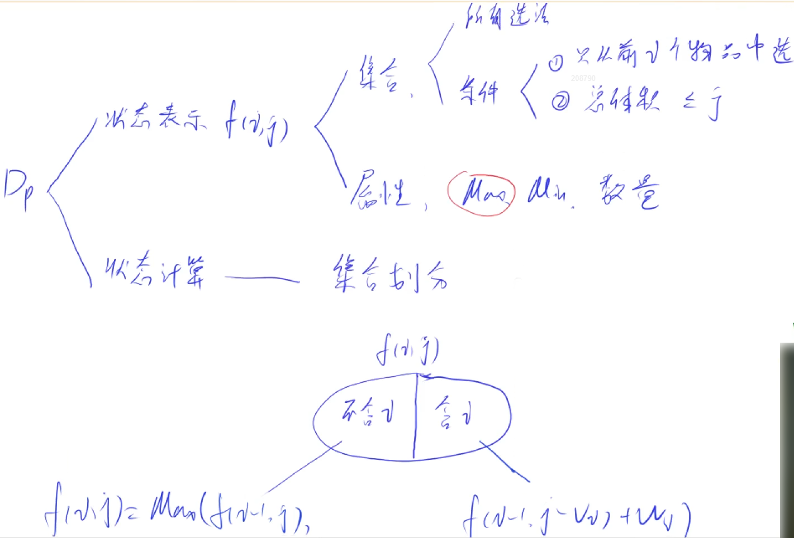

- `f(i, j) = k`表示在条件约束(i, j)下所有选取方法的最大值为k(状态最终表示的是代表集合的一个属性)
- 状态表示：用几维变量表示状态，每一维的含义分别是什么？
- 状态计算：如何把每一个状态划分为更小的子集进而计算出来？最终应该是`f(N,V)`
- DP的优化：一般来说都是对状态方程作等价变形，因此要先把基本形式写出来
- 当背包装不下第i个物品时，右边的子集为空，所以有个条件判断

:dart:  **参考代码**

> 朴素版
```C++
#include <iostream>
#include <algorithm>

using namespace std;

const int N = 1010;
int n, m; //n表示物品的个数，m表示背包的容量or体积
int v[N], w[N]; //一维数组v[i]表示第i个物品的体积，w[i]表示第i个物品的价值
int f[N][N]; //二维数组f[i][j]表示从前i个物品中选择且体积不超过j的选法集合

int main()
{
    cin >> n >> m;
    
    //读入所有的物品信息，这里为了对应物品的编号因此从1开始
    for (int i = 1; i <= n; i ++) 
        cin >> v[i] >> w[i];
        
    for (int i = 1; i <= n; i ++) //外层循环从i=1开始，因为i=0表示从前0件物品中选择没有实际意义
        for (int j = 0; j <= m; j ++)
        {
            f[i][j] = f[i - 1][j]; //已将二维数组定义为全局变量，因此初始值为零
            if (j >= v[i]) //只有当背包的总体积不小于第i个物品的体积时，右边子集才有可能不为空
                f[i][j] = max(f[i][j], f[i - 1][j - v[i]] + w[i]);
        }
        
    cout << f[n][m] << endl;
    
    return 0;
}
```

> 优化版
```C++
#include <iostream>
#include <algorithm>

using namespace std;

const int N = 1010;
int n, m;
int v[N], w[N];
int f[N];

int main()
{
    cin >> n >> m;
    
    for (int i = 1; i <= n; i ++)
        cin >> v[i] >> w[i];
        
    for (int i = 1; i <= n; i ++) 
        for (int j = m; j >= v[i]; j --)
        {
            f[j] = max(f[j], f[j - v[i]] + w[i]);
        }
    // 每次计算时只会用到上一轮(i - 1)的信息，因此可以将二维数组优化为一维数组，即在原二维的基础上去掉第一维
    // 对内层循环j的起始做约束可以省略if判断条件
    // 如果内层循环j正序循环的话，那么f[j - v[i]]表示的是当前轮(i)的信息，而f[j]要使用的是上一轮(i - 1)的信息
    // 因此只有内层循环采用倒序的方式才能保留上一轮(i - 1)的信息
        
    cout << f[m] << endl;
    
    return 0;
}
```

:rocket:  **[AcWing 3. 完全背包问题](https://www.acwing.com/problem/content/3/)**

:memo:  **解题思路**


- 状态转移方程为：`f[i,j] = f[i - 1, j - k * v[i]] + k * w[i]`(k为从0到背包中全部装第i个物品的数量，因为有体积限制所以不可能无限装)

> 优化思路：枚举状态转移方程找规律


第二行左边`f[i][j - v]`表示从前$i$个物品中选择体积不超过$j - v$的物品的所有选法，因此若不选第$i$个物品，集合表示为`f[i -1][j - v]`；若选择$k$个第$i$种物品，集合表示为`f[i - 1][f - (k + 1) * v] + k * w`

> 与01背包问题的状态转移方程对比


- 上面是01背包问题的状态转移方程，当前状态都是从第(i - 1)个状态转移而来的；下面是完全背包问题的状态转移方程，用第i个状态的部分进行了代换
- 通过比较可以看出内层循环时j的循环方向为什么不一样：使用上一层的状态进行状态转移需要倒序，使用本层的状态进行状态转移需要正序

:dart:  **参考代码**

> 朴素版，可能超时
```C++
#include <iostream>
#include <algorithm>

using namespace std;

const int N = 1010;
int n, m;
int v[N], w[N];
int f[N][N];

int main()
{
    cin >> n >> m;
    
    for (int i = 1; i <= n; i ++)
        cin >> v[i] >> w[i];
        
    for (int i = 1; i <= n; i ++)
        for (int j = 1; j <= m; j ++)
            for (int k = 0; k * v[i] <= j; k ++) //有体积限制
                f[i][j] =max(f[i][j], f[i - 1][j - k * v[i]] + k * w[i]);
    //最坏情况下的时间复杂度O(n) = 10^9
    
    cout << f[n][m] << endl;
    
    return 0;
}
```

> 二维优化版
```C++
#include <iostream>
#include <algorithm>

using namespace std;

const int N = 1010;
int n, m;
int v[N], w[N];
int f[N][N];

int main()
{
    cin >> n >> m;
    
    for (int i = 1; i <= n; i ++)
        cin >> v[i] >> w[i];

    // 外层循环从1开始，表示从第一件物品开始选取
    // 内层循环从0开始，表示体积约束为0
    // 尽管没有意义，但是为了保证状态转移方程的正确性，必须要有这一步
    for (int i = 1; i <= n; i ++)
        for (int j = 0; j <= m; j ++)
        {
            f[i][j] = f[i - 1][j];
            if (j >= v[i])
                f[i][j] = max(f[i][j], f[i][j - v[i]] + w[i]);
        }    
    
    cout << f[n][m] << endl;
    
    return 0;
}
```

>一维终极优化版

```C++
#include <iostream>
#include <algorithm>

using namespace std;

const int N = 1010;
int n, m;
int v[N], w[N];
int f[N];

int main()
{
    cin >> n >> m;
    
    for (int i = 1; i <= n; i ++)
        cin >> v[i] >> w[i];
        
    for (int i = 1; i <= n; i ++)
        for (int j = v[i]; j <= m; j ++) //与01背包问题的区别只在这里
            f[j] = max(f[j], f[j - v[i]] + w[i]);
    //内层循环要保证数组不能越界，因此j从v[i]开始计数

    cout << f[m] << endl;
    
    return 0;
}
```

:rocket:  **[AcWing 4. 多重背包问题](https://www.acwing.com/problem/content/4/)**

:memo:  **解题思路**

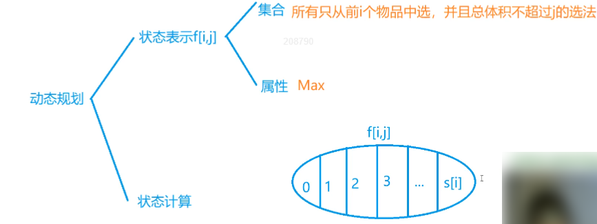

- 状态转移方程为：`f[i][j] = max(f[i][j], f[i - 1][j - k * v[i]] + k * w[i])`(k从0到s[i])

:dart:  **参考代码**

> 朴素版

```C++
#include <iostream>
#include <algorithm>

using namespace std;

const int N = 110;
int n, m;
int s[N], v[N], w[N];
int f[N][N];

int main()
{
    cin >> n >> m;
    
    for (int i = 1; i <= n; i ++)
        cin >> v[i] >> w[i] >> s[i];
    
    // 外层循环从1开始，表示从第一件物品开始选取
    // 内层循环从0开始，表示体积约束为0
    // 尽管没有意义，但是为了保证状态转移方程的正确性，必须要有这一步
    for (int i = 1; i <= n; i ++)
        for (int j = 0; j <= m; j ++)
            for (int k = 0; k <= s[i] && k * v[i] <= j; k ++)
                f[i][j] = max(f[i][j], f[i -1][j - v[i] * k] + w[i] * k);
                
    cout << f[n][m] << endl;
                
    
    return 0;
}
```

:rocket:  **[AcWing 5. 多重背包问题 II](https://www.acwing.com/problem/content/5/)**

:memo:  **解题思路**

> 二进制优化思路：依次将1023个物品打包为十组，将每组看做01背包问题中的一个物品，那么通过这十个不同物品的01选用，就可以凑出0-1023个物品的取值

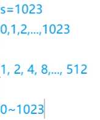

> 一般分法与证明

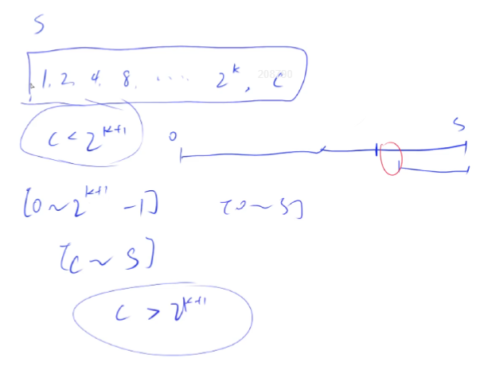

> 时间复杂度降低

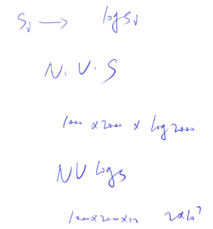

:dart: **参考代码**

```C++
#include <iostream>
#include <algorithm>

using namespace std;

// 打包之后的最大物品数是1000 * log2000
const int N = 25000, M = 2010;
int n, m;
int v[N], w[N];
int f[N];

int main()
{
    cin >> n >> m;
    
    int cnt = 0;
    //对接下来的共N * s[i]个物品，按照种类进行分别打包，对打包成的新物品进行编号
    
    for (int i = 1; i <= n; i ++)
    {
        int a, b, s;
        cin >>a >> b >> s;
        int k = 1;
        while (k <= s) //k个物品分为一组
        {
            cnt++;
            v[cnt] = k * a; //这一组的体积
            w[cnt] = k * b; //这一组的价值
            s -= k;
            k *= 2;
        }
        if (s > 0) //如果成立说明没有恰好分完，要在末尾补上余量
        {
            cnt++;
            v[cnt] = s * a;
            w[cnt] = s * b;
            
        }
    }
     
    n = cnt;
        
    for (int i = 1; i <= n; i ++)
        for (int j = m; j >= v[i]; j --)
            f[j] = max(f[j], f[j - v[i]] + w[i]);
                
    cout << f[m] << endl;
    
    return 0;
}
```

:rocket:  **[AcWing 9. 分组背包问题](https://www.acwing.com/activity/content/problem/content/1001/)**

:memo: **解题思路**


- 状态的计算依次可以分为：不从第$i$组中选、选择第$i$组中第1个物品、选择第$i$组中第2个物品、...、选择第$i$组中第$k$个物品(0 < k < s[i])
- 与多重背包问题相区别，多重背包问题的划分思路是对于第$i$个物品选几个

:dart: **参考代码**

```C++
#include <iostream>
#include <algorithm>

using namespace std;

const int N = 110;

int n, m;
int v[N][N], w[N][N], s[N]; //一维数组s[i]表示第i组物品中含有的物品数量
//二维数组v[i][j]、w[i][j]分别表示第i组编号为j的物品的体积与价值
int f[N];

int main()
{
    cin >> n >> m;
    
    for (int i = 1; i <= n; i ++)
    {
        cin >> s[i]; //读入第i组物品中的物品数
        for (int j = 0; j < s[i]; j ++)
            cin >> v[i][j] >> w[i][j];
    }
    
    // 从前往后枚举每一组物品，从大到小枚举体积限制
    for (int i = 1; i <= n; i ++)
        for (int j = m; j >= 0; j --) //使用上一层的状态进行计算，因此要倒序
            for (int k = 0; k < s[i]; k ++)
                if (v[i][k] <= j)
                    f[j] = max(f[j], f[j - v[i][k]] + w[i][k]);
                    
    cout << f[m] << endl;
    return 0;
}
```

:memo: 解题思路


- **动态规划问题五部曲：确定dp数组(dp table)以及下标的含义、确定递推公式、dp数组如何初始化、确定遍历顺序、举例推导dp数组**
- 外层循环可以抽象为要到达的目标状态(有$i$个物品可以选、有$i$阶楼梯需要爬、需要拆分的数为$i$)，内层循环可以抽象为了到达目标状态进行的不同操作(选其中的$j$个物品、一步爬$j$阶楼梯、第一个拆分出的数为$j$)
- dp 数组初始化时一定要结合题目所给的取值范围，不要强行解释

:rocket:  **[LeetCode 509. 斐波那契数](https://leetcode.cn/problems/fibonacci-number/)**
- 方法一：递归，注意设置终止条件
- 方法二：迭代，滚动优化，注意边界条件的判断，先处理特殊情况，再递推
- 方法三：动态规划，题目已给出递推公式及dp数组初始化条件，注意边界条件的判断，先处理特殊情况，再从`i = 2`开始递推

:rocket:  **[LeetCode 70. 爬楼梯](https://leetcode.cn/problems/climbing-stairs/)**
- n阶楼梯的方案数等于n-1阶楼梯的方案数(一步跨越一阶楼梯)加上n-2阶楼梯的方案数(一步跨越两阶楼梯)，即递推公式为`dp[n] = dp[n - 1] + dp[n - 2]`
- 注意从`i = 3`开始递推

:rocket:  **[LeetCode 746. 使用最小花费爬楼梯](https://leetcode.cn/problems/min-cost-climbing-stairs/)**
- dp 数组中 dp[i] 的含义是到达第 i 阶楼梯的最小花费
- 题目说明可以选择从第零阶或第一阶楼梯开始起跳，这给出了 dp 数组的初始条件
- 距离楼顶还有一阶楼梯时，一步跳到楼顶的花费是`dp[i - 1] + cost[i - 1]`；距离楼顶还有两阶楼梯时，一步跳到楼顶的花费是`dp[i - 2] + cost[i - 2]`。两种情况取最小，即为到达楼顶的最小花费

:rocket:  **[LeetCode 62. 不同路径](https://leetcode.cn/problems/unique-paths/)**
- 初始条件：对于单独一行或单独一列，走法有且只有一种
- 递推公式：可以从目标点的左侧或上侧走到目标点，因此`dp[i][j] = dp[i - 1][j] + dp[i][j - 1]`

:rocket:  **[LeetCode 63. 不同路径 II](https://leetcode.cn/problems/unique-paths-ii/)**
- 基本思路同上一题，在初始条件中，只要遇到障碍，以障碍后的点为终点的路径总数都为0
- 在递推公式中，如果当前点是障碍，那么以当前点为终点的路径总数也为0
- 因此在定义dp数组时就需要执行初始化：
```C++
vector<vector<int>> dp(m, vector<int>(n, 0));
```

:rocket:  **[LeetCode 343. 整数拆分](https://leetcode.cn/problems/integer-break/)**
- 递推公式：`dp[i] = max(dp[i], max(j * (i - j), j * dp[i - j]))`，其中`j`表示拆分出来的第一个整数

:rocket:  **[LeetCode 95. 不同的二叉搜索树 II](https://leetcode.cn/problems/unique-binary-search-trees-ii/)**
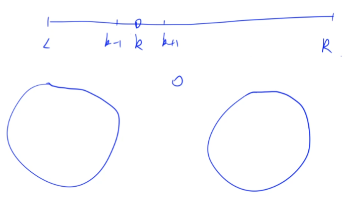
- 利用二叉搜索树的性质，左子树的所有节点都小于根节点，右子树的所有节点都大于根节点，枚举根节点，递推左右子树的可能情况，从左子树的所有可能情况与右子树的所有可能情况中各选其一即可组成二叉搜索树

:rocket:  **[LeetCode 96. 不同的二叉搜索树](https://leetcode.cn/problems/unique-binary-search-trees/)**

- 递推公式：dp[i] += dp[以 j 为头结点左子树节点数量] * dp[以 j 为头结点右子树节点数量]，即`dp[i] += dp[j - 1] * dp[i - j]`(递推思路见上一题)

:rocket:  **[LeetCode 53. 最大子数组和](https://leetcode.cn/problems/maximum-subarray/)** 

:rocket:  **[LeetCode 63. 不同路径 II](https://leetcode.cn/problems/unique-paths-ii/)**

:rocket:  **[LeetCode 63. 不同路径 II](https://leetcode.cn/problems/unique-paths-ii/)**

:rocket:  **[LeetCode 63. 不同路径 II](https://leetcode.cn/problems/unique-paths-ii/)**

:rocket:  **[LeetCode 63. 不同路径 II](https://leetcode.cn/problems/unique-paths-ii/)**

## 第二次课

:date: 2022-11-12

### 线性DP

:rocket:  **[AcWing 898. 数字三角形](https://www.acwing.com/problem/content/900/)**

:memo: **解题思路**

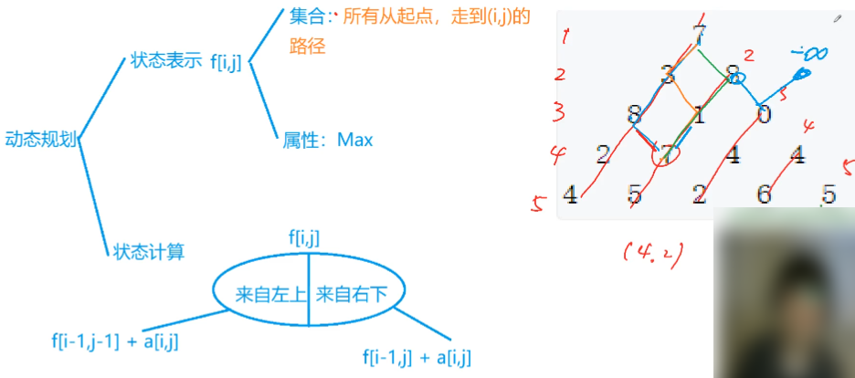

- 状态划分的依据是走到当前终点的方式，右边集合应该是来自右上

:dart: **参考代码**

```C++
#include <iostream>
#include <algorithm>

using namespace std;

const int N = 510, INF = 1e9;
int n;
int a[N][N];
int f[N][N]; 

int main()
{
    cin >> n;
    
    //读入数字三角形，为了与行列的实际意义对应，这里都是从1开始循环
    for (int i = 1; i <= n; i ++) 
        for (int j = 1; j <= i; j ++)
            cin >> a[i][j];

    //初始化二维数组f的时候，因为会用到f[0][0]，所以从0开始循环
    //初始化时每行要多初始化一列，防止每行的最后一列用到其右上方的路径    
    for (int i = 0; i <= n; i ++)
        for (int j = 0; j <= i + 1; j ++)
            f[i][j] = -INF;
    
    f[1][1] = a[1][1];   
    for (int i = 2; i <= n; i ++) //外层循环从2开始，因为第一层没有路径
        for (int j = 1; j <= i; j ++)
            f[i][j] = max(f[i - 1][j - 1] + a[i][j], f[i - 1][j] + a[i][j]);
    
    int res = -INF;
    //遍历数字三角形的底层，因为其中的任何一个都可能是最大值
    for (int i = 1; i <= n; i ++)
        res = max(res, f[n][i]);
        
    cout << res << endl;
    
    return 0;
}
```

:rocket:  **[AcWing 895. 最长上升子序列](https://www.acwing.com/problem/content/897/)**

:memo: **解题思路**

- 可以从原序列隔着挑数，只要保证与在原序列中的先后顺序一致即可


- 状态划分的依据是所求的上升子序列中倒数第二个数是原序列中的第几个数(第0个数代表上升子序列中只有第`i`个数)

:dart: **参考代码**

> 原问题答案

```C++
#include <iostream>
#include <algorithm>

using namespace std;

const int N = 1010;
int n;
int a[N], f[N];

int main()
{
    cin >> n;
    
    for (int i = 1; i <= n; i ++)
        cin >> a[i];
        
    for (int i = 1; i <= n; i ++)
    {
        f[i] = 1; //上升子序列只有a[i]这一个数
        for (int j = 1; j < i; j ++)
            if (a[j] < a[i])
                f[i] = max(f[i], f[j] + 1);
    }
    
    //res初始化为零，因为res表示的是上升子序列的长度，而不是序列中数的和，所以res至少是1
    //数字三角形中res初始化为-INF，因为res表示的是路径中所有数之和，这个和非常有可能是负数
    int res = 0;
    for (int i = 1; i <= n; i ++)
        res = max(res, f[i]);
        
    cout << res << endl;
    
    return 0;
}
```

> 要求同时输出上升子序列

```C++
#include <iostream>
#include <algorithm>

using namespace std;

const int N = 1010;
int n;
int a[N], f[N], g[N];
//一维数组g[i]储存的是以a[i]为结尾的上升子序列中的数在原序列中的下标
//这样的话就可以一步步往前倒推输出上升子序列

int main()
{
    cin >> n;
    
    for (int i = 1; i <= n; i ++)
        cin >> a[i];
        
    for (int i = 1; i <= n; i ++)
    {
        f[i] = 1; 
        g[i] = 0;
        for (int j = 1; j < i; j ++)
            if (a[j] < a[i])
                if (f[i] <f[j] + 1)
                {
                    f[i] = f[j] + 1;
                    g[i] = j; //记录是从哪个下标转移过来的
                }
    }
    
    int k = 1;
    for (int i = 1; i <= n; i ++)
        if (f[k] < f[i])
            k = i;
            
    cout << f[k] << endl;
        
    for (int i = 0, len = f[k]; i <len; i ++)
    {
        cout << a[k] << ' ';
        k = g[k];
    }
    
    return 0;
}
```

:rocket:  **[AcWing 896. 最长上升子序列 II](https://www.acwing.com/problem/content/898/)**

:memo: **解题思路**

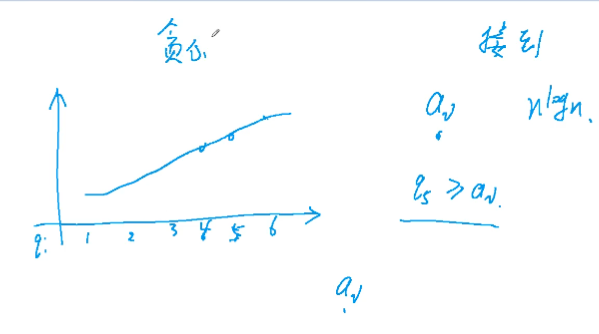

- 对于长度相同的上升子序列，只需要保留末尾的数最小的序列即可。因为末尾的数越小，就会有越多的数可以接在后面，进而形成长度更长的上升子序列
- 对于长度相同的上升子序列，只存储末尾数最小的序列。在这种情况下的长度不同的上升子序列，可以证明：长度越长，子序列末尾的数越大。记当前保存的长度为5的上升子序列的末尾数为`a`，当前保存的长度为6的上升子序列的末尾数为`b`，如果`a >= b`，那么长度为5的上升子序列的末尾数应该为长度为6的上升子序列的导数第二个数，而不是`a`，矛盾
- 因此对于原序列中某个特定的数，只需要用**整数二分法**找到比该数小且与其距离最近的数，再通过以这个数结尾的最长上升子序列长度加一即可得到问题的答案

:dart: **参考代码**

```C++
#include <iostream>
#include <algorithm>

using namespace std;

const int N = 100010;

int n;
int a[N];
int q[N]; //q[i]存储长度为i的上升子序列中末尾的最小数

int main()
{
    cin >> n;
    
    for (int i = 0; i < n; i ++) //读入所给序列
        cin >> a[i];
    
    int len = 0; 
    //表示此时一维数组q中有几个数被更新过，即当前找到了长度为len的上升子序列
    q[0] = -2e9;
    for (int i = 0; i < n; i ++)
    {
        int l = 0, r = len;
        while (l < r)
        {
            int mid = l + r + 1 >> 1;
            if (q[mid] < a[i])
                l = mid;
            else 
                r = mid - 1; 
        }
        len = max(len, r + 1);
        q[r + 1] = a[i]; //此时a[i]为长度(r + 1)的上升子序列中末尾数最小的
    }
    
    cout << len << endl;
    
    return 0;
}
```

:rocket:  **[AcWing 897. 最长公共子序列](https://www.acwing.com/problem/content/899/)**

:memo: **解题思路**

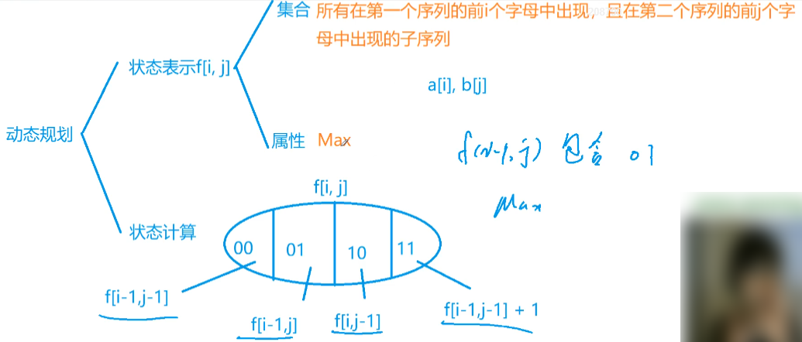

- 在子问题的划分部分，状态表示最大值或最小值时，分成的子状态之间时可以有重复的，不影响最后求最值的结果；状态表示数量时，子状态之间不可以有重复
- 状态划分的依据公共子序列是否包含`a[i]`、`b[j]`这两个字母
- 第一种情况`f[i - 1][j - 1]`包含在第二种或第三种情况之间，因此实际写代码时可以省略这一部分
- 第四种情况只有当`a[i] = b[j]`时才加一，因此要有条件判断

:dart: **参考代码**

```C++
#include <iostream>
#include <algorithm>

using namespace std;

const int N = 1010;

int n, m;
char a[N], b[N];
int f[N][N];

int main()
{
    cin >> n >> m;
    
    for (int i = 1; i <= n; i ++)
        cin >> a[i];

    for (int j = 1; j <= m; j ++)
        cin >> b[j];
    
    for (int i = 1; i <= n; i ++)
        for (int j = 1; j <= m; j ++)
            {
                f[i][j] = max(f[i -1][j], f[i][j - 1]);
                if (a[i] == b[j])
                    f[i][j] = max(f[i][j], f[i - 1][j - 1] + 1);
            }
            
    cout << f[n][m] << endl;
    
    return 0;
}
```

:rocket:  **[AcWing 902. 最短编辑距离](https://www.acwing.com/problem/content/904/)**

:memo: **解题思路**


- 状态划分的依据是最后一步的操作，共有删、增、改三种
- 如果删掉`a[1~i]`的最后一个字母与`b[1~j]`匹配成功，那么说明`a[1~i-1]`与`b[1~j]`已经匹配成功
- 如果在`a[1~i]`的末尾增加一个字母与`b[1~j]`匹配成功，那么说明`a[1~i]`与`b[1~j-1]`已经匹配成功
- 如果修改`a[1~i]`的最后一个字母与`b[1~j]`匹配成功，那么说明`a[1~i-1]`与`b[1~j-1]`已经匹配成功

:dart: **参考代码**

```C++
#include <iostream>
#include <algorithm>

using namespace std;

const int N = 1010;

int n, m;
char a[N], b[N]; 
int f[N][N];

int main()
{
    scanf("%d%s", &n, a + 1); //数组名的本质是个指针/地址
    scanf("%d%s", &m, b + 1);
    
    //处理边界问题：只有通过增加才能匹配
    for (int i = 0; i <= m; i ++) 
        f[0][i] = i;
    
    //处理边界问题：只有通过删除才能匹配   
    for (int i = 0; i <= n; i ++)
        f[i][0] = i;
        
    for (int i = 1; i <= n; i ++)
        for (int j = 1; j <= m; j ++)
        {
            f[i][j] = min(f[i - 1][j] + 1, f[i][j - 1] + 1);
            if (a[i] == b[j])
                f[i][j] = min(f[i][j], f[i - 1][j - 1]);
            else
                f[i][j] = min(f[i][j], f[i - 1][j - 1] + 1);
        }
        
    cout << f[n][m] << endl;
    
    return 0;
}
```

:rocket:  **[AcWing 899. 编辑距离](https://www.acwing.com/problem/content/901/)**

:memo: **解题思路**

> 最短编辑距离的应用问题

:dart: **参考代码**

```C++
#include <iostream>
#include <algorithm>
#include <cstring>

using namespace std;

const int N = 15, M = 1010; //N表示一个字符串的最大长度，M表示最多有多少字符串
int a[20];
int f[N][N];
char str[M][N];
int n, m;

int edit_distance(char a[], char b[])
{
    int la = strlen(a + 1), lb = strlen(b + 1);
    
    for (int i = 0; i <= lb; i ++) f[0][i] = i;
    for (int i = 0; i <= la; i ++) f[i][0] = i;
    
    for (int i = 1; i <= la; i ++)
        for (int j = 1; j <= lb; j ++)
        {
            f[i][j] = min(f[i - 1][j] + 1, f[i][j - 1] + 1);
            if (a[i] == b[j])
                f[i][j] = min(f[i][j], f[i - 1][j - 1]);
            else
                f[i][j] = min(f[i][j], f[i -1][j - 1] + 1);
        }
        
    return f[la][lb];
}

int main()
{
    cin >> n >> m;
    
    for (int i = 0; i < n; i ++)
        scanf("%s", str[i] + 1);
        
    while (m--)
    {
        char s[N];
        int limit;
        scanf("%s%d", s + 1, &limit);
        
        int res = 0;
        for (int i = 0; i < n; i ++)
            if (edit_distance(str[i], s) <= limit)
                res++;
                
        cout << res << endl;
    }
    
    return 0;
}
```

### 区间DP

:rocket:  **[AcWing 282. 石子合并](https://www.acwing.com/problem/content/284/)**

:memo: **解题思路**

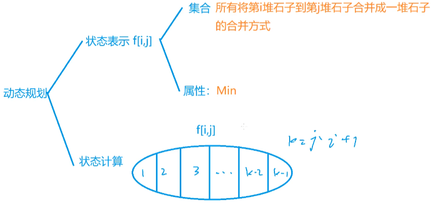

- 状态划分的依据是最后一次合并时两堆石子各自是由原始哪些堆的石子合并而来的


:dart: **参考代码**

```C++
#include <iostream>
#include <algorithm>

using namespace std;

const int N = 310;
int n, a[N], s[N];
int f[N][N];

int main()
{
    cin >> n;
    
    //读入每堆石子的重量
    for (int i = 1; i <= n; i ++)
    {
        cin >> a[i];
        s[i] = a[i];
    }
        
    
    //处理前缀和
    for (int i = 1; i <= n; i ++)
    {
        s[i] += s[i - 1];
        //cout  << s[i] << endl;
    }
        
    for (int len = 2; len <= n; len ++) //枚举区间长度
        for (int i = 1; i + len - 1 <= n; i ++) //枚举区间起点
        {
            int l = i, r = i + len - 1; //区间的左右端点
            f[l][r] = 1e9; //区间DP的初始化与其他初始化不同
            for (int k = l; k < r; k ++)
                f[l][r] = min(f[l][r], f[l][k] + f[k + 1][r] + s[r]- s[l - 1]);
        }
        
    cout << f[1][n] << endl;
    
    return 0;
}

```

### 计数类DP

:rocket:  **[AcWing 900. 整数划分](https://www.acwing.com/problem/content/902/)**

:memo: **解题思路**

> 样例分解


> 背包做法

可以转化为完全背包问题：有一个容量为`n`的背包，有`n`个体积分别为1、2、……、n的物品，求**恰好装满**背包的方案数，其中每个物品可以使用无数次。与完全背包问题的区别是：`f[i][j]`表示的是从前`i`个物品中选择物品总体积恰好为`j`的选择方案**数量**

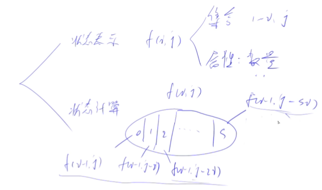

状态转移方程如下：
- `f[i][j] = f[i - 1][j] + f[i - 1][j -i] + f[i - 1][j - 2*i] + ... + f[i - 1][j - s*i]`
- `f[i][j - i] = f[i - 1][j - i] + f[i - 1][j - 2*i] + ... + f[i - 1][j - s*i]`
因此：`f[i][j] = f[i - 1][j] + f[i][j - i]`，一维优化：`f[j] = f[j] + f[j - i]`

> 特殊做法


- 当方案中所有数的最小值为1时，可以将方案中的最小值去掉，这样的话方案的总和变为`i-1`，由`j-1`个数组成，所以集合左边的状态为`f[i - 1][j - 1]`
- 当方案中所有数的最小值大于1时，可以将方案中的所有数都减去1，这样的话方案的总和变为`i-j`，但还是由`j`个数组成，所以集合右边的状态为`f[i - j][j]`
- 最后必须要对所有可能求和

> 比较上述两种方法的状态转移方程：背包做法为：`f[i][j] = f[i - 1][j] + f[i][j - i]`，特殊做法为：`f[i][j] = f[i - 1][j - 1] + f[i -j][j]`

:dart: **参考代码**

> 背包做法

```C++
#include <iostream>
#include <algorithm>

using namespace std;

const int N = 1010, M = 1e9 + 7;

int n;
int f[N];

int main()
{
    cin >> n;
    f[0] = 1; //体积为0时有一种方案
    
    for (int i = 1; i <= n; i ++)
        for (int j = i; j <= n; j ++) //体积从小到大循环，j的取值保证状态数组不能越界，因此从i开始
            f[j] = (f[j] + f[j - i]) % M;
            
    cout << f[n] << endl;
    
    return 0;
}
```

> 特殊做法

```C++
#include <iostream>
#include <algorithm>

using namespace std;

const int N = 1010, M = 1e9 + 7;

int n;
int f[N][N];

int main()
{
    cin >> n;
    
    f[0][0] = 1;
    for (int i = 1; i <= n; i ++)
        for (int j = 1; j <= i; j ++) //总和为i，最多可以表示成i个1的和
            f[i][j] = (f[i - 1][j - 1] + f[i - j][j]) % M;
            
    int res = 0;
    for (int i = 0; i <= n; i ++)
        res = (res + f[n][i]) % M;
            
    cout << res << endl;
    
    return 0;
}
```

### 数位统计DP

:rocket:  **[AcWing 338. 计数问题](https://www.acwing.com/problem/content/340/)**

:memo: **解题思路**


- 当1出现在最高位时，第一种情况将不存在
- 

:dart: **参考代码**

```C++

```

### 状态压缩DP

:rocket:  **[AcWing 291. 蒙德里安的梦想](https://www.acwing.com/problem/content/293/)**

:memo: **解题思路**

- 思考的核心：先横着摆放，后竖着摆放
- 总方案数等于只横着摆放小方块的合法方案数？如何判断当前只横着摆放是否合法？因为题目要求要全部充满所给区域，所以只要判断剩余的位置能否由竖着摆放的小方块填充完整即可
- 当竖着摆放小方块时，按列枚举所给区域，每一列内空着的小方块区域必须是偶数个，若是奇数个则必有区域不被填充或填充后与其他区域发生冲突，不满足题意要求


:dart: **参考代码**

```C++
#include <iostream>
#include <cstring>
#include <algorithm>
#include <vector>

using namespace std;

typedef long long LL;

const int N = 12, M = 1 << N; //M表示某一行所有可能的状态数

int n, m; //所给区域的行数与列数
LL f[N][M]; //状态表示
vector<int> state[M]; //存储当前列的合法状态
bool st[M]; //st[i] = false 表示第i列的摆放方式不合法，即剩下的区域不能被竖着摆放填充满

int main()
{
    while (cin >> n >> m, n || m)
    {
        //用十进制的数字i表示状态，总状态数有1 << n种，下面的循环即是遍历所有状态
        for (int i = 0; i < 1 << n; i ++)
        {
            int cnt = 0; //表示当前列空白区域的个数
            bool is_valid = true;
            for (int j = 0; j < n; j ++)
                if (i >> j & 1)
                {
                    if (cnt & 1) 
                    {
                        is_valid = false;
                        break;
                    }
                    cnt = 0;
                }
                else cnt ++;
            if (cnt & 1) is_valid = false;
            st[i] = is_valid;
        }
        
        for (int i = 0; i < 1 << n; i ++)
        {
            state[i].clear();
            for (int j = 0; j < 1 << n; j ++)
                if ((i & j) == 0 && st[i | j])
                    state[i].push_back(j);
        }
        
        memset(f, 0, sizeof f); //清空所有状态
        f[0][0] = 1;
        for (int i = 1; i <= m; i ++) //遍历每一列
            for (int j = 0; j < 1 << n; j ++) //遍历当前列的所有状态
                for (auto k : state[j]) //遍历当前列的所有合法状态
                    f[i][j] += f[i - 1][k];
                    
        cout << f[m][0] << endl;
    }
    
    return 0;
}
```

:rocket:  **[AcWing 91. 最短Hamilton路径](https://www.acwing.com/problem/content/93/)**

### 树形DP

:rocket:  **[AcWing 285. 没有上司的舞会](https://www.acwing.com/problem/content/287/)**

### 记忆化搜索

:rocket:  **[AcWing 901. 滑雪](https://www.acwing.com/problem/content/903/)**