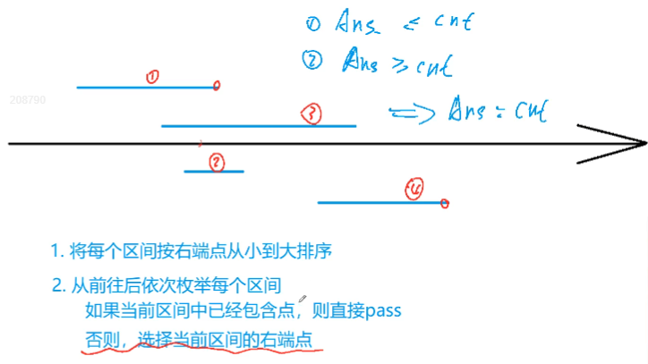
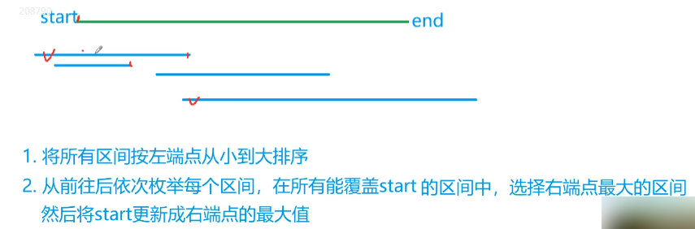
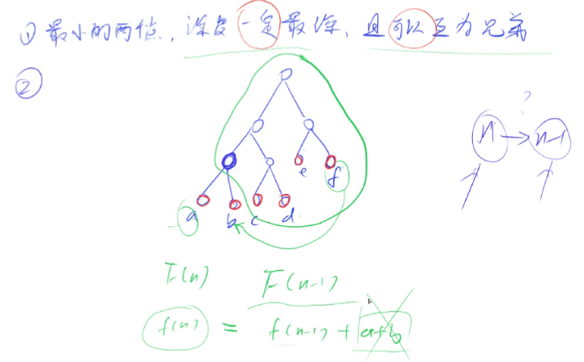
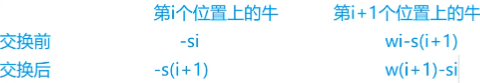

# 贪心算法

> - **主要参考来源：[AcWing 算法基础课](https://www.acwing.com/activity/content/introduction/11/)、[AcWing LeetCode究极班](https://www.acwing.com/activity/content/31/)、[代码随想录](https://programmercarl.com/other/say_feel.html)、[阿秀的学习笔记](https://interviewguide.cn/notes/03-hunting_job/03-algorithm/03-leetcode/01-introduce.html)、[labuladong](https://labuladong.github.io/algo/2/)**
> - **主要包含内容：区间问题、Huffman树、排序不等式、绝对值不等式、推公式**

## 第一次课

:date: 2022-11-27

### 区间问题

:rocket:  **[AcWing 905. 区间选点](https://www.acwing.com/problem/content/907/)**

:memo: **解题思路**



:dart: **参考代码**

```C++
#include <iostream>
#include <algorithm>

using namespace std;

const int N = 100010;

int n;
struct Range
{
    int l, r;
    //按照区间右端点排序需要重载运算符
    bool operator< (const Range &W)const
    {
        return r < W.r;
    }
}range[N];

int main()
{
    cin >> n;
    
    for (int i = 0; i < n; i ++)
        cin >> range[i].l >> range[i].r;
        
    sort(range, range + n);
    
    int res = 0, ed = -2e9;
    //res表示已选出点的数量，ed表示上一个选出的点的下标
    for (int i = 0; i < n; i ++)
        if (range[i].l > ed)
        {
            res ++;
            ed = range[i].r;
        }
    cout << res << endl;
    
    return 0;
}
```

:rocket:  **[AcWing 908. 最大不相交区间数量](https://www.acwing.com/problem/content/910/)**

:memo: **解题思路**

:dart: **参考代码**

```C++
#include <iostream>
#include <algorithm>

using namespace std;

const int N = 100010;

int n;
struct Range
{
    int l, r;
    //按照区间右端点排序需要重载运算符
    bool operator< (const Range &W)const
    {
        return r < W.r;
    }
}range[N];

int main()
{
    cin >> n;
    
    for (int i = 0; i < n; i ++)
        cin >> range[i].l >> range[i].r;
        
    sort(range, range + n);
    
    int res = 0, ed = -2e9;
    //res表示已选出点的数量，ed表示上一个选出的点的下标
    for (int i = 0; i < n; i ++)
        if (range[i].l > ed)
        {
            res ++;
            ed = range[i].r;
        }
    cout << res << endl;
    
    return 0;
}
```

:rocket:  **[AcWing 906. 区间分组](https://www.acwing.com/problem/content/908/)**

:memo: **解题思路**


- 设所有合法方案的最小组数为$ans$，按照以上做法得到的组数为$cnt$

- 首先，按照上述算法得到的组一定是一种合法的方案，因为算法保证了组内区间两两不相交，即有$ans≤cnt$。其次，考察开最后一个组的时刻，假设枚举到最后区间时，前$cnt-1$个组都与这个区间有交集，即每个组的最大右端点值都大于等于这个区间的左端点，并且由于枚举是按照区间左端点从小到大，因此前$cnt-1$个组内每个区间的左端点都小于等于当前区间的左端点，所以对于前$cnt-1$个组，每个组内都能找到一个区间，其左端点小于等于当前区间的左端点，且右端点大于等于当前区间的右端点，即，当前区间和这$cnt-1$个区间都相交，因此这$cnt$个区间必须完全分开，即任意方案的组数都不小于 cnt，因此有$ans≥cnt$。综上，有 $ans=cnt$

:dart: **参考代码**

```C++
#include <iostream>
#include <algorithm>
#include <queue>

using namespace std;

const int N = 100010;

int n;
struct Range
{
    int l, r;
    bool operator< (const Range &W)const
    {
        return l < W.l;
    }
}range[N];

int main()
{
    cin >> n;
    
    for (int i = 0; i < n; i ++)
        cin >> range[i].l >> range[i].r;
        
    sort(range, range + n);
    
    priority_queue<int, vector<int>, greater<int>> heap;
    //定义一个小根堆，存储已经分好组的最右侧端点，堆顶为最小值
    for (int i = 0; i < n; i ++)
    {
        auto r = range[i];
        if (heap.empty() || heap.top() >= r.l)
            heap.push(r.r); //开新组
        else 
        {//将当前区间放到右侧端点最小的分组中
            int t = heap.top(); 
            heap.pop(); //删除堆顶
            heap.push(r.r); //更新当前组的右端点
        }
    }
    
    cout << heap.size() << endl;
    
    return 0;
}
```

:rocket:  **[AcWing 907. 区间覆盖](https://www.acwing.com/problem/content/909/)**

:memo: **解题思路**



:dart: **参考代码**

```C++
#include <iostream>
#include <algorithm>

using namespace std;

const int N = 100010;

int st, ed;
int n;

struct Range
{
    int l, r;
    bool operator< (const Range &W)const
    {
        return l <W.l;
    }
}range[N];

int main()
{
    cin >> st >> ed;
    
    cin >> n;
    for (int i = 0; i <n; i ++)
        cin >> range[i].l >> range[i].r;
    sort(range, range + n);
        
    int res = 0;
    bool success = false;
    for (int i = 0; i < n; i ++)
    {
        int j = i, r = -2e9;
        while (j < n && range[j].l <= st) //遍历所有左端点在给定线段左端点左边的区间
        {
            r = max(r, range[j].r); //在满足条件的区间中取右端点最大者
            j ++;
        }
        
        if (r < st)
        {
            res = -1;
            break;
        }
        res++;
        if (r >= ed)
        {
            success = true;
            break;
        }
        
        st = r;
        i = j - 1;
    }
    if (!success) res = -1;
    cout << res << endl;
    
    return 0;
}
```

### Huffman树

:rocket:  **[AcWing 148. 合并果子](https://www.acwing.com/problem/content/150/)**

> 与AcWing 282. 石子合并的区别

石子合并要求只能合并相邻的两堆，而本题不要求“相邻”

:memo: **解题思路**



:dart: **参考代码**

```C++
#include <iostream>
#include <algorithm>
#include <queue>

using namespace std;

int main()
{
    int n;
    cin >> n;
    
    priority_queue<int, vector<int>, greater<int>> heap;
    while (n --)
    {
        int x;
        cin >> x;
        heap.push(x);
    }
    
    int res = 0;
    while (heap.size() > 1)
    {
        int a = heap.top(); heap.pop();
        int b = heap.top(); heap.pop();
        res += a + b;
        heap.push(a + b); //把合并后的新堆加入到队列中
    }
    cout << res << endl;
    return 0;
}
```

### 排序不等式

:rocket:  **[AcWing 913. 排队打水](https://www.acwing.com/problem/content/description/915/)**

:memo: **解题思路**


:dart: **参考代码**

```C++
#include <iostream>
#include <algorithm>

using namespace std;

typedef long long LL;

const int N = 100010;
int n;
int t[N];

int main()
{
    cin >> n;
    
    for (int i = 0; i < n; i ++)
        cin >> t[i];
        
    sort(t, t + n);
    
    LL res = 0;
    for (int i = 0; i < n; i ++)
        res += t[i] * (n - i - 1);
        
    cout << res << endl;
    
    return 0;
}
```

### 绝对值不等式

:rocket:  **[AcWing 104. 货仓选址](https://www.acwing.com/problem/content/106/)**

:memo: **解题思路**


- 只要货仓在一对商店之间的任意位置，那么货仓到这两个商量的距离之和就是一定的

:dart: **参考代码**

```C++
#include <iostream>
#include <algorithm>

using namespace std;

const int N = 100010;

int n;
int x[N];

int main()
{
    cin >> n;
    
    for (int i = 0; i < n; i ++)
        cin >> x[i];
        
    sort(x, x + n);
    
    int res = 0;
    for (int i = 0; i < n; i ++)
        res += abs(x[i] - x[n / 2]); 
        
    cout << res << endl;
    
    return 0;
}
```

### 推公式

:rocket:  **[AcWing 125. 耍杂技的牛](https://www.acwing.com/problem/content/127/)**

:memo: **解题思路**





:dart: **参考代码**

```C++
#include <iostream>
#include <algorithm>

using namespace std;

typedef pair<int, int> PII;

const int N = 50010;

int n;
PII cow[N];

int main()
{
    cin >> n;
    
    for (int i = 0; i < n; i ++)
    {
        int w, s;
        cin >> w >> s;
        cow[i] = {w + s, w};
    }
    
    sort(cow, cow + n);
    
    int res = -2e9, sum = 0;
    for (int i = 0; i < n; i ++)
    {
        int w = cow[i].second, s = cow[i].first - w;
        res = max(res, sum - s);
        sum += w;
    }
    
    cout << res << endl;
    
    return 0;
}
```