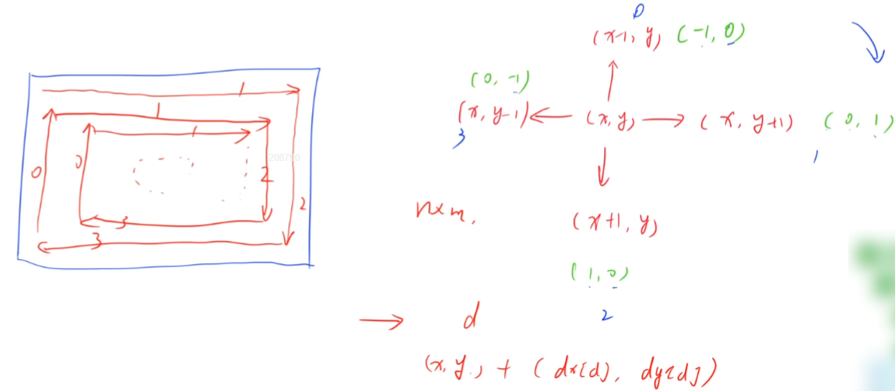
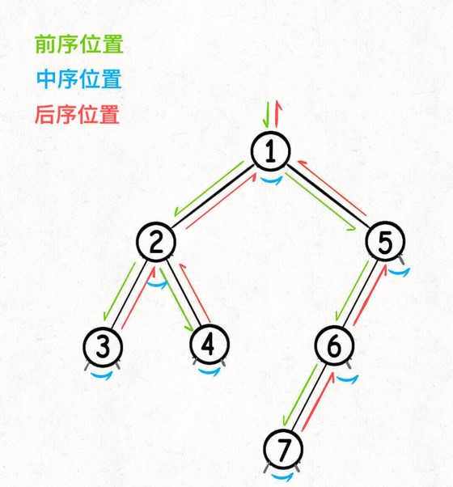
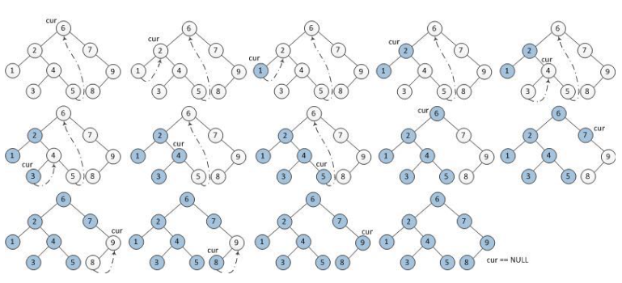

# 其他总结

## 矩阵中的「距离」

### 偏移距离

:rocket:  **[LeetCode 54. 螺旋矩阵](https://leetcode.cn/problems/spiral-matrix/)**

:rocket:  **[LeetCode 59. 螺旋矩阵 II](https://leetcode.cn/problems/spiral-matrix-ii/)**

- 偏移矩阵：`int dx[4] = {-1, 0, 1, 0}, dy[4] = {0, 1, 0, -1};`

### 曼哈顿距离

### 边界线距离

### 对角线距离

## 二叉/多叉/二叉搜索树

:pushpin: **基本原理**

- **[二叉树理论基础](https://programmercarl.com/%E4%BA%8C%E5%8F%89%E6%A0%91%E7%90%86%E8%AE%BA%E5%9F%BA%E7%A1%80.html)：完全二叉树(Complete Binary Tree, CBT)、二叉搜索树(Binary Search Tree, BST)、二叉线索树(Binary Thread Tree, BTT)、平衡二叉搜索树(Adelson Velsky and Landis, AVL)**
- **[东哥带你刷二叉树（纲领篇）](https://labuladong.gitee.io/algo/di-yi-zhan-da78c/shou-ba-sh-66994/dong-ge-da-334dd/)：遍历思想：是否可以通过遍历二叉树的每一个节点得到答案？如果可以，用一个`traverse`函数(唯一形参)配合若干个外部变量来实现；分治思想：是否可以通过子问题(子树)的答案推导出原问题的答案？如果可以，一般直接用LeetCode上的待补全函数作为递归函数，并充分利用函数的返回值，该思路核心在于你要给该函数一个合适的定义(输入、输出、功能)，然后用函数的定义来解释每一个节点进行的操作(这是递归的精髓，不要陷入函数具体的执行过程中)；如果逻辑成功自恰，说明这个算法是正确的。** 这两种思想都需要思考：如果单独抽出一个二叉树节点，它需要做什么事情？需要在什么时候(前/中/后序位置)做，其他的节点不用操心，递归函数会在所有节点上执行相同的操作

### 二叉树的深度优先遍历

:pushpin: **基本原理**

- 二叉树的遍历方式可大致分为深度优先遍历与广度优先遍历，深度优先遍历中根据根节点的遍历位置可分为先序遍历、中序遍历、后序遍历(均是先遍历左子节点再遍历右子节点)，广度优先遍历指的是层序遍历(使用队列)
- 深度优先遍历做法可以分为两大种：递归(遍历函数本身递归)与迭代(手动模拟栈)。使用栈进行迭代时，将根节点压入栈顶对应递归左子树，在此之前读取根节点的内容对应前序遍历；遍历完左子树后弹出栈顶前读取根节点的内容对应中序遍历；后序遍历顺序为“左右根”，因此使用迭代方法遍历时，可以先按照“根右左”的顺序遍历，最后将结果翻转即可
- **把前中后序遍历理解为三个不同的时间点，在三个不同的时间点上可以进行很复杂的操作来达到目的。把递归函数理解为一个指针，在不同节点上游走，递归函数一次运行结束意味着该指针返回这次操作前的原位置。对一个节点进行操作的前中后序时间点就是在指针刚刚指向/左右子节点切换/将要离开该节点的时间点**

- 另外还有一种Morris遍历方法，这种方法不常用，是在线索二叉树的基础上衍生出来的一种方法
- LeetCode上对于二叉树均是以数组形式输入的，因此正确的理解逻辑是数组中的元素是二叉树先序遍历的结果，然后通过补空法即可创建想要的二叉树
- **思想提炼：[东哥带你刷二叉树（纲领篇）](https://labuladong.gitee.io/algo/di-yi-zhan-da78c/shou-ba-sh-66994/dong-ge-da-334dd/)，数组和链表也有迭代与递归两种遍历方式，和二叉树的深度优先遍历统一。前序、中序、后序是遍历二叉树过程中操作每一个节点的三个特殊时间点，绝不仅仅是三个顺序不同的序列**
```C++
/**
 * Definition for a binary tree node.
 * struct TreeNode {
 *     int val;
 *     TreeNode *left;
 *     TreeNode *right;
 *     TreeNode() : val(0), left(NULL), right(NULL) {}
 *     TreeNode(int x) : val(x), left(NULL), right(NULL) {}
 *     TreeNode(int x, TreeNode *left, TreeNode *right) : val(x), left(left), right(right) {}
 * };
 */

/* 递归遍历二叉树 */
void traverse(TreeNode* root) {
    if (root == null) {
        return;
    }
    // 前序位置：自顶向下
    traverse(root->left);
    // 中序位置
    traverse(root->right);
    // 后序位置：自底向上
}

/* 迭代遍历二叉树 */
stack<TreeNode*> stk;
// 左侧树枝一撸到底
void pushLeftBranch(TreeNode* p) {
    while (p != null) {
        /* 前序位置 */
        stk.push(p);
        p = p->left;
    }
}

void traverse(TreeNode* root) {
    // 指向上一次遍历完的子树根节点
    TreeNode* visited = new TreeNode(-1);
    // 开始遍历整棵树
    pushLeftBranch(root);
    while (stk.size()) {
        TreeNode* p = stk.top();
        // p的左子树被遍历完了，但右子树还未被遍历
        if ((p->left == null || p->left == visited) && p->right != visited)
            /* 中序位置 */
            /* 接下来遍历右子树 */
            pushLeftBranch(p->right);
        // p的右子树被遍历完乐
        if (p->right == null || p->right != visited)
            /* 后序位置 */
            /* 以p为根的子树被遍历完了，出栈，指针visited指向p */
            visited = stk.pop();
    }
}


/* 正序迭代遍历数组 */
void traverse(int[] arr) {
    for (int i = 0; i < arr.length; i++) {

    }
}

/* 倒序迭代遍历数组 */
void traverse(int[] arr) {
    for (int i = arr.length - 1; i >= 0; i --) {

    }
}

/* 递归遍历数组 */
void traverse(int[] arr, int i) {
    if (i == arr.length) {
        return;
    }
    // 前序位置
    traverse(arr, i + 1);
    // 后序位置
}

/* 正序迭代遍历单链表 */
void traverse(ListNode* head) {
    for (ListNode p = head; p != null; p = p.next) {

    }
}

/* 倒序迭代遍历双向链表 */

/* 递归遍历单链表 */
void traverse(ListNode* head) {
    if (head == null) {
        return;
    }
    // 前序位置
    traverse(head.next);
    // 后序位置
}
```

:rocket:  **[LeetCode 99. 恢复二叉搜索树](https://leetcode.cn/problems/recover-binary-search-tree/)**
- 二叉搜索树是有序树。若它的左子树不空，则左子树上所有节点的值均小于它的根节点的值；若它的右子树不空，则右子树上所有节点的值均大于它的根节点的值；同时它的左、右子树也分别为二叉排序树
- 寻找前驱节点与后继节点时最优的遍历方式是**中序遍历**，这就与线索二叉树对应。因此对二叉搜索树的更高级理解是**中序遍历递增树**，这样可以利用线索二叉树的理论寻找前驱节点与后继节点
- 有序数列从小到大排序，但有两个数被交换了位置。共有两种情况：交换的是相邻两个数，例如`1 3 2 4 5 6`，则第一个相邻逆序对，就是被交换的两个数，这里是3和2；交换的是不相邻的数，例如`1 5 3 4 2 6`，则第一个相邻逆序对的第一个数和第二个相邻逆序对的第二个数就是被交换的两个数，这里是5和2
  
> Morris算法：类似于线索二叉树中寻找前驱节点与后继节点


 
1) 参考来源：[题解](https://www.acwing.com/video/1444/)
2) 该算法的时间复杂度是 O(n)，空间复杂度是 O(1)
3) 当前节点有左子树时，其前驱节点是其左子树最右下角的节点(上图中的P)

:rocket:  **[LeetCode 144. 二叉树的前序遍历](https://leetcode.cn/problems/binary-tree-preorder-traversal/)**

:rocket:  **[LeetCode 589. N叉树的前序遍历](https://leetcode.cn/problems/n-ary-tree-preorder-traversal/)**

:rocket:  **[LeetCode 94. 二叉树的中序遍历](https://leetcode.cn/problems/binary-tree-inorder-traversal/)**

:rocket:  **[LeetCode 145. 二叉树的后序遍历](https://leetcode.cn/problems/binary-tree-postorder-traversal/)**

:rocket:  **[LeetCode 590. N叉树的后序遍历](https://leetcode.cn/problems/n-ary-tree-postorder-traversal/)**

### 二叉树的宽度优先遍历

:rocket:  **[LeetCode 102. 二叉树的层序遍历](https://leetcode.cn/problems/binary-tree-level-order-traversal/)**
- 层序遍历本质是BFS问题，下面简称层序思想

:rocket:  **[LeetCode 107. 二叉树的层序遍历 II](https://leetcode.cn/problems/binary-tree-level-order-traversal-ii/)**
- 层序思想：要求自底向上遍历只需将最后结果二维`vector`翻转即可

:rocket:  **[LeetCode 199. 二叉树的右视图](https://leetcode.cn/problems/binary-tree-right-side-view/)**
- 层序思想：在每一层遍历时判断是否到达本层的最后即可
- 遍历思想：先遍历右子树，再遍历左子树，第一次进入每层时将当前节点的值存入全局变量即可

:rocket:  **[LeetCode 515. 在每个树行中找最大值](https://leetcode.cn/problems/find-largest-value-in-each-tree-row/)**
- 层序思想：在每一层遍历时求取最大值即可

:rocket:  **[LeetCode 1161. 最大层内元素和](https://leetcode.cn/problems/maximum-level-sum-of-a-binary-tree/)**
- 层序思想：在每一层遍历时求取层内元素之和并判断，记录所在层数即可

:rocket:  **[LeetCode 637. 二叉树的层平均值](https://leetcode.cn/problems/average-of-levels-in-binary-tree/)**
- 层序思想：在每一层遍历时求取平均值即可

:rocket:  **[LeetCode 116. 填充每个节点的下一个右侧节点指针](https://leetcode.cn/problems/populating-next-right-pointers-in-each-node/)**
- 层序思想：在每一层遍历时操作节点的`next`指针即可
- 遍历思想：将原二叉树中两两需要连接在一起的节点看做是三叉树中的一个新节点，进行三叉树的节点遍历即可(实操难度较大)

:rocket:  **[LeetCode 513. 找树左下角的值](https://leetcode.cn/problems/find-bottom-left-tree-value/)**
- 层序思想：最后一层遍历时的第一个元素就是树左下角的值

:rocket:  **[LeetCode 1302. 层数最深叶子节点的和](https://leetcode.cn/problems/deepest-leaves-sum/)**

:rocket:  **[LeetCode 429. N 叉树的层序遍历](https://leetcode.cn/problems/n-ary-tree-level-order-traversal/)**
- 层序思想：将当前节点的所有子节点全部加入队列
- 图论中BFS思想的起源

### 求取二叉树的属性、判断二叉树的性质

:rocket:  **[LeetCode 100. 相同的树](https://leetcode.cn/problems/same-tree/)**
- 分治思想：如果左子树与右子树都分别相同，则这两个二叉树相同

:rocket:  **[LeetCode 572. 另一棵树的子树](https://leetcode.cn/problems/subtree-of-another-tree/)**
- 分治思想：需要用到上一题判断两个二叉树是否完全相同的思路

:rocket:  **[LeetCode 1367. 二叉树中的链表](https://leetcode.cn/problems/linked-list-in-binary-tree/)**
- 先考虑链表是否为空，再考虑二叉树是否为空，这样可以减少很多特判

:rocket:  **[LeetCode 101. 对称二叉树](https://leetcode.cn/problems/symmetric-tree/)**
- 分治思想：左子树的右子节点与右子树的左子节点镜像对称，且左子树的左子结点与右子树的右子节点镜像对称

:rocket:  **[LeetCode 104. 二叉树的最大深度](https://leetcode.cn/problems/maximum-depth-of-binary-tree/)**
- 分治思想：二叉树的最大深度等于左子树深度与右子树深度取较大值加一(根节点)
- 遍历思想：遍历二叉树中的每一个节点，用一个外部变量记录当前节点所在的深度，当到达叶子节点时与全局变量取较大值就可以得到最大深度

:rocket:  **[LeetCode 559. N叉树的最大深度](https://leetcode.cn/problems/maximum-depth-of-n-ary-tree/)**
- 遍历思想：遍历N叉树中的每一个节点，用一个外部变量记录当前节点所在的深度，当到达叶子节点时与全局变量取较大值就可以得到最大深度

:rocket:  **[LeetCode 543. 二叉树的直径](https://leetcode.cn/problems/diameter-of-binary-tree/)**
- 遍历思想：遍历二叉树中每一个节点，节点的直径等于左子树深度与右子树深度之和(可以沿用求最大深度的思路)，最后取最大值就可以得到整个二叉树的直径
- 分治思想：二叉树的直径等于左子树深度与右子树深度之和，在求最大深度的后序位置可以顺便求出以当前节点为根节点的二叉树的直径，最后维护一个全局变量即可

:rocket:  **[LeetCode 111. 二叉树的最小深度](https://leetcode.cn/problems/minimum-depth-of-binary-tree/)**
- 分治思想：二叉树的最小深度等于左子树深度与右子树深度取较小值加一(根节点)，注意当其中一棵子树为空时不能取其深度，因为还未到达叶子结点，因此要进行两次特判
- 遍历思想：遍历二叉树中的每一个节点，用一个外部变量记录当前节点所在的深度，当到达叶子节点时与全局变量取较小值就可以得到最小深度
- 注意：取较大值时全局变量的初始值设为`0`或`-INT_MAX`，取较大值时全局变量的初始值设为`INT_MAX`，这是和最大深度问题的不同之处
- 层序思想：自顶向下从左到右遍历时，首先遇到的叶子结点处的深度就是最小深度

:rocket:  **[LeetCode 222. 完全二叉树的节点个数](https://leetcode.cn/problems/count-complete-tree-nodes/)**

:rocket:  **[LeetCode 110. 平衡二叉树](https://leetcode.cn/problems/balanced-binary-tree/)**

:rocket:  **[LeetCode 257. 二叉树的所有路径](https://leetcode.cn/problems/binary-tree-paths/)**
- 遍历思想：遍历二叉树中的每一个节点，判断是否到达叶子节点，若到达就将当前路径加入全局变量之中，加入之前需要使用`int`向`string`转换的函数：`to_string`

:rocket:  **[LeetCode 404. 左叶子之和](https://leetcode.cn/problems/sum-of-left-leaves/)**
- 遍历思想：遍历二叉树中的每一个节点，判断是否到达左叶子节点，然后维护一个全局`sum`变量

:rocket:  **[LeetCode 513. 找树左下角的值](https://leetcode.cn/problems/find-bottom-left-tree-value/)**

:rocket:  **[LeetCode 112. 路径总和](https://leetcode.cn/problems/path-sum/)**
- 遍历思想：用一个外部变量记录所走过路径上的和，然后遍历一遍二叉树即可，在遍历途中到达叶子节点是进行是否与目标和相等的判断即可
- 分治思想：在根结点的左右子树中寻找和为`targetSum - root->val`的路径即可

:rocket:  **[LeetCode 113. 路径总和 II](https://leetcode.cn/problems/path-sum-ii/)**
- 遍历思想：与上一题的遍历思想一样，只不过在遍历时不仅需要记录当前走过的路径总和，还需要记录当前走过的路径，在离开节点时也需要维护两个全局变量

:rocket:  **[LeetCode 437. 路径总和 III](https://leetcode.cn/problems/path-sum-iii/)**

:rocket:  **[LeetCode 129. 求根节点到叶节点数字之和](https://leetcode.cn/problems/sum-root-to-leaf-numbers/)**
- 遍历思想：遍历一遍二叉树即可得到答案，判断是否到达叶子结点维护全局变量`sum`即可，在进入/离开节点时维护的全局变量`line`需要一定技巧

:rocket:  **[LeetCode 1022. 从根到叶的二进制数之和](https://leetcode.cn/problems/sum-of-root-to-leaf-binary-numbers/)**
- 遍历思想：遍历一遍二叉树即可得到答案，判断是否到达叶子结点维护全局变量`sum`即可，在进入/离开节点时维护的全局变量`path`需要一定技巧，直接将`root->val`变为十进制加和

:rocket:  **[LeetCode 988. 从叶结点开始的最小字符串](https://leetcode.cn/problems/smallest-string-starting-from-leaf/)**
- 遍历思想：遍历一遍二叉树即可得到答案，判断是否到达叶子节点，维护全局变量`path`时要先翻转`reverse`再与`res`作比较，比完还得再翻转回来，方便下一次记录路径，因为记录路径的过程是自顶向下，但题目要求自底向上

:rocket:  **[LeetCode 662. 二叉树最大宽度](https://leetcode.cn/problems/maximum-width-of-binary-tree/)**

:rocket:  **[LeetCode 1457. 二叉树中的伪回文路径](https://leetcode.cn/problems/pseudo-palindromic-paths-in-a-binary-tree/)**
- 遍历思想：遍历一遍二叉树即可得到答案，判断是否到达叶子节点，用计数数组记录在到达叶子节点前路径上每个数字出现的次数，如果至多有一个数字出现了奇数次，那么该路径中包含回文序列，即该路径是伪回文路径

### 二叉树的修改与构造

:rocket:  **[LeetCode 226. 翻转二叉树](https://leetcode.cn/problems/invert-binary-tree/)**
- 遍历思想：遍历二叉树中的每一个节点，交换其左右子节点
- 分治思想：在左右子树全部交换完成之后，交换根节点的左右子树即可(后序位置)

:rocket:  **[LeetCode 971. 翻转二叉树以匹配先序遍历](https://leetcode.cn/problems/flip-binary-tree-to-match-preorder-traversal/)**
- 提交错误

:rocket:  **[LeetCode 114. 二叉树展开为链表](https://leetcode.cn/problems/flatten-binary-tree-to-linked-list/)**
- 分治思想：将左右子树展开为链表，然后将右子树接到左子树后面，最后将左子树作为右子树

:rocket:  **[LeetCode 105. 从前序与中序遍历序列构造二叉树](https://leetcode.cn/problems/construct-binary-tree-from-preorder-and-inorder-traversal/)**
- 前序遍历结果第一个就是根节点的值，然后再根据中序遍历结果确定左右子树的节点

:rocket:  **[LeetCode 106. 从中序与后序遍历序列构造二叉树](https://leetcode.cn/problems/construct-binary-tree-from-inorder-and-postorder-traversal/)**
- 后序遍历结果最后一个就是根节点的值，然后再根据中序遍历结果确定左右子树的节点

:rocket:  **[LeetCode 889. 根据前序和后序遍历构造二叉树](https://leetcode.cn/problems/construct-binary-tree-from-preorder-and-postorder-traversal/)**
- 首先把前序遍历结果的第一个元素或者后序遍历结果的最后一个元素确定为根节点的值
- 然后把前序遍历结果的第二个元素作为左子树的根节点的值
- 在后序遍历结果中寻找左子树根节点的值，从而确定了左子树的索引边界，进而确定右子树的索引边界，递归构造左右子树即可

:rocket:  **[LeetCode 654. 最大二叉树](https://leetcode.cn/problems/maximum-binary-tree/)**
- 分治思想：在给定数组的起始区间中寻找区间内的最大值作为根结点的值，然后递归创建其左右子树即可

:rocket:  **[LeetCode 1325. 删除给定值的叶子节点](https://leetcode.cn/problems/delete-leaves-with-a-given-value/)**
- 遍历思想：遍历一遍二叉树即可得到答案，关键在于只有当节点的左右子节点全部被遍历过之后，这个节点才知道自己会不会变成叶子节点，只有这样才能达到题目中“重复此过程直到不能继续删除”的要求，所以要利用左右子节点的信息必须在后序位置进行是否删除的判断

:rocket:  **[LeetCode 617. 合并二叉树](https://leetcode.cn/problems/merge-two-binary-trees/)**
- 遍历思想：像遍历一棵二叉树那样操作即可，直接利用待补全函数的返回值

:rocket:  **[LeetCode 623. 在二叉树中增加一行](https://leetcode.cn/problems/add-one-row-to-tree/)**
- 遍历思想：遍历一遍二叉树即可得到答案，判断是否到达目标深度的上一层即可

:rocket:  **[LeetCode 297. 二叉树的序列化与反序列化](https://leetcode.cn/problems/serialize-and-deserialize-binary-tree/)**
- 暂未解决，视频讲解在4.2二叉树的构造例题解析末尾部分

### 求取二叉搜索树的属性

```C++
void BST(TreeNode* root, int target) {
    if (root->val == target)
        // 找到目标，做点什么
    if (root->val < target) 
        BST(root->right, target);
    if (root->val > target)
        BST(root->left, target);
}
```

:rocket:  **[LeetCode 700. 二叉搜索树中的搜索](https://leetcode.cn/problems/search-in-a-binary-search-tree/)**
- 当给定节点不存在时，返回比该节点小且最大的节点(`floorKey`)
```C++
class Solution {
public:
    TreeNode* insertIntoBST(TreeNode* root, int val) {
        if (root == NULL) 
            return new TreeNode(val);
        else if (root->val > val) {
            return insertIntoBST(root->left, val);
        }    
        else {
            TreeNode* p = insertIntoBST(root->right, val);
            if (p == NULL) return root;
            return p;
        }
        return root;
    }
};
```
- 当给定节点不存在时，返回比该节点大且最小的节点(`ceilingKey`)
```C++
class Solution {
public:
    TreeNode* insertIntoBST(TreeNode* root, int val) {
        if (root == NULL) 
            return new TreeNode(val);
        else if (root->val > val) {
            TreeNode* p = insertIntoBST(root->left, val);
            if (p == NULL) return root;
            return p;
        }    
        else root->right =  insertIntoBST(root->right, val);
        return root;
    }
};
```

:rocket:  **[LeetCode 98. 验证二叉搜索树](https://leetcode.cn/problems/validate-binary-search-tree/)**
- 对于每一个节点`root`，不能简单比较当前节点的左右子节点的值是否满足条件，因为根据 BST 的定义`root`的整个左子树都要小于`root->val`，整个右子树都要大于`root->val`，这种情况下左右子节点的子节点就有可能不满足，见下图
- 
- 题目所给的节点数值的范围有可能取到`INT_MAX`，所以传递最大最小节点(一开始为空)进行判断，而不能传递节点数值

:rocket:  **[LeetCode 530. 二叉搜索树的最小绝对差](https://leetcode.cn/problems/minimum-absolute-difference-in-bst/)**

:rocket:  **[LeetCode 501. 二叉搜索树中的众数](https://leetcode.cn/problems/find-mode-in-binary-search-tree/)**

:rocket:  **[LeetCode 538. 把二叉搜索树转换为累加树](https://leetcode.cn/problems/convert-bst-to-greater-tree/)**
- 利用二叉搜索树的中序遍历递增的特性，在中序遍历位置累加求和并赋值给当前节点即可

:rocket:  **[LeetCode 938. 二叉搜索树的范围和](https://leetcode.cn/problems/range-sum-of-bst/)**
- 遍历和分治都能做

:rocket:  **[LeetCode 230. 二叉搜索树中第K小的元素](https://leetcode.cn/problems/kth-smallest-element-in-a-bst/)**
- 利用二叉搜索树的中序遍历递增的特性，记录当前节点的位次，判断到与给定位次相等时即可返回

### 二叉树的公共祖先问题

:rocket:  **[LeetCode 235. 二叉搜索树的最近公共祖先](https://leetcode.cn/problems/lowest-common-ancestor-of-a-binary-search-tree/)**

:rocket:  **[LeetCode 236. 二叉树的最近公共祖先](https://leetcode.cn/problems/lowest-common-ancestor-of-a-binary-tree/)**

### 二叉搜索树的修改与构造

:rocket:  **[LeetCode 701. 二叉搜索树中的插入操作](https://leetcode.cn/problems/insert-into-a-binary-search-tree/)**

:rocket:  **[LeetCode 450. 删除二叉搜索树中的节点](https://leetcode.cn/problems/delete-node-in-a-bst/)**

:rocket:  **[LeetCode 669. 修剪二叉搜索树](https://leetcode.cn/problems/trim-a-binary-search-tree/)**

:rocket:  **[LeetCode 108. 将有序数组转换为二叉搜索树](https://leetcode.cn/problems/convert-sorted-array-to-binary-search-tree/)**

:rocket:  **[LeetCode 1008. 前序遍历构造二叉搜索树](https://leetcode.cn/problems/construct-binary-search-tree-from-preorder-traversal/)**
- 通过二叉搜索树的性质确定左右子树的分界点

## 字符串

## 模拟

:rocket:  **[LeetCode 941. 有效的山脉数组](https://leetcode.cn/problems/valid-mountain-array/)**

## 打表

## 刷题常用库函数

- 以程序举例说明

## 栈

### 队列

### 字符串

### 动态数组

### 双端队列

### 优先队列